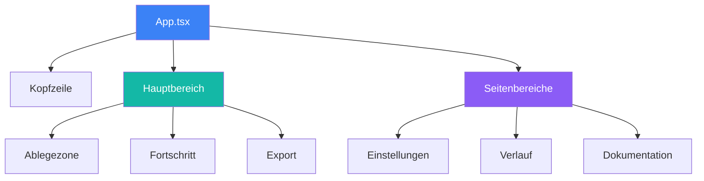
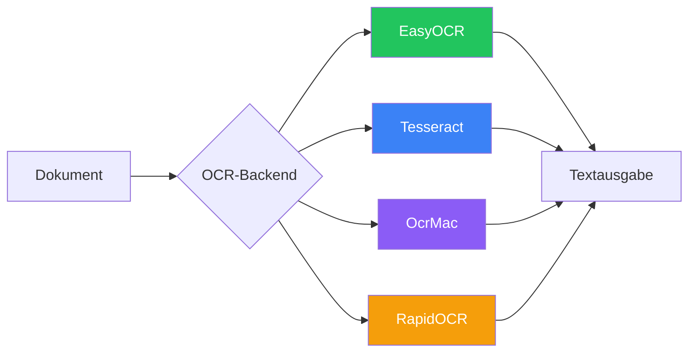
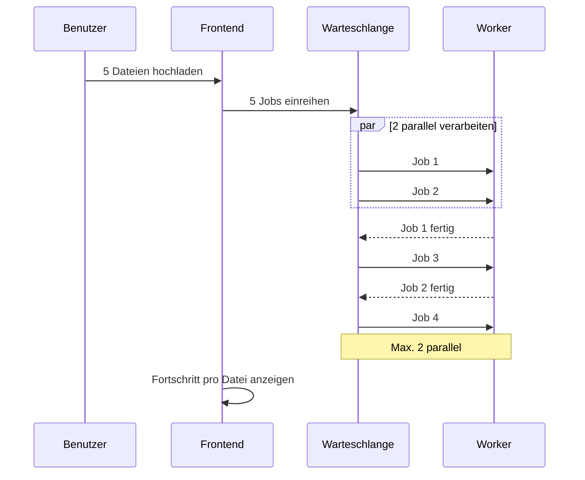

# Komponenten

Ausführliche Komponentendokumentation für Duckling.

## Frontend-Architektur

### Technologie-Stack

- **React 18** – UI-Framework mit Funktionskomponenten und Hooks
- **TypeScript** – Typsicheres JavaScript
- **Tailwind CSS** – Utility-first-CSS-Framework
- **Framer Motion** – Animationsbibliothek
- **React Query** – Server-State-Verwaltung
- **Axios** – HTTP-Client
- **Vite** – Build-Tool und Entwicklungsserver

### Komponentenstruktur



### Komponentendateien

| Pfad | Beschreibung |
|------|-------------|
| `src/App.tsx` | Hauptanwendungskomponente |
| `src/main.tsx` | Einstiegspunkt der Anwendung |
| `src/index.css` | Globale Styles |
| `src/components/DropZone.tsx` | Datei-Upload mit Drag-and-Drop |
| `src/components/ConversionProgress.tsx` | Fortschrittsanzeige |
| `src/components/ExportOptions.tsx` | Ergebnisse herunterladen und in der Vorschau anzeigen |
| `src/components/SettingsPanel.tsx` | Konfigurationsbereich |
| `src/components/HistoryPanel.tsx` | Konvertierungsverlauf |
| `src/components/DocsPanel.tsx` | Dokumentationsansicht |
| `src/hooks/useConversion.ts` | Zustand und Aktionen der Konvertierung |
| `src/hooks/useSettings.ts` | Zustandsverwaltung für Einstellungen |
| `src/services/api.ts` | API-Client-Funktionen |
| `src/types/index.ts` | TypeScript-Schnittstellen |

### Zustandsverwaltung

Die Anwendung kombiniert:

1. **Lokalen Zustand** – Komponentenzustand mit `useState`
2. **React Query** – Caching und Synchronisation des Serverzustands
3. **Eigene Hooks** – Gekapselte Geschäftslogik

### Wichtige Hooks

#### `useConversion`

Verwaltet den Ablauf der Dokumentkonvertierung:

- Datei-Upload (einzeln und Batch)
- Statusabfrage
- Abruf der Ergebnisse
- Download-Handling

#### `useSettings`

Verwaltet Anwendungseinstellungen:

- OCR-, Tabellen-, Bild-, Leistungs- und Chunking-Einstellungen
- Persistenz der Einstellungen über die API
- Validierung der Einstellungen

---

## Backend-Architektur

### Technologie-Stack

- **Flask** – Web-Framework
- **SQLAlchemy** – ORM für Datenbankzugriffe
- **SQLite** – Eingebettete Datenbank für den Verlauf
- **Docling** – Dokumentkonvertierungs-Engine
- **Threading** – Asynchrone Job-Verarbeitung

### Modulstruktur

| Pfad | Beschreibung |
|------|-------------|
| `backend/duckling.py` | Flask-Anwendungsfabrik |
| `backend/config.py` | Konfiguration und Standardwerte |
| `backend/models/database.py` | SQLAlchemy-Modelle |
| `backend/routes/convert.py` | Konvertierungs-Endpunkte |
| `backend/routes/settings.py` | Einstellungs-Endpunkte |
| `backend/routes/history.py` | Verlaufs-Endpunkte |
| `backend/services/converter.py` | Docling-Integration |
| `backend/services/file_manager.py` | Dateioperationen |
| `backend/services/history.py` | Verlauf CRUD |
| `backend/tests/` | Testsuite |

### Dienste

#### ConverterService

Übernimmt die Dokumentkonvertierung mit Docling:

```python
class ConverterService:
    def convert(self, file_path: str, settings: dict) -> ConversionResult:
        """Dokument mit den angegebenen Einstellungen konvertieren."""
        pass

    def get_status(self, job_id: str) -> JobStatus:
        """Status eines Konvertierungsjobs abrufen."""
        pass
```

#### FileManager

Verwaltet Uploads und Ausgaben:

```python
class FileManager:
    def save_upload(self, file) -> str:
        """Hochgeladene Datei speichern und Pfad zurückgeben."""
        pass

    def get_output_path(self, job_id: str) -> str:
        """Ausgabeverzeichnis für einen Job abrufen."""
        pass
```

#### HistoryService

CRUD für den Konvertierungsverlauf:

```python
class HistoryService:
    def create(self, job_id: str, filename: str) -> Conversion:
        """Neuen Verlaufseintrag erstellen."""
        pass

    def update(self, job_id: str, **kwargs) -> Conversion:
        """Vorhandenen Eintrag aktualisieren."""
        pass

    def get_stats(self) -> dict:
        """Konvertierungsstatistiken abrufen."""
        pass
```

---

## OCR-Integration

Docling unterstützt mehrere OCR-Backends:



| Backend | Beschreibung | GPU-Unterstützung |
|---------|-------------|-------------|
| **EasyOCR** | Allgemein, mehrsprachig | Ja |
| **Tesseract** | Klassische OCR-Engine | Nein |
| **OcrMac** | macOS Vision-Framework | Nein |
| **RapidOCR** | Schnell, ONNX-basiert | Nein |

Das Backend fällt automatisch auf Verarbeitung ohne OCR zurück, wenn die OCR-Initialisierung fehlschlägt.

---

## Batch-Verarbeitung



| Schritt | Beschreibung |
|------|-------------|
| 1 | Frontend sendet POST /convert/batch mit mehreren Dateien |
| 2 | Backend speichert jede Datei, erstellt Jobs und reiht alle ein |
| 3 | Backend antwortet mit 202 und einem Array von Job-IDs |
| 4 | Frontend fragt den Status für jeden Job parallel ab |
| 5 | Backend verarbeitet maximal 2 Jobs gleichzeitig, der Rest wartet |
| 6 | Frontend zeigt den Fortschritt pro Datei |
