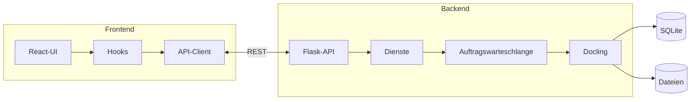
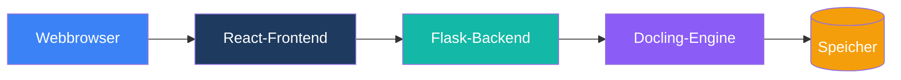
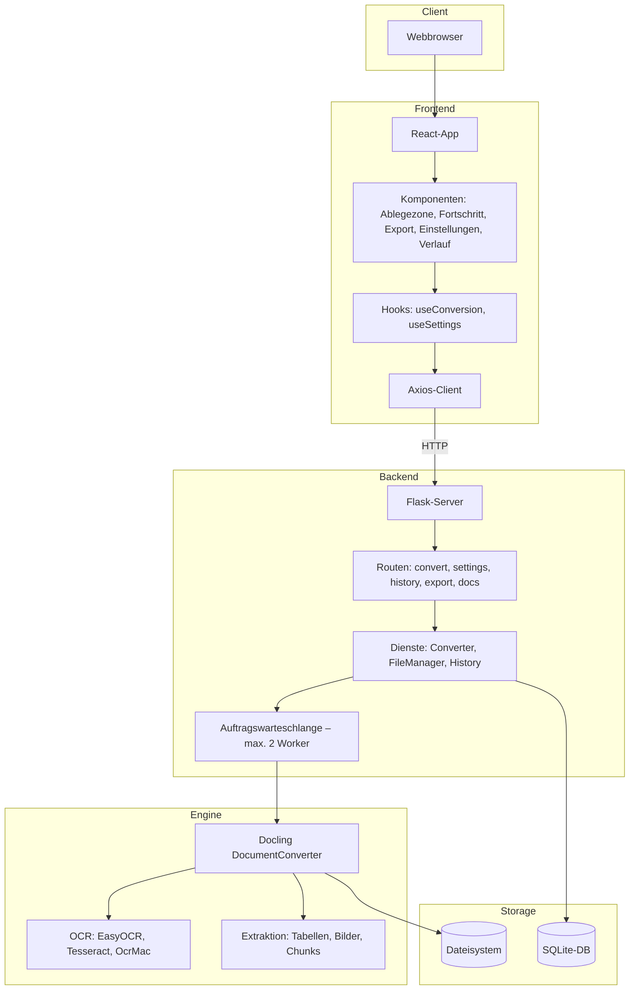
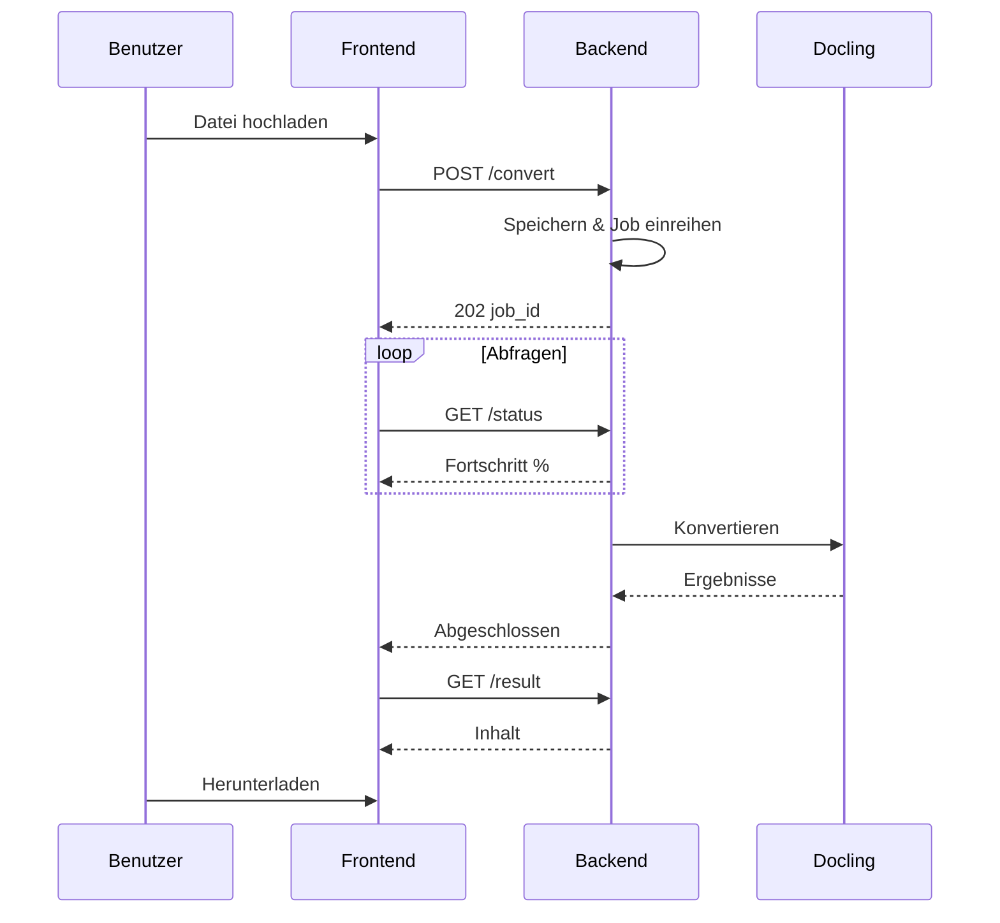
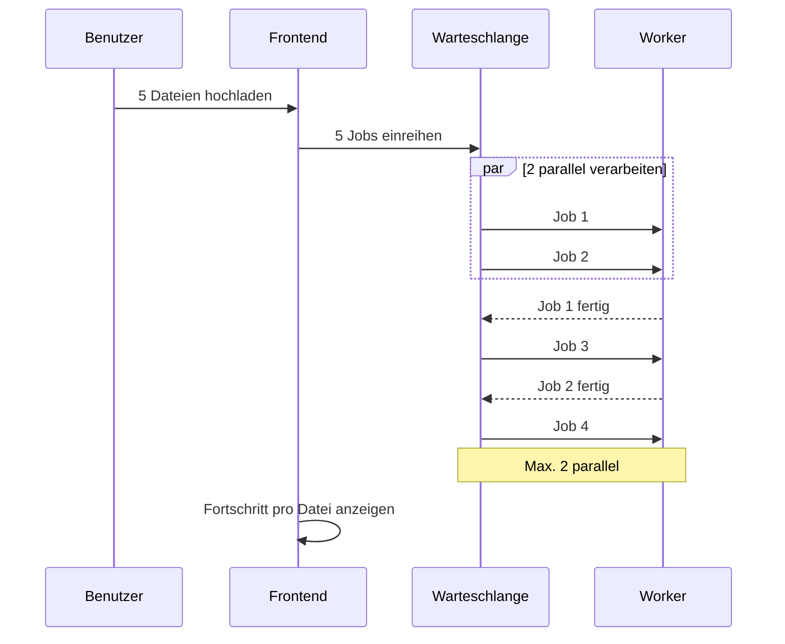
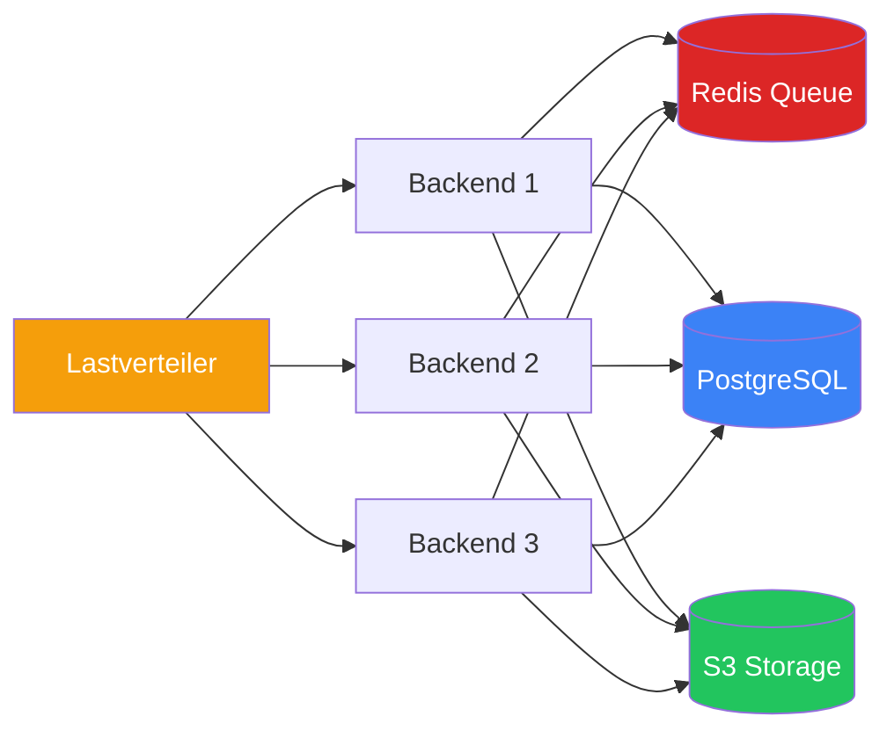
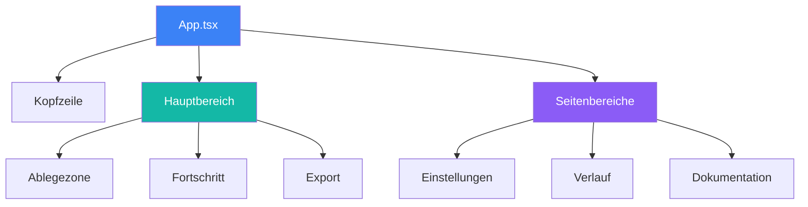
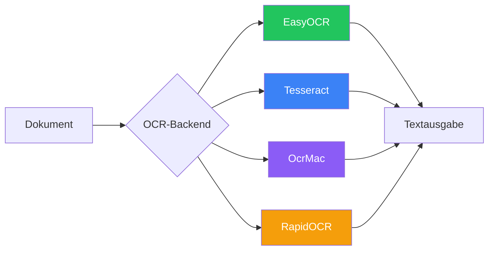

# Architekturdiagramme

Visuelle Diagramme zur Duckling-Architektur.

## Systemarchitektur – Überblick

---

## Einfache Architektur

---

## Detaillierte Schichtenansicht

---

## Konvertierungsablauf

---

## Batch-Verarbeitung

---

## Skalierungsarchitektur

Für produktive Bereitstellungen mit hohem Traffic:

---

## Komponentenbaum

---

## OCR-Optionen

---

## Statische Diagrammbilder

Wenn Mermaid nicht gerendert werden kann, stehen statische Bilder bereit:

- [Systemarchitektur](../arch.png)
- [Detaillierte Schichtenansicht](../Detailed-Layer-View.png)
- [Konvertierungspipeline](../ConversionPipeline.png)
- [Batch-Verarbeitung](../BatchProcessing.png)
- [Skalierungsarchitektur](../ScalingArchitecture.png)
- [Komponentenbaum](../ComponentTree.png)
- [OCR-Optionen](../OCR.png)
