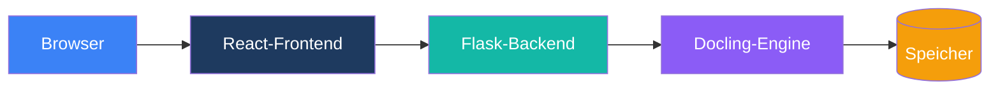

# Architektur

Technische Architektur-Dokumentation für Duckling.

## Übersicht

Duckling ist eine Full-Stack-Webanwendung mit klarer Trennung von Frontend und Backend:

## Abschnitte

-   :material-view-dashboard:{ .lg .middle } __Systemübersicht__

    ---

    Architektur auf hoher Ebene und Datenfluss

    [:octicons-arrow-right-24: Übersicht](overview.md)

-   :material-puzzle:{ .lg .middle } __Komponenten__

    ---

    Details zu Frontend- und Backend-Komponenten

    [:octicons-arrow-right-24: Komponenten](components.md)

-   :material-chart-box:{ .lg .middle } __Diagramme__

    ---

    Architekturdiagramme und Flussdiagramme

    [:octicons-arrow-right-24: Diagramme](diagrams.md)

## Wichtige Designentscheidungen

### Trennung der Belange

- **Frontend**: React mit TypeScript für Typsicherheit und moderne UI
- **Backend**: Flask für Einfachheit und Python-Ökosystem-Zugang
- **Engine**: Docling für Dokumentkonvertierung (IBMs Bibliothek)

### Async Verarbeitung

Die Dokumentkonvertierung läuft asynchron ab:

1. Der Client lädt die Datei hoch
2. Der Server antwortet sofort mit einer Auftrags-ID
3. Der Client fragt den Status ab
4. Der Server verarbeitet im Hintergrundthread
5. Ergebnisse stehen nach Abschluss bereit

### Auftragswarteschlange

Eine threadbasierte Warteschlange begrenzt den Speicherverbrauch:

- Maximal 2 gleichzeitige Konvertierungen
- Weitere Aufträge werden eingeordnet, wenn die Kapazität erreicht ist
- Automatische Bereinigung abgeschlossener Aufträge

### Persistenz der Einstellungen

Einstellungen werden pro Benutzersitzung gespeichert und pro Konvertierung angewendet:

- Globale Standardwerte in `config.py`
- Benutzereinstellungen in der Datenbank (pro Sitzungs-ID)
- Überschreibungen pro Anfrage über die API

Einstellungen sind pro Sitzung getrennt, sodass sich Mehrbenutzer-Installationen nicht gegenseitig beeinflussen.

## Technologie-Stack

### Frontend

| Technologie | Zweck |
|------------|---------|
| React 18 | UI-Framework |
| TypeScript | Typsicherheit |
| Tailwind CSS | Styling |
| Framer Motion | Animationen |
| Axios | HTTP-Client |
| Vite | Build-Tool |

### Backend

| Technologie | Zweck |
|------------|---------|
| Flask | Web-Framework |
| SQLAlchemy | Datenbank-ORM |
| SQLite | Verlaufsspeicher |
| Docling | Dokumentkonvertierung |
| Threading | Asynchrone Verarbeitung |

