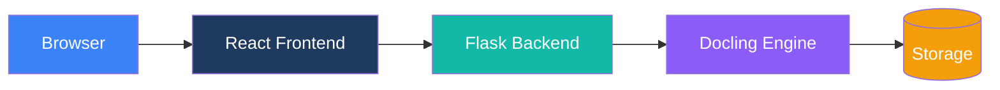

# Architektur

Technische Architektur-Dokumentation für Duckling.

## Übersicht

Duckling is a full-stack web application with a clear separation between frontend und backend:

## Abschnitte

-   :material-view-dashboard:{ .lg .middle } __Systemübersicht__

    ---

    Architektur auf hoher Ebene und Datenfluss

    [:octicons-arrow-right-24: Übersicht](overview.md)

-   :material-puzzle:{ .lg .middle } __Komponenten__

    ---

    Details zu Frontend- und Backend-Komponenten

    [:octicons-arrow-right-24: Komponenten](components.md)

-   :material-chart-box:{ .lg .middle } __Diagramme__

    ---

    Architekturdiagramme und Flussdiagramme

    [:octicons-arrow-right-24: Diagramme](diagrams.md)

## Wichtige Designentscheidungen

### Trennung der Belange

- **Frontend**: React mit TypeScript für Typsicherheit und moderne UI
- **Backend**: Flask für Einfachheit und Python-Ökosystem-Zugang
- **Engine**: Docling für Dokumentkonvertierung (IBMs Bibliothek)

### Async Verarbeitung

Document conversion is hundled asynchronously:

1. Client uploads file
2. Server returns job ID immediately
3. Client polls for status
4. Server processes in background thread
5. Results available when complete

### Job Queue

A thread-based job queue prevents memory exhaustion:

- Maximum 2 concurrent conversions
- Jobs queued when capacity reached
- Automatic cleanup of completed jobs

### Einstellungen Persistence

Einstellungen are stored per-user session und applied per-conversion:

- Global defaults in `config.py`
- User settings stored in database (per session ID)
- Per-request overrides via API

Einstellungen are isolated per user session, ensuring multi-user deployments don't interfere with each other's preferences.

## Technology Stack

### Frontend

| Technology | Zweck |
|------------|---------|
| React 18 | UI framework |
| TypeScript | Type safety |
| Tailwind CSS | Styling |
| Framer Motion | Animations |
| Axios | HTTP client |
| Vite | Build tool |

### Backend

| Technology | Zweck |
|------------|---------|
| Flask | Web framework |
| SQLAlchemy | Database ORM |
| SQLite | History storage |
| Docling | Document conversion |
| Threading | Async processing |

