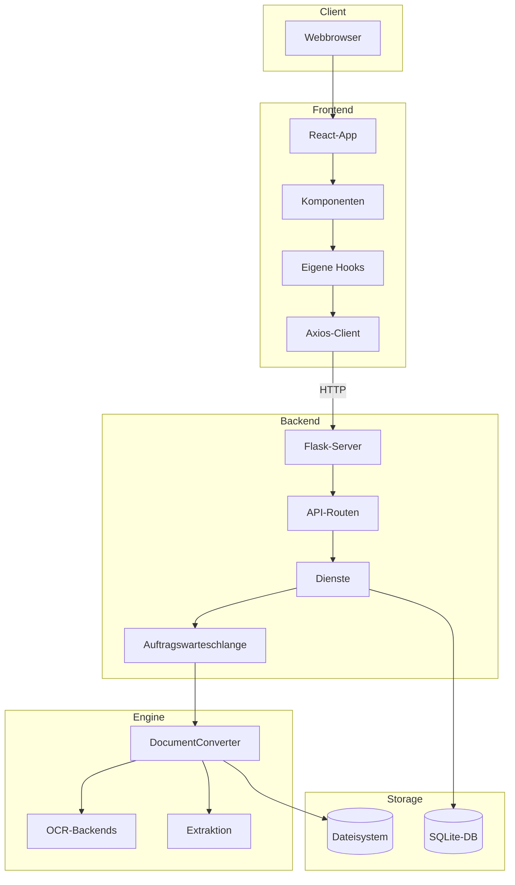
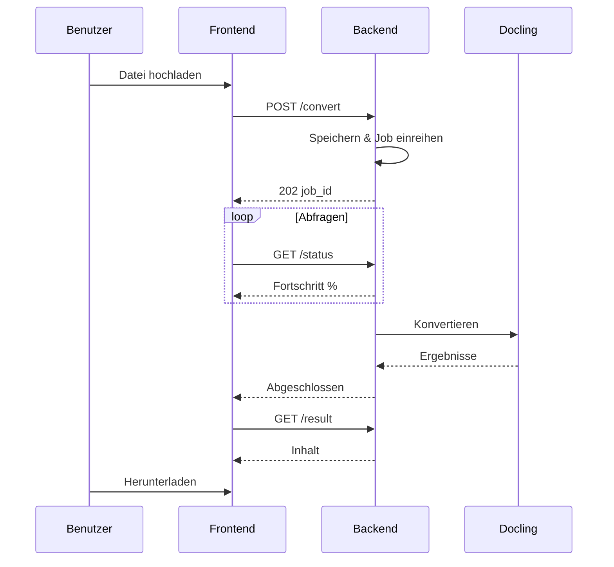

# Systemübersicht

Architektur und Datenfluss in Duckling auf hoher Ebene.

## Architekturdiagramm


## Detaillierte Schichtenansicht



## Datenfluss

### Ablauf der Dokumentkonvertierung



### Konvertierungspipeline

| Schritt | Beschreibung |
|------|-------------|
| 1 | **Upload-Anfrage** – Datei per POST empfangen |
| 2 | **Dateivalidierung & Speicherung** – Erweiterung prüfen, in uploads/ speichern |
| 3 | **Job-Erstellung** – UUID vergeben, Eintrag anlegen |
| 4 | **Einreihen zur Verarbeitung** – In die Auftragswarteschlange |
| 5 | **Worker-Thread übernimmt Job** – Wenn Kapazität frei ist |
| 6 | **DocumentConverter initialisiert** – Mit OCR-, Tabellen- und Bildeinstellungen |
| 7 | **Dokumentkonvertierung** – Bilder, Tabellen, Chunks extrahieren |
| 8 | **Export in Formate** – MD, HTML, JSON, TXT, DocTags, Tokens |
| 9 | **Jobstatus & Verlauf aktualisieren** – Als abgeschlossen markieren, Metadaten speichern |
| 10 | **Ergebnisse verfügbar** – Bereit zum Download |

**Ordner-Upload (UI):** Der Browser expandiert ein gewähltes oder per Drag-and-Drop abgelegtes Verzeichnis zu einer Dateiliste; das Frontend filtert nach zulässiger Erweiterung und Größe und sendet unterstützte Dateien als `POST /api/convert/batch` mit wiederholten `files`-Teilen (wie beim Mehrfach-Batch). Das Backend lehnt nicht unterstützte Teile einzeln ab; wenn kein Teil konvertiert werden kann, antwortet die API mit **400**.

## Auftragswarteschlange

Um eine Speichererschöpfung bei mehreren Dokumenten zu vermeiden:

```python
class ConverterService:
    _job_queue: Queue       # Pending jobs
    _worker_thread: Thread  # Background processor
    _max_concurrent_jobs = 2  # Limit parallel processing
```

Der Worker-Thread:

1. Überwacht die Auftragswarteschlange
2. Startet Konvertierungs-Threads bis zum Parallelitätslimit
3. Verfolgt aktive Threads und räumt abgeschlossene auf
4. Verhindert Ressourcenerschöpfung bei Batch-Verarbeitung

## Datenbankschema

### Tabelle „Conversion“

| Spalte | Typ | Beschreibung |
|--------|------|-------------|
| `id` | VARCHAR(36) | Primärschlüssel (UUID) |
| `filename` | VARCHAR(255) | Bereinigter Dateiname |
| `original_filename` | VARCHAR(255) | Ursprünglicher Upload-Name |
| `input_format` | VARCHAR(50) | Erkanntes Format |
| `status` | VARCHAR(50) | pending/processing/completed/failed |
| `confidence` | FLOAT | OCR-Konfidenzwert |
| `error_message` | TEXT | Fehlerdetails bei Misserfolg |
| `output_path` | VARCHAR(500) | Pfad zu Ausgabedateien |
| `settings` | TEXT | Verwendete JSON-Einstellungen |
| `file_size` | FLOAT | Dateigröße in Bytes |
| `created_at` | DATETIME | Zeitstempel des Uploads |
| `completed_at` | DATETIME | Zeitstempel des Abschlusses |

## Sicherheitsaspekte

| Thema | Gegenmaßnahme |
|---------|------------|
| **Datei-Upload** | Nur zulässige Erweiterungen |
| **Dateigröße** | Konfigurierbares Maximum (Standard 100MB) |
| **Dateinamen** | Vor der Speicherung bereinigt |
| **Dateizugriff** | Nur über API, keine direkten Pfade |
| **CORS** | Auf Frontend-Ursprung beschränkt |

## Leistungsoptimierungen

| Optimierung | Beschreibung |
|--------------|-------------|
| **Converter-Caching** | DocumentConverter-Instanzen nach Einstellungs-Hash gecacht |
| **Auftragswarteschlange** | Sequentielle Verarbeitung verhindert Speichererschöpfung |
| **Lazy Loading** | Schwere Komponenten bei Bedarf geladen |
| **React-Query-Caching** | API-Antworten gecacht und dedupliziert |
| **Hintergrundverarbeitung** | Konvertierungen blockieren die API nicht |
