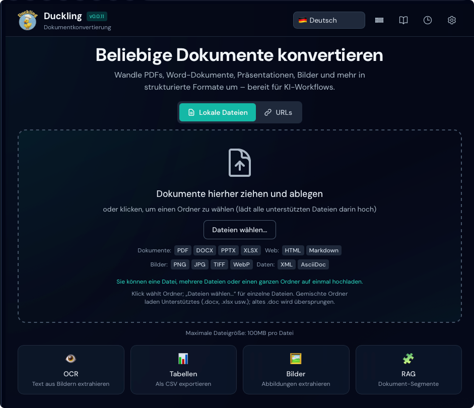
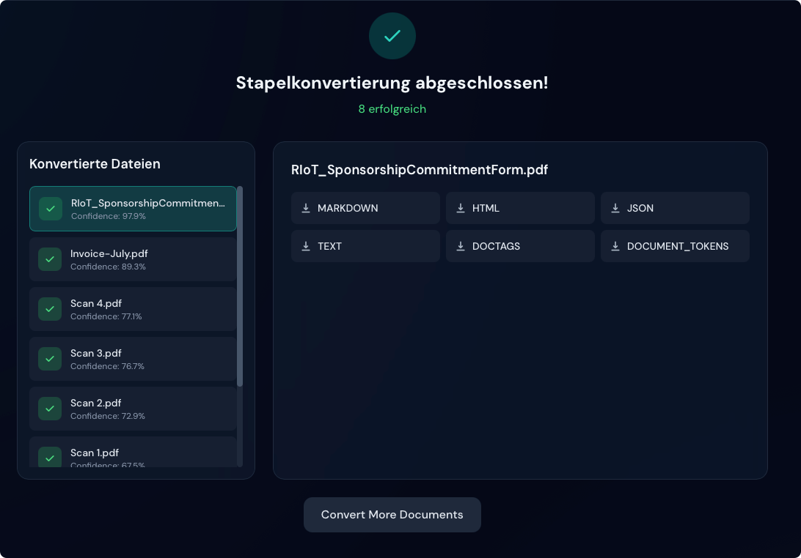

# Schnellstart

Starten Sie in 5 Minuten mit Duckling.

## Anwendung starten

Wählen Sie Ihre bevorzugte Methode:

=== "Docker (empfohlen)"

    Der schnellste Weg zum Start – keine Abhängigkeiten zu installieren!

    **Option 1: Vorgefertigte Images (am schnellsten)**
    ```bash
    # Compose-Datei herunterladen
    curl -O https://raw.githubusercontent.com/duckling-ui/duckling/main/docker-compose.prebuilt.yml

    # Duckling starten
    docker-compose -f docker-compose.prebuilt.yml up -d
    ```

    **Option 2: Lokal erstellen**
    ```bash
    # Repository klonen und starten
    git clone https://github.com/duckling-ui/duckling.git
    cd duckling
    docker-compose up --build
    ```

    Die Benutzeroberfläche ist unter `http://localhost:3000` erreichbar.

    !!! tip "Erster Start"
        Der erste Start kann einige Minuten dauern, während Docker die Images herunterlädt oder baut.

=== "Manuelle Einrichtung"

    ### Terminal 1: Backend

    ```bash
    cd backend
    source venv/bin/activate  # Windows: venv\Scripts\activate
    python duckling.py
    ```

    Die API ist unter `http://localhost:5001` erreichbar.

    ### Terminal 2: Frontend

    ```bash
    cd frontend
    npm run dev
    ```

    Die Benutzeroberfläche ist unter `http://localhost:3000` erreichbar.

## Ihre erste Konvertierung

### 1. Anwendung öffnen

Öffnen Sie `http://localhost:3000` im Browser.

<figure markdown="span">
  { loading=lazy }
  <figcaption>Die Hauptoberfläche von Duckling</figcaption>
</figure>

### 2. Dokument hochladen

Ziehen Sie eine PDF-, Word-Datei oder ein Bild in die Ablagezone, oder klicken Sie zum Durchsuchen.

### 3. Fortschritt beobachten

Der Konvertierungsfortschritt wird in Echtzeit angezeigt.

### 4. Ergebnisse herunterladen

Nach Abschluss wählen Sie Ihr Exportformat:

<figure markdown="span">
  { loading=lazy }
  <figcaption>Konvertierung abgeschlossen mit Exportoptionen</figcaption>
</figure>

- **Markdown** – Gut für Dokumentation
- **HTML** – Ausgabe für das Web
- **JSON** – Vollständige Dokumentstruktur
- **Nur Text** – Einfache Textextraktion

## Grundlegende Konfiguration

Klicken Sie auf die Schaltfläche :material-cog: **Einstellungen**, um zu konfigurieren:

### OCR-Einstellungen

| Einstellung | Standard | Beschreibung |
|-------------|----------|--------------|
| Aktiviert | `true` | OCR für gescannte Dokumente aktivieren |
| Backend | `easyocr` | Zu verwendende OCR-Engine |
| Sprache | `en` | Primärsprache |

### Tabelleneinstellungen

| Einstellung | Standard | Beschreibung |
|-------------|----------|--------------|
| Aktiviert | `true` | Tabellen aus Dokumenten extrahieren |
| Modus | `accurate` | Genauigkeit der Erkennung |

### Bildeinstellungen

| Einstellung | Standard | Beschreibung |
|-------------|----------|--------------|
| Extrahieren | `true` | Eingebettete Bilder extrahieren |
| Skalierung | `1.0` | Ausgabeskala für Bilder |

## Stapelverarbeitung

Um mehrere Dateien auf einmal zu konvertieren:

1. **Ziehen Sie** mehrere Dateien **oder einen ganzen Ordner** per Drag-and-drop in die Ablagezone. Der Browser löst einen Ordner in seine Dateien auf; Duckling reiht jedes unterstützte Dokument ein (nicht unterstützte Typen werden übersprungen).
2. **Klicken** Sie auf die Ablagezone, um einen **Ordner**-Dialog zu öffnen und alle unterstützten Dateien darin auf einmal hochzuladen.
3. Nutzen Sie **Dateien auswählen…**, wenn Sie nur **einzelne Dateien** wählen möchten (kein Ordnermodus).

Alle eingereihten Dateien werden über die Auftragswarteschlange verarbeitet (siehe [Funktionen](../user-guide/features.md) zu gleichzeitigen Grenzen).

!!! tip "Leistung"
    Die Stapelverarbeitung nutzt eine Auftragswarteschlange mit maximal 2 gleichzeitigen Konvertierungen, um Speicherüberlastung zu vermeiden.

## API nutzen

Für programmatischen Zugriff verwenden Sie die REST-API:

```bash
# Dokument hochladen und konvertieren
curl -X POST http://localhost:5001/api/convert \
  -F "file=@document.pdf"

# Antwort
{
  "job_id": "550e8400-e29b-41d4-a716-446655440000",
  "status": "processing"
}
```

Die [API-Referenz](../api/index.md) enthält die vollständige Dokumentation.

## Nächste Schritte

- [Funktionen](../user-guide/features.md) – Alle Möglichkeiten entdecken
- [Konfiguration](../user-guide/configuration.md) – Erweiterte Einstellungen
- [API-Referenz](../api/index.md) – In Ihre Apps integrieren

