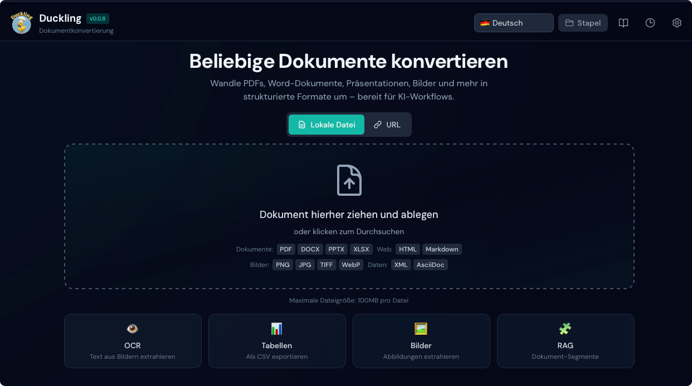
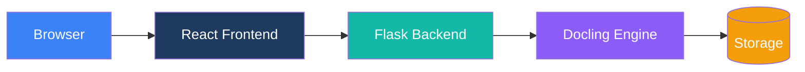

# Duckling

Eine moderne, benutzerfreundliche Web-Oberfläche für [Docling](https://github.com/docling-project/docling) (IBM) – eine leistungsstarke Bibliothek zur Dokumentkonvertierung.



## Überblick

Duckling bietet eine intuitive Web-Oberfläche, um Dokumente mit Docling zu konvertieren. Ob du Text aus PDFs extrahieren, Word-Dokumente nach Markdown konvertieren oder OCR für gescannte Bilder nutzen möchtest: Duckling macht es einfach.

## Hauptfunktionen

<div class="grid cards" markdown>

-   <a href="user-guide/features/#drag-and-drop" class="card-link" markdown="1">
    :material-cursor-move:{ .lg .middle } __Drag-and-Drop-Upload__

    ---

    Ziehen Sie Ihre Dokumente einfach auf die Oberfläche für sofortige Verarbeitung
    </a>

-   <a href="user-guide/features/#batch-processing" class="card-link" markdown="1">
    :material-file-multiple:{ .lg .middle } __Stapelverarbeitung__

    ---

    Konvertieren Sie mehrere Dateien gleichzeitig mit paralleler Verarbeitung
    </a>

-   <a href="user-guide/formats/" class="card-link" markdown="1">
    :material-format-list-bulleted:{ .lg .middle } __Multi-Format-Unterstützung__

    ---

    PDFs, Word-Dokumente, PowerPoints, Excel-Dateien, HTML, Markdown, Bilder und mehr
    </a>

-   <a href="user-guide/features/#export-formats" class="card-link" markdown="1">
    :material-export:{ .lg .middle } __Mehrere Exportformate__

    ---

    Exportieren Sie nach Markdown, HTML, JSON, DocTags, Document Tokens, RAG Chunks oder Klartext
    </a>

-   <a href="user-guide/features/#table-extraction" class="card-link" markdown="1">
    :material-image-multiple:{ .lg .middle } __Bild- und Tabellenextraktion__

    ---

    Extrahieren Sie eingebettete Bilder und Tabellen mit CSV-Export
    </a>

-   <a href="user-guide/features/#rag-chunking" class="card-link" markdown="1">
    :material-puzzle:{ .lg .middle } __RAG-optimiertes Chunking__

    ---

    Generieren Sie Dokument-Segmente, die für RAG-Anwendungen optimiert sind
    </a>

-   <a href="user-guide/features/#ocr-optical-character-recognition" class="card-link" markdown="1">
    :material-eye:{ .lg .middle } __Erweiterte OCR__

    ---

    Mehrere OCR-Backends mit GPU-Beschleunigungsunterstützung
    </a>

-   <a href="user-guide/features/#conversion-history" class="card-link" markdown="1">
    :material-history:{ .lg .middle } __Konvertierungsverlauf__

    ---

    Greifen Sie jederzeit auf zuvor konvertierte Dokumente zu
    </a>

-   <a href="user-guide/features/#statistics-panel" class="card-link" markdown="1">
    :material-chart-line:{ .lg .middle } __Konvertierungsstatistiken__

    ---

    Analyse-Panel mit Durchsatz, Speichernutzung und Leistungsmetriken
    </a>

</div>


## Schnellstart

Siehe **Getting Started**, um Duckling mit Docker oder lokal in der Entwicklung zu installieren und auszuführen.

## Übersetzungsstatus

Die deutsche Dokumentation ist in Arbeit. Einige Seiten können vorläufig oder nur teilweise übersetzt sein.


    ```bash
    # Repository klonen
    git clone https://github.com/davidgs/duckling.git
    cd duckling

    # Backend-Einrichtung
    cd backend
    python -m venv venv
    source venv/bin/activate
    pip install -r requirements.txt
    python duckling.py

    # Frontend-Einrichtung (neues Terminal)
    cd frontend
    npm install
    npm run dev
    ```

Greifen Sie auf die Anwendung unter `http://localhost:3000` zu

## Unterstützte Formate

### Eingabeformate

| Format | Erweiterungen | Beschreibung |
|--------|---------------|--------------|
| PDF | `.pdf` | Portable Document Format |
| Word | `.docx` | Microsoft Word-Dokumente |
| PowerPoint | `.pptx` | Microsoft PowerPoint-Präsentationen |
| Excel | `.xlsx` | Microsoft Excel-Tabellenkalkulationen |
| HTML | `.html`, `.htm` | Webseiten |
| Markdown | `.md`, `.markdown` | Markdown-Dateien |
| Bilder | `.png`, `.jpg`, `.jpeg`, `.tiff`, `.gif`, `.webp`, `.bmp` | Direkte Bild-OCR |
| AsciiDoc | `.asciidoc`, `.adoc` | Technische Dokumentation |
| PubMed XML | `.xml` | Wissenschaftliche Artikel |
| USPTO XML | `.xml` | Patentdokumente |

### Exportformate

| Format | Erweiterung | Beschreibung |
|--------|-------------|--------------|
| Markdown | `.md` | Formatierter Text mit Überschriften, Listen, Links |
| HTML | `.html` | Web-fertiges Format mit Styling |
| JSON | `.json` | Vollständige Dokumentstruktur |
| Klartext | `.txt` | Einfacher Text ohne Formatierung |
| DocTags | `.doctags` | Markiertes Dokumentformat |
| Document Tokens | `.tokens.json` | Token-Ebene-Darstellung |
| RAG Chunks | `.chunks.json` | Chunks für RAG-Anwendungen |

## Architektur



## Dokumentation

- **[Erste Schritte](getting-started/index.md)** - Installations- und Schnellstartanleitung
- **[Benutzerhandbuch](user-guide/index.md)** - Funktionen und Konfigurationsoptionen
- **[API-Referenz](api/index.md)** - Vollständige API-Dokumentation
- **[Architektur](architecture/index.md)** - Systemdesign und Komponenten
- **[Bereitstellung](deployment/index.md)** - Produktionsbereitstellungsanleitung
- **[Mitwirken](contributing/index.md)** - Wie man beiträgt## Danksagungen- [Docling](https://github.com/docling-project/docling) von IBM für die leistungsstarke Dokumentkonvertierungs-Engine
- [React](https://react.dev/) für das Frontend-Framework
- [Flask](https://flask.palletsprojects.com/) für das Backend-Framework
- [Tailwind CSS](https://tailwindcss.com/) für das Styling
- [Framer Motion](https://www.framer.com/motion/) für Animationen
