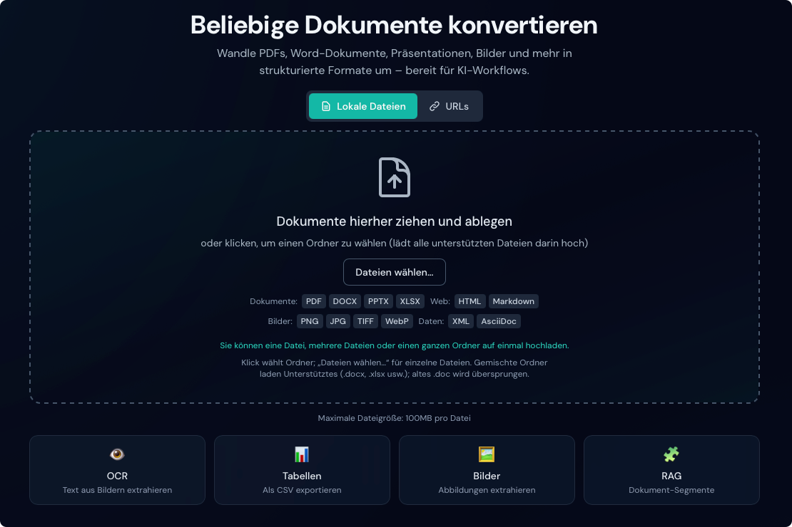

# Funktionen

Duckling bietet umfassende Funktionen für die Dokumentkonvertierung.

## Dokumenten-Upload

### Drag-and-drop

Ziehen Sie Dateien auf die Ablagezone für den sofortigen Upload. Die Oberfläche prüft Dateitypen und zeigt den Upload-Fortschritt.

<figure markdown="span">
  { loading=lazy }
  <figcaption>Ablagezone bereit zum Empfang von Dateien</figcaption>
</figure>

### Eingabe per URL

Konvertieren Sie Dokumente direkt über URLs, ohne sie zuerst manuell herunterzuladen:

1. Klicken Sie auf die Registerkarte **URLs** über der Ablagezone
2. Fügen Sie eine URL pro Zeile ein (eine Zeile = ein Dokument; mehrere Zeilen = Stapelverarbeitung)
3. Klicken Sie auf **Alle konvertieren**
4. Die Dokumente werden automatisch heruntergeladen und konvertiert

Unterstützte URL-Funktionen:

- Automatische Erkennung des Dateityps aus dem URL-Pfad
- Erkennung per `Content-Type`-Header bei Dateien ohne Erweiterung
- Unterstützung von `Content-Disposition` für Dateinamen
- Dieselben Typbeschränkungen wie bei lokalen Uploads
- **Automatischer Bild-Export für HTML-Seiten**: Beim Konvertieren von HTML über URLs lädt Duckling alle in der Seite referenzierten Bilder herunter und stellt sie in der Bildvorschau-Galerie bereit

!!! tip "HTML-Seiten mit Bildern"
    Wenn Sie eine HTML-Seite konvertieren (z. B. einen Blogartikel), führt Duckling Folgendes aus:

    1. Lädt den HTML-Inhalt herunter
    2. Findet alle ``-Tags und CSS-Hintergrundbilder
    3. Lädt jedes Bild von seiner Quell-URL herunter
    4. Bettet die Bilder als Base64-Daten-URIs in das HTML ein
    5. Speichert die Bilder separat für Vorschau und Download

    So bleiben alle Bilder in den konvertierten HTML-Dokumenten erhalten, auch offline.

!!! tip "Direkte Links"
    Verwenden Sie direkte Download-Links, keine generischen Webseiten-URLs. Zum Beispiel:

    - ✅ `https://example.com/document.pdf`
    - ✅ `https://example.com/blog/article` (HTML-Seiten funktionieren ebenfalls)
    - ❌ `https://example.com/view/document` (per JavaScript gerenderte Inhalte funktionieren ggf. nicht)

### Mehrere Dateien und Ordner

Laden Sie mehrere Dateien (oder einen ganzen Ordner) über dieselbe Zone hoch – ohne separaten Modus:

1. Dateien ziehen, Ordner wählen oder **Dateien wählen…** nutzen
2. Zur Registerkarte **URLs** wechseln und eine URL pro Zeile einfügen
3. Den Fortschritt verfolgen (ein Auftrag: übliche Ansicht; mehrere: Mehrdatei-Übersicht)
4. Ergebnisse einzeln oder gesamt nach dem Stapel herunterladen

#### Mehrere URLs

Das URL-Feld ist immer ein mehrzeiliges Textfeld:

1. Zur Registerkarte **URLs** wechseln
2. Eine URL pro Zeile einfügen
3. Auf **Alle konvertieren** klicken

!!! info "Gleichzeitige Verarbeitung"
    Die Warteschlange verarbeitet bis zu 2 Dokumente parallel, um den Speicherverbrauch zu begrenzen.

## OCR (optische Zeichenerkennung)

Text aus gescannten Dokumenten und Bildern extrahieren.

### Unterstützte Engines

| Engine | Beschreibung | GPU | Ideal für |
|--------|--------------|-----|-----------|
| **EasyOCR** | Mehrsprachig, präzise | Ja (CUDA) | Komplexe Dokumente |
| **Tesseract** | Klassisch, zuverlässig | Nein | Einfache Dokumente |
| **macOS Vision** | Native Apple-OCR | Apple Neural Engine | Mac-Nutzer |
| **RapidOCR** | Schnell, schlank | Nein | Hoher Durchsatz |

### Automatische Installation der Engines

Duckling kann OCR-Engines bei Auswahl automatisch installieren:

1. Öffnen Sie das Panel **Einstellungen**
2. Wählen Sie eine OCR-Engine in der Liste
3. Ist sie nicht installiert, erscheint **Installieren**
4. Klicken Sie für die Installation per pip

<figure markdown="span">
  { loading=lazy }
  <figcaption>OCR-Einstellungen und Engine-Auswahl</figcaption>
</figure>

!!! note "Installationsvoraussetzungen"
    - **EasyOCR, OcrMac, RapidOCR**: Installation per pip möglich
    - **Tesseract**: zuerst systemweit installieren:
      - macOS: `brew install tesseract`
      - Ubuntu/Debian: `apt-get install tesseract-ocr`
      - Windows: Download von [GitHub releases](https://github.com/UB-Mannheim/tesseract/wiki)

<figure markdown="span">
  { loading=lazy }
  <figcaption>Tesseract erfordert eine manuelle Systeminstallation</figcaption>
</figure>

Das Panel **Einstellungen** zeigt den Status jeder Engine:

- ✓ **Installiert und bereit** – für die Konvertierung verfügbar
- ⚠ **Nicht installiert** – zum Installieren klicken (per pip installierbar)
- ℹ **Systeminstallation erforderlich** – manuelle Anleitung befolgen

### Unterstützte Sprachen

Über 28 Sprachen, u. a.:

- **Europa**: Englisch, Deutsch, Französisch, Spanisch, Italienisch, Portugiesisch, Niederländisch, Polnisch, Russisch
- **Asien**: Japanisch, Chinesisch (vereinfacht/traditionell), Koreanisch, Thai, Vietnamesisch
- **Naher Osten**: Arabisch, Hebräisch, Türkisch
- **Südasien**: Hindi

### OCR-Optionen

| Option | Beschreibung |
|--------|----------------|
| Gesamte Seite per OCR | Ganze Seite statt nur erkannte Bereiche |
| GPU-Beschleunigung | CUDA für schnellere Verarbeitung (EasyOCR) |
| Konfidenzschwelle | Mindest-Konfidenz der Ergebnisse (0–1) |
| Bitmap-Flächenschwelle | Mindestflächenanteil für Bitmap-OCR |

## Tabellenextraktion

Tabellen in Dokumenten automatisch erkennen und extrahieren.

### Erkennungsmodi

=== "Präziser Modus"

    - Präzisere Erkennung
    - Bessere Zellgrenzen
    - Langsamere Verarbeitung
    - Empfohlen für komplexe Tabellen

=== "Schneller Modus"

    - Schnellere Verarbeitung
    - Gut für einfache Tabellen
    - Komplexe Strukturen können fehlen

### Exportoptionen

- **CSV**: jede Tabelle als CSV herunterladen
- **Bild**: Tabelle als PNG herunterladen
- **JSON**: vollständige Tabellenstruktur in der API-Antwort

## Bildextraktion

Eingebettete Bilder aus Dokumenten extrahieren.

### Optionen

| Option | Beschreibung |
|--------|--------------|
| Bilder extrahieren | Bildextraktion aktivieren |
| Bilder klassifizieren | Bilder taggen (Abbildung, Grafik usw.) |
| Seitenbilder erzeugen | Pro Seite ein Bild erzeugen |
| Abbildungsbilder erzeugen | Abbildungen als Dateien extrahieren |
| Tabellenbilder erzeugen | Tabellen als Bilder extrahieren |
| Bildskala | Ausgabeskalierung (0,1x bis 4,0x) |

### Bildvorschau-Galerie

Nach der Konvertierung erscheinen extrahierte Bilder in einer Galerie:

- **Miniaturraster**: alle Bilder als Vorschaubilder
- **Aktionen beim Hover**: schneller Zugriff auf Anzeige und Download
- **Lightbox**: Klick für Vollbild in einem Dialog
- **Navigation**: Pfeile zum Durchblättern
- **Herunterladen**: einzeln aus Galerie oder Lightbox

<figure markdown="span">
  { loading=lazy }
  <figcaption>Extrahierte Bilder als Miniaturen</figcaption>
</figure>

<figure markdown="span">
  { loading=lazy }
  <figcaption>Vollbildansicht mit Navigation</figcaption>
</figure>

!!! tip "Bildformate"
    Extrahierte Bilder werden als PNG gespeichert für maximale Kompatibilität.

## Dokumenten-Anreicherung

Erweitern Sie konvertierte Dokumente mit KI-gestützten Funktionen.

### Verfügbare Anreicherungen

| Funktion | Beschreibung | Auswirkung |
|----------|--------------|------------|
| **Code-Anreicherung** | Spracherkennung und verbesserte Codeblöcke | Gering |
| **Formel-Anreicherung** | LaTeX aus mathematischen Gleichungen | Mittel |
| **Bildklassifikation** | Semantische Typen (Abbildung, Diagramm, Foto) | Gering |
| **Bildbeschreibung** | KI-generierte Bildunterschriften | Hoch |

### Konfiguration

Aktivieren Sie Anreicherungen unter **Einstellungen**, Abschnitt **Dokumenten-Anreicherung**:

1. **Einstellungen** öffnen (Zahnrad)
2. Zu **Dokumenten-Anreicherung** scrollen
3. Gewünschte Optionen ein-/ausschalten
4. Einstellungen werden automatisch gespeichert

<figure markdown="span">
  { loading=lazy }
  <figcaption>Panel Dokumenten-Anreicherung</figcaption>
</figure>

!!! warning "Verarbeitungsdauer"
    Anreicherungen, besonders **Bildbeschreibung** und **Formel-Anreicherung**, verlängern die Laufzeit deutlich (Modell-Inferenz). Bei Aktivierung erscheint ein Hinweis.

<figure markdown="span">
  { loading=lazy }
  <figcaption>Hinweis bei langsamen Optionen</figcaption>
</figure>

### Code-Anreicherung

Aktiviert u. a.:

- Automatische Programmiersprachen-Erkennung
- Metadaten für Syntaxhervorhebung
- Bessere Strukturerkennung von Code

### Formel-Anreicherung

Extrahiert mathematische Formeln und wandelt sie in LaTeX um:

- Inline: `$E = mc^2$`
- Abgesetzte Gleichungen mit Formatierung
- Besseres Rendering in HTML- und Markdown-Export

### Bildklassifikation

Versieht Bilder mit Typ-Tags:

- **Abbildung**: Schemata, Illustrationen
- **Diagramm**: Balken, Linien, Kreise
- **Foto**: Fotos, Screenshots
- **Logo**: Logos, Symbole
- **Tabelle**: Tabellenbilder (getrennt von Tabellenextraktion)

### Bildbeschreibung

Nutzt Vision-Sprach-Modelle für Beschreibungen:

- Beschreibungen in natürlicher Sprache
- Hilfreich für Barrierefreiheit (Alternativtext)
- Bessere Durchsuchbarkeit
- Modell-Download beim ersten Einsatz

!!! note "Modellanforderungen"
    Bildbeschreibung benötigt ein Vision-Sprach-Modell (~1–2 GB), automatischer Download beim ersten Einsatz (kann mehrere Minuten dauern).

### Modelle vorab herunterladen

Um Wartezeiten zu vermeiden, können Sie Modelle vorab laden:

1. **Einstellungen** öffnen
2. Zu **Dokumenten-Anreicherung** scrollen
3. Unten den Bereich **Modelle vorab herunterladen** nutzen
4. Neben dem gewünschten Modell auf **Herunterladen** klicken

| Modell | Größe | Zweck |
|--------|-------|-------|
| Bildklassifikator | ~350 MB | Bildtyp |
| Bildbeschreiber | ~2 GB | KI-Bildtexte |
| Formelerkenner | ~500 MB | LaTeX-Extraktion |
| Code-Erkenner | ~200 MB | Programmiersprache |

!!! tip "Download-Fortschritt"
    Ein Fortschrittsbalken zeigt den Status. Modelle werden lokal gecacht; einmaliger Download genügt.

## RAG-Segmentierung

Erzeugen Sie Dokumentsegmente für Retrieval-Augmented Generation (RAG).

### Funktionsweise

1. Das Dokument wird in semantische Segmente zerlegt
2. Jedes Segment respektiert die Dokumentstruktur
3. Segmente enthalten Metadaten (Überschriften, Seitenzahlen)
4. Zu kleine Segmente können zusammengeführt werden

### Konfiguration

| Parameter | Beschreibung | Standard |
|-----------|--------------|----------|
| Max. Token | Maximale Token pro Segment | 512 |
| Peers zusammenführen | Kleine Segmente zusammenführen | true |

### Ausgabeformat

```json
{
  "chunks": [
    {
      "id": 1,
      "text": "Introduction to machine learning...",
      "meta": {
        "headings": ["Chapter 1", "Introduction"],
        "page": 1
      }
    }
  ]
}
```

## Exportformate

### Verfügbare Formate

| Format | Erweiterung | Beschreibung |
|--------|-------------|--------------|
| **Markdown** | `.md` | Strukturierter Text (Überschriften, Listen, Links) |
| **HTML** | `.html` | Webfertig mit Styling |
| **JSON** | `.json` | Vollständige Dokumentstruktur (verlustfrei) |
| **Klartext** | `.txt` | Einfacher Text |
| **DocTags** | `.doctags` | Getaggtes Format |
| **Document Tokens** | `.tokens.json` | Token-Ebene |
| **RAG-Chunks** | `.chunks.json` | Segmente für RAG-Anwendungen |

<figure markdown="span">
  { loading=lazy }
  <figcaption>Verfügbare Exportformate</figcaption>
</figure>

### Vorschau

Das Export-Panel zeigt eine Live-Vorschau, die sich mit dem gewählten Format aktualisiert.

#### Vorschau pro Format

- **Dynamischer Inhalt**: lädt je nach gewähltem Format
- **Format-Badge**: aktuell angezeigtes Format
- **Zwischenspeicher**: schnelles Umschalten bereits geladener Formate

#### Gerendert oder Roh

Bei HTML und Markdown zwischen gerendertem und Quelltext umschalten:

<figure markdown="span">
  { loading=lazy }
  <figcaption>Zwischen gerendeter und Roh-Vorschau wechseln</figcaption>
</figure>

=== "Gerenderter Modus"

    - **HTML**: Formatierung, Tabellen, Links
    - **Markdown**: Überschriften, fett/kursiv, Codeblöcke, Links
    - Ideal für die visuelle Prüfung

    { loading=lazy }

=== "Rohmodus"

    - Zeigt den Quellcode
    - HTML: Roh-Tags und Attribute
    - Markdown: Syntax (`#`, `**fett**`, usw.)
    - Nützlich zum Kopieren oder für Format-Debugging

    { loading=lazy }

#### Weitere Formate

- **JSON**: formatiert mit Einrückung
- **Klartext**: unverändert
- **DocTags / Tokens**: Rohanzeige

<figure markdown="span">
  { loading=lazy }
  <figcaption>Formatierte JSON-Ausgabe</figcaption>
</figure>

## Konvertierungsverlauf

Zugriff auf zuvor konvertierte Dokumente:

- Status und Metadaten der Konvertierung
- Erneuter Download der Ergebnisse
- Suche nach Dateinamen
- Konvertierungsstatistiken

### Funktionen des Verlaufs

- **Suche**: nach Dateinamen
- **Filter**: nach Status (abgeschlossen, fehlgeschlagen)
- **Export**: Verlauf als JSON
- **Dokument erneut laden**: abgeschlossene Einträge anklicken, Ergebnis ohne Neukonvertierung öffnen
  - Dokumente werden nach der Konvertierung auf der Festplatte gespeichert
  - Vollständige Struktur bleibt erhalten; sofortiges erneutes Laden
- **Deduplizierung**: gleiche Datei und gleiche Einstellungen nutzen gespeicherte Ausgabe
- **Chunks jetzt erzeugen**: fehlen RAG-Segmente, Erzeugung auf Abruf mit aktuellen Chunking-Einstellungen (ohne Neukonvertierung)
  - Konvertierungen mit gleichem Inhalt und dokumentrelevanten Einstellungen (OCR, Tabellen, Bilder) können aus dem Cache kommen
  - Ausgaben werden einmal gespeichert und per Symlinks geteilt

### Statistik-Panel

Seitenpanel für Konvertierungsanalysen. Öffnen über **Statistiken** in der Kopfzeile oder **Vollständige Statistiken anzeigen** im Verlauf.

**Überblick**

- Gesamtzahl Konvertierungen, Erfolg/Fehler, Erfolgsquote
- Mittlere Bearbeitungszeit und Warteschlangen-Tiefe

**Speicher**

- Uploads, Ausgaben und Gesamtspeicher

**Aufschlüsselungen**

- Eingabeformate, OCR-Engines, Ausgabeformate
- Hardware (CPU/CUDA/MPS), Quelltypen
- Fehlerkategorien
- Anzahl mit aktivem RAG-Chunking

**Erweiterte Metriken**

- **System**: Hardware-Typ (CPU/CUDA/MPS), CPU-Kerne, aktuelle CPU-Last (Duckling-Backend), GPU-Infos
- **Durchsatz**: durchschnittliche Seiten/s und Seiten/s pro CPU-Kern
- **Zeitverteilung**: Median, 95. und 99. Perzentil
- **Seiten/s über die Zeit**: Diagramm im Verlauf
- **Leistung nach Konfiguration**: Seiten/s und Dauer nach Hardware, OCR-Engine und Bildklassifikator
