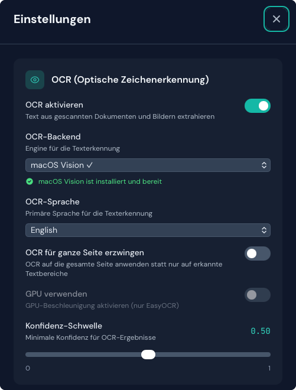
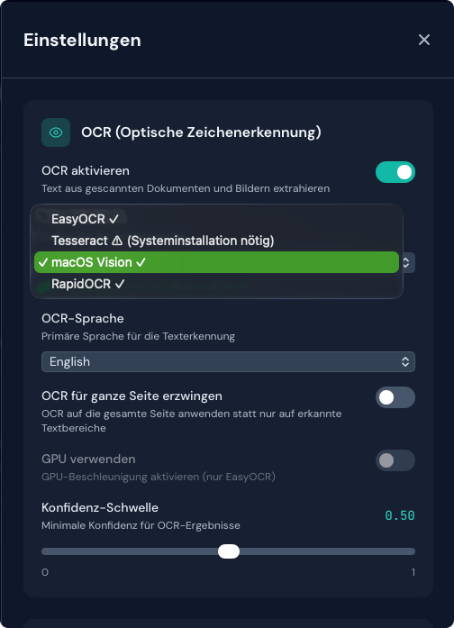

# Screenshot-Galerie

Diese Seite führt visuell durch die Duckling-Oberfläche. Alle Screenshots sind im Dunkelmodus aufgenommen.

!!! note "Hinweis zu Screenshots"
    Einige Screenshots können Platzhalter zeigen. Anleitung zum Nachziehen finden Sie im [Screenshot-Leitfaden](../../assets/screenshots/SCREENSHOT_GUIDE.md).

## Hauptoberfläche

### Ablagezone

Hauptbereich zum Ziehen und Ablegen von Dokumenten für die Konvertierung.

=== "Leerer Zustand"

    <figure markdown="span">
      { loading=lazy }
      <figcaption>Bereit zum Empfang von Dateien</figcaption>
    </figure>

=== "Ziehen (Hover)"

    <figure markdown="span">
      { loading=lazy }
      <figcaption>Visuelles Feedback beim Ziehen von Dateien</figcaption>
    </figure>

=== "Wird hochgeladen"

    <figure markdown="span">
      { loading=lazy }
      <figcaption>Fortschrittsanzeige beim Hochladen</figcaption>
    </figure>

=== "Mehrere Dateien"

    <figure markdown="span">
      { loading=lazy }
      <figcaption>Mehrere Dateien für den Upload ausgewählt</figcaption>
    </figure>

### Kopfzeile

<figure markdown="span">
  { loading=lazy }
  <figcaption>Kopfzeile mit Einstellungen und Sprachwahl</figcaption>
</figure>

### Verlaufsbereich

=== "Verlaufsliste"

    <figure markdown="span">
      { loading=lazy }
      <figcaption>Liste früherer Konvertierungen</figcaption>
    </figure>

=== "Suche"

    <figure markdown="span">
      { loading=lazy }
      <figcaption>Konvertierungsverlauf durchsuchen</figcaption>
    </figure>

---

## Einstellungen

### OCR-Einstellungen

=== "Übersicht"

    <figure markdown="span">
      { loading=lazy }
      <figcaption>OCR-Konfiguration</figcaption>
    </figure>

=== "Backend installieren"

    <figure markdown="span">
      { loading=lazy }
      <figcaption>Ein-Klick-Installation des Backends</figcaption>
    </figure>

=== "Hinweis zu Tesseract"

    <figure markdown="span">
      { loading=lazy }
      <figcaption>Anleitung zur manuellen Installation von Tesseract</figcaption>
    </figure>

### Tabelleneinstellungen

<figure markdown="span">
  { loading=lazy }
  <figcaption>Konfiguration der Tabellenextraktion</figcaption>
</figure>

### Bildeinstellungen

<figure markdown="span">
  { loading=lazy }
  <figcaption>Optionen zur Bildextraktion</figcaption>
</figure>

### Anreicherung

=== "Alle Optionen"

    <figure markdown="span">
      { loading=lazy }
      <figcaption>Dokumentanreicherung: Code, Formeln, Bildklassifizierung und Beschreibung</figcaption>
    </figure>

=== "Warnmeldung"

    <figure markdown="span">
      { loading=lazy }
      <figcaption>Warnung bei aktivierten, langsamen Anreicherungsfunktionen</figcaption>
    </figure>

### Leistung

<figure markdown="span">
  { loading=lazy }
  <figcaption>Verarbeitungsleistung konfigurieren</figcaption>
</figure>

### Chunking

<figure markdown="span">
  { loading=lazy }
  <figcaption>RAG-Chunking konfigurieren</figcaption>
</figure>

### Ausgabe

<figure markdown="span">
  { loading=lazy }
  <figcaption>Standard-Ausgabeformat wählen</figcaption>
</figure>

---

## Export

### Formatauswahl

=== "Alle Formate"

    <figure markdown="span">
      { loading=lazy }
      <figcaption>Verfügbare Exportformate</figcaption>
    </figure>

=== "Ausgewähltes Format"

    <figure markdown="span">
      { loading=lazy }
      <figcaption>Ausgewähltes Format mit Häkchen</figcaption>
    </figure>

### Vorschaumodi

=== "Gerendert/Roh umschalten"

    <figure markdown="span">
      { loading=lazy }
      <figcaption>Zwischen gerenderten und Rohansichten wechseln</figcaption>
    </figure>

=== "Markdown gerendert"

    <figure markdown="span">
      { loading=lazy }
      <figcaption>Gerendertes Markdown mit Formatierung</figcaption>
    </figure>

=== "Markdown Roh"

    <figure markdown="span">
      { loading=lazy }
      <figcaption>Markdown-Quelltext</figcaption>
    </figure>

=== "HTML gerendert"

    <figure markdown="span">
      { loading=lazy }
      <figcaption>Gerendertes HTML mit Styling</figcaption>
    </figure>

=== "HTML Roh"

    <figure markdown="span">
      { loading=lazy }
      <figcaption>HTML-Quellcode</figcaption>
    </figure>

=== "JSON"

    <figure markdown="span">
      { loading=lazy }
      <figcaption>Formatiertes JSON (Pretty-Print)</figcaption>
    </figure>

---

## Funktionen in der Praxis

### Konvertierungsstatus

=== "In Bearbeitung"

    <figure markdown="span">
      { loading=lazy }
      <figcaption>Dokument wird verarbeitet</figcaption>
    </figure>

=== "Abgeschlossen"

    <figure markdown="span">
      { loading=lazy }
      <figcaption>Erfolgreiche Konvertierung mit Statistik</figcaption>
    </figure>

=== "Konfidenzwert"

    <figure markdown="span">
      { loading=lazy }
      <figcaption>OCR-Konfidenz in Prozent</figcaption>
    </figure>

### Bildergalerie

=== "Miniaturraster"

    <figure markdown="span">
      { loading=lazy }
      <figcaption>Extrahierte Bilder als Miniaturen</figcaption>
    </figure>

=== "Aktionen bei Hover"

    <figure markdown="span">
      { loading=lazy }
      <figcaption>Anzeigen- und Herunterladen-Buttons beim Darüberfahren</figcaption>
    </figure>

=== "Lightbox"

    <figure markdown="span">
      { loading=lazy }
      <figcaption>Vollbildanzeige mit Navigation</figcaption>
    </figure>

### Tabellen

=== "Tabellenliste"

    <figure markdown="span">
      { loading=lazy }
      <figcaption>Extrahierte Tabellen mit Vorschau</figcaption>
    </figure>

=== "Download-Optionen"

    <figure markdown="span">
      { loading=lazy }
      <figcaption>Export als CSV und Bild</figcaption>
    </figure>

### RAG-Chunks

<figure markdown="span">
  { loading=lazy }
  <figcaption>Dokument-Chunks mit Metadaten</figcaption>
</figure>
