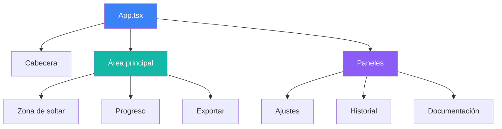
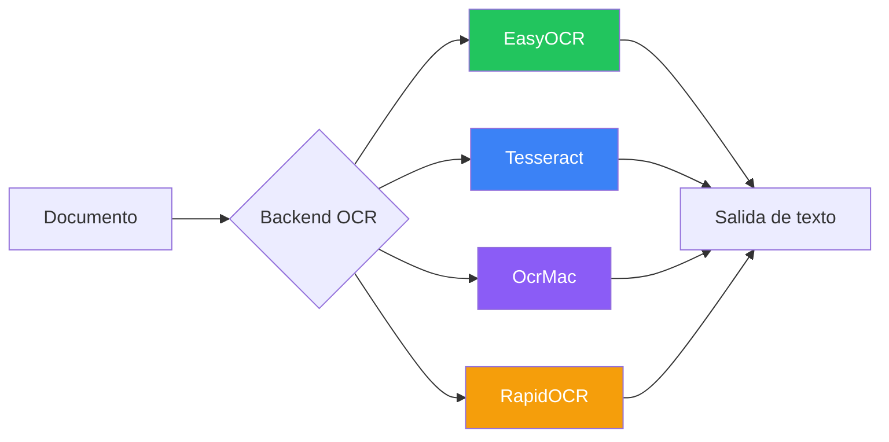
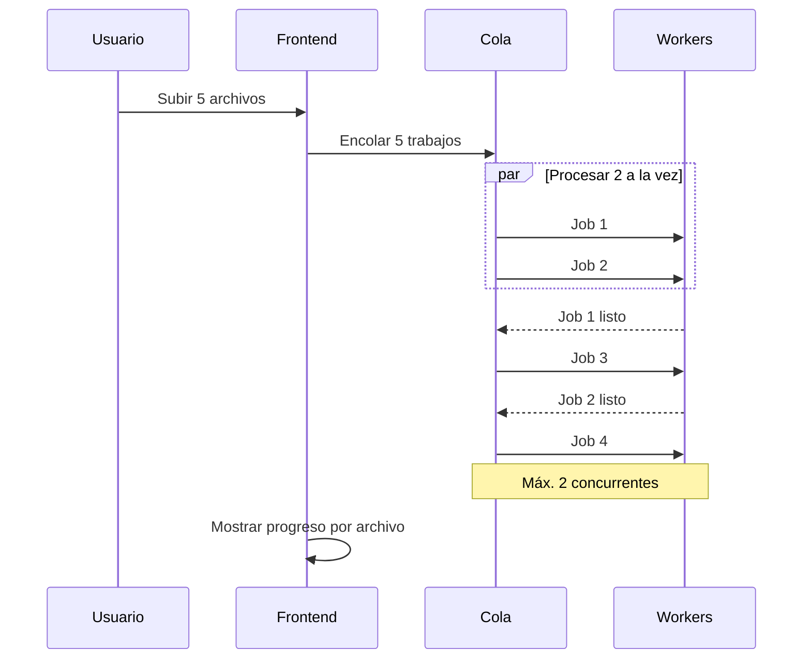

# Componentes

Documentación detallada de los componentes de Duckling.

## Arquitectura del frontend

### Pila tecnológica

- **React 18** – Framework de UI con componentes funcionales y hooks
- **TypeScript** – JavaScript con tipos
- **Tailwind CSS** – Framework CSS utility-first
- **Framer Motion** – Biblioteca de animaciones
- **React Query** – Gestión del estado del servidor
- **Axios** – Cliente HTTP
- **Vite** – Herramienta de compilación y servidor de desarrollo

### Estructura de componentes



### Archivos de componentes

| Ruta | Descripción |
|------|-------------|
| `src/App.tsx` | Componente principal de la aplicación |
| `src/main.tsx` | Punto de entrada de la aplicación |
| `src/index.css` | Estilos globales |
| `src/components/DropZone.tsx` | Subida de archivos con arrastrar y soltar |
| `src/components/ConversionProgress.tsx` | Visualización del progreso |
| `src/components/ExportOptions.tsx` | Descarga y vista previa de resultados |
| `src/components/SettingsPanel.tsx` | Panel de configuración |
| `src/components/HistoryPanel.tsx` | Historial de conversiones |
| `src/components/DocsPanel.tsx` | Visor de documentación |
| `src/hooks/useConversion.ts` | Estado y acciones de conversión |
| `src/hooks/useSettings.ts` | Gestión del estado de ajustes |
| `src/services/api.ts` | Funciones del cliente API |
| `src/types/index.ts` | Interfaces TypeScript |

### Gestión de estado

La aplicación combina:

1. **Estado local** – Estado a nivel de componente con `useState`
2. **React Query** – Caché y sincronización del estado del servidor
3. **Hooks personalizados** – Lógica de negocio encapsulada

### Hooks clave

#### `useConversion`

Gestiona el flujo de conversión de documentos:

- Subida de archivos (individual y por lotes)
- Sondeo de estado
- Obtención de resultados
- Manejo de descargas

#### `useSettings`

Gestiona los ajustes de la aplicación:

- Ajustes OCR, tablas, imágenes, rendimiento y fragmentación
- Persistencia de ajustes vía API
- Validación de ajustes

---

## Arquitectura del backend

### Pila tecnológica

- **Flask** – Framework web
- **SQLAlchemy** – ORM para operaciones de base de datos
- **SQLite** – Base de datos embebida para el historial
- **Docling** – Motor de conversión de documentos
- **Threading** – Procesamiento asíncrono de trabajos

### Estructura de módulos

| Ruta | Descripción |
|------|-------------|
| `backend/duckling.py` | Fábrica de aplicación Flask |
| `backend/config.py` | Configuración y valores por defecto |
| `backend/models/database.py` | Modelos SQLAlchemy |
| `backend/routes/convert.py` | Endpoints de conversión |
| `backend/routes/settings.py` | Endpoints de ajustes |
| `backend/routes/history.py` | Endpoints de historial |
| `backend/services/converter.py` | Integración con Docling |
| `backend/services/file_manager.py` | Operaciones con archivos |
| `backend/services/history.py` | CRUD del historial |
| `backend/tests/` | Suite de pruebas |

### Servicios

#### ConverterService

Gestiona la conversión de documentos con Docling:

```python
class ConverterService:
    def convert(self, file_path: str, settings: dict) -> ConversionResult:
        """Convertir un documento con los ajustes indicados."""
        pass

    def get_status(self, job_id: str) -> JobStatus:
        """Obtener el estado de un trabajo de conversión."""
        pass
```

#### FileManager

Gestiona subidas y salidas:

```python
class FileManager:
    def save_upload(self, file) -> str:
        """Guardar el archivo subido y devolver la ruta."""
        pass

    def get_output_path(self, job_id: str) -> str:
        """Obtener el directorio de salida de un trabajo."""
        pass
```

#### HistoryService

Operaciones CRUD del historial de conversiones:

```python
class HistoryService:
    def create(self, job_id: str, filename: str) -> Conversion:
        """Crear una nueva entrada de historial."""
        pass

    def update(self, job_id: str, **kwargs) -> Conversion:
        """Actualizar una entrada existente."""
        pass

    def get_stats(self) -> dict:
        """Obtener estadísticas de conversión."""
        pass
```

---

## Integración OCR

Docling admite varios backends OCR:



| Backend | Descripción | Soporte GPU |
|---------|-------------|-------------|
| **EasyOCR** | Uso general, multilingüe | Sí |
| **Tesseract** | Motor OCR clásico | No |
| **OcrMac** | Framework Vision de macOS | No |
| **RapidOCR** | Rápido, basado en ONNX | No |

El backend recurre automáticamente al procesamiento sin OCR si falla la inicialización OCR.

---

## Procesamiento por lotes



| Paso | Descripción |
|------|-------------|
| 1 | El frontend envía POST /convert/batch con varios archivos |
| 2 | El backend guarda cada archivo, crea trabajos y los encola todos |
| 3 | El backend responde 202 con un array de job IDs |
| 4 | El frontend sondea el estado de cada trabajo en paralelo |
| 5 | El backend procesa como máximo 2 trabajos a la vez; el resto espera |
| 6 | El frontend muestra el progreso por archivo |
