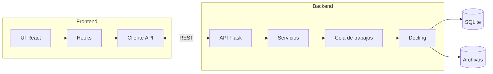
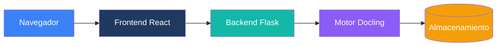
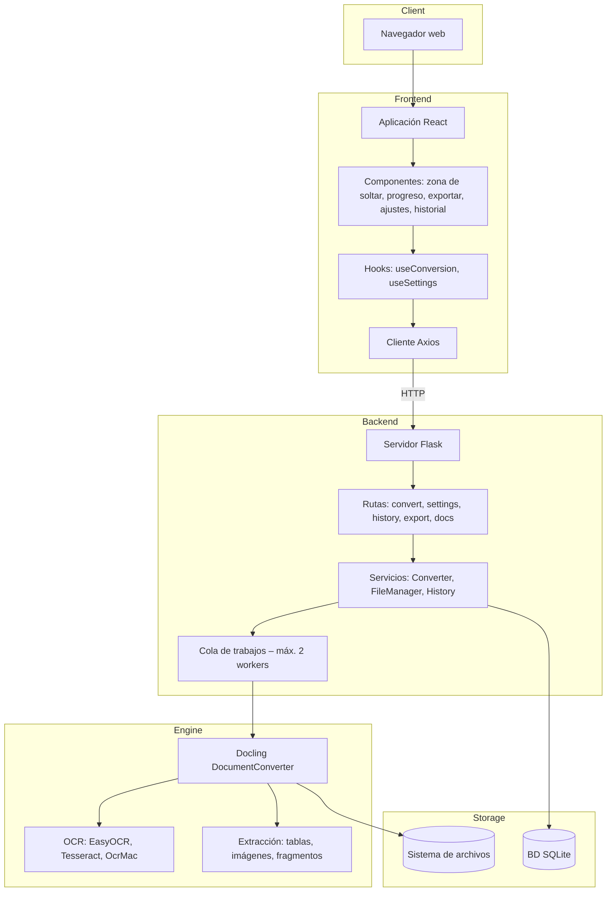
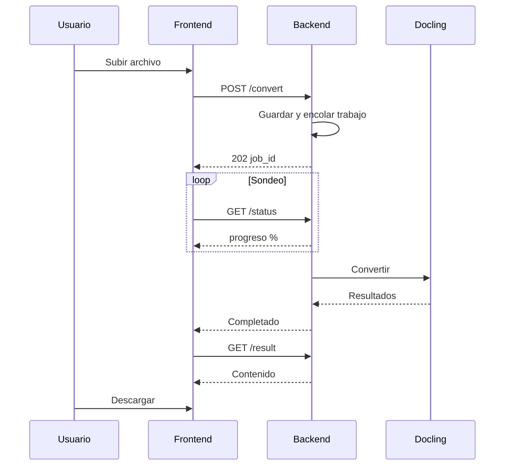
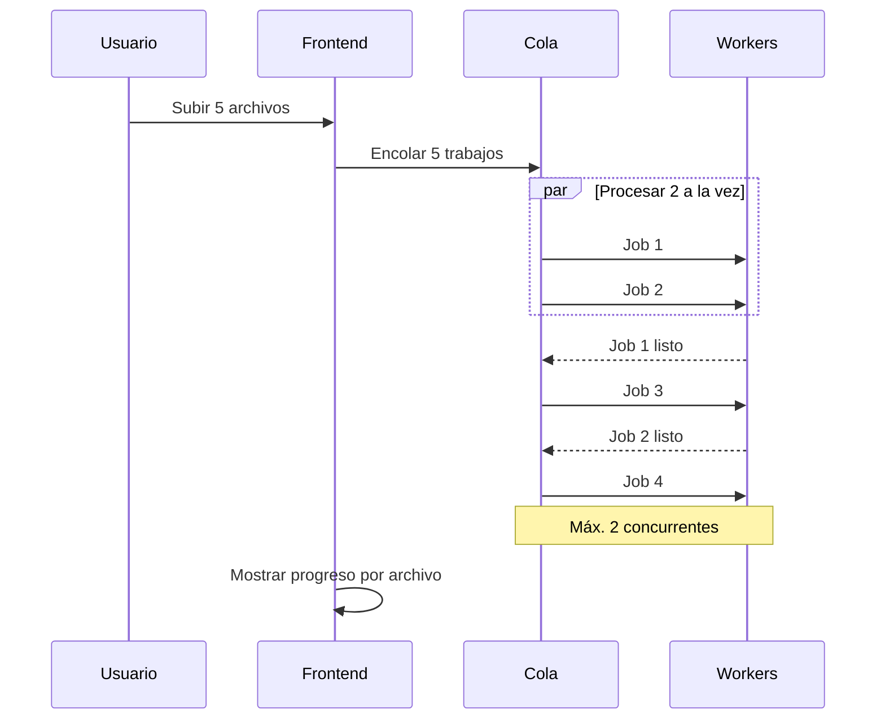
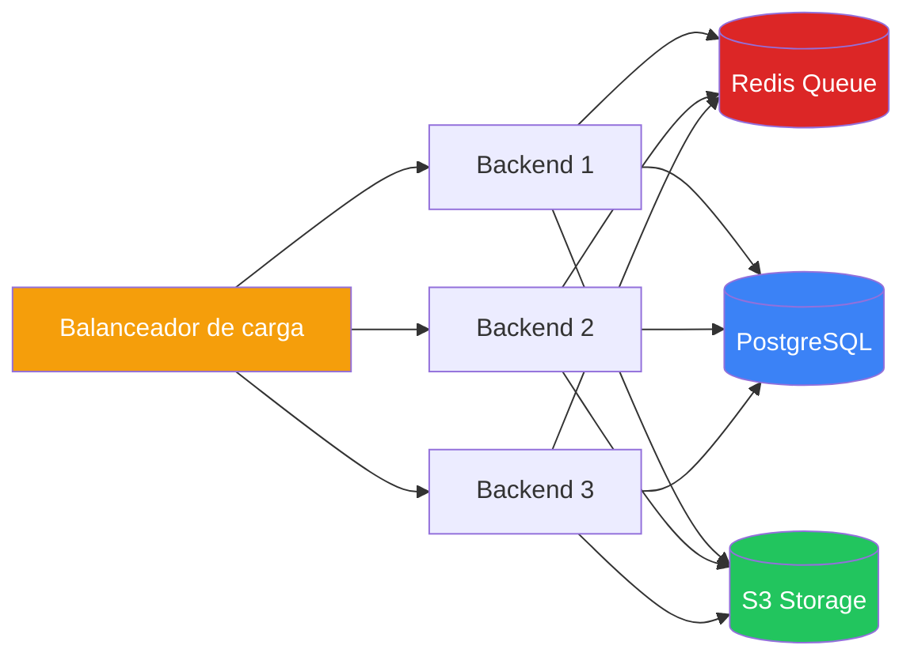
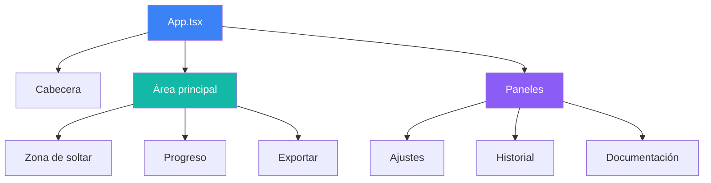
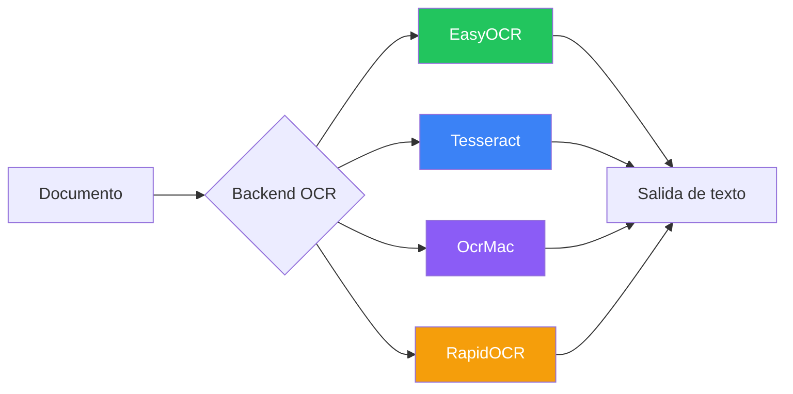

# Diagramas de arquitectura

Diagramas visuales de la arquitectura de Duckling.

## Visión general de la arquitectura del sistema

---

## Arquitectura simple

---

## Vista detallada por capas

---

## Flujo de conversión

---

## Procesamiento por lotes

---

## Arquitectura de escalado

Para despliegues en producción con mucho tráfico:

---

## Árbol de componentes

---

## Opciones OCR

---

## Imágenes estáticas de diagramas

Si el entorno no admite el renderizado de Mermaid, hay imágenes estáticas:

- [Arquitectura del sistema](../arch.png)
- [Vista detallada por capas](../Detailed-Layer-View.png)
- [Canal de conversión](../ConversionPipeline.png)
- [Procesamiento por lotes](../BatchProcessing.png)
- [Arquitectura de escalado](../ScalingArchitecture.png)
- [Árbol de componentes](../ComponentTree.png)
- [Opciones OCR](../OCR.png)
