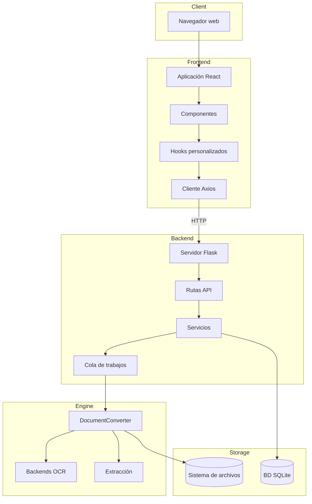
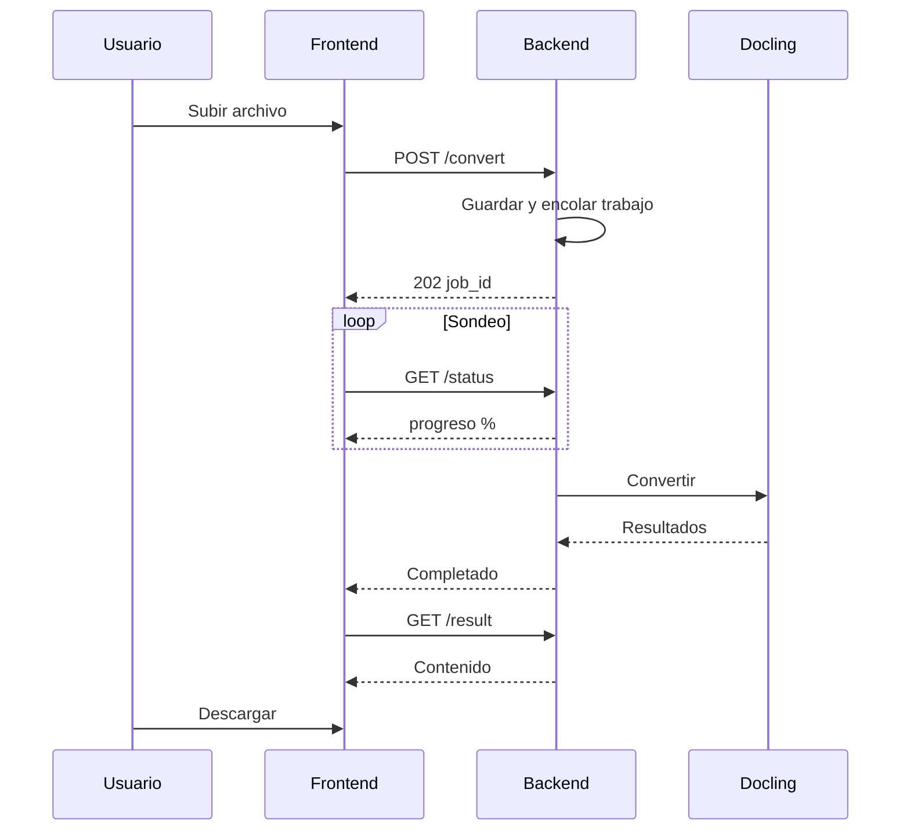

# Visión general del sistema

Arquitectura y flujo de datos de Duckling a alto nivel.

## Diagrama de arquitectura


## Vista detallada por capas



## Flujo de datos

### Flujo de conversión de documentos



### Canal de conversión

| Paso | Descripción |
|------|-------------|
| 1 | **Solicitud de subida** – Archivo recibido vía POST |
| 2 | **Validación y almacenamiento** – Comprobar extensión, guardar en uploads/ |
| 3 | **Creación del trabajo** – UUID asignado, entrada creada |
| 4 | **Encolado para procesamiento** – Añadido a la cola de trabajos |
| 5 | **El hilo worker toma el trabajo** – Cuando hay capacidad |
| 6 | **DocumentConverter inicializado** – Con ajustes OCR, tablas e imágenes |
| 7 | **Conversión del documento** – Extraer imágenes, tablas y fragmentos |
| 8 | **Exportar a formatos** – MD, HTML, JSON, TXT, DocTags, Tokens |
| 9 | **Actualizar estado e historial** – Marcar como completado, guardar metadatos |
| 10 | **Resultados disponibles** – Listos para descargar |

**Subida de carpeta (UI):** El navegador expande un directorio elegido o arrastrado a una lista de archivos; el frontend filtra por extensión y tamaño permitidos y envía los archivos admitidos como `POST /api/convert/batch` con partes `files` repetidas (igual que el lote multiarchivo). El backend rechaza las partes no admitidas de forma individual; si ninguna parte puede convertirse, la API responde **400**.

## Cola de trabajos

Para evitar el agotamiento de memoria al procesar varios documentos:

```python
class ConverterService:
    _job_queue: Queue       # Pending jobs
    _worker_thread: Thread  # Background processor
    _max_concurrent_jobs = 2  # Limit parallel processing
```

El hilo worker:

1. Supervisa la cola de trabajos
2. Inicia hilos de conversión hasta el límite de concurrencia
3. Rastrea los hilos activos y limpia los completados
4. Evita el agotamiento de recursos durante el procesamiento por lotes

## Esquema de base de datos

### Tabla de conversión

| Columna | Tipo | Descripción |
|--------|------|-------------|
| `id` | VARCHAR(36) | Clave primaria (UUID) |
| `filename` | VARCHAR(255) | Nombre de archivo saneado |
| `original_filename` | VARCHAR(255) | Nombre original de la subida |
| `input_format` | VARCHAR(50) | Formato detectado |
| `status` | VARCHAR(50) | pending/processing/completed/failed |
| `confidence` | FLOAT | Puntuación de confianza OCR |
| `error_message` | TEXT | Detalles del error si falló |
| `output_path` | VARCHAR(500) | Ruta a los archivos de salida |
| `settings` | TEXT | Ajustes JSON utilizados |
| `file_size` | FLOAT | Tamaño del archivo en bytes |
| `created_at` | DATETIME | Marca de tiempo de la subida |
| `completed_at` | DATETIME | Marca de tiempo de finalización |

## Consideraciones de seguridad

| Riesgo | Mitigación |
|---------|------------|
| **Subida de archivos** | Solo extensiones permitidas |
| **Tamaño de archivo** | Máximo configurable (predeterminado 100MB) |
| **Nombres de archivo** | Saneados antes del almacenamiento |
| **Acceso a archivos** | Servidos solo por la API, sin rutas directas |
| **CORS** | Restringido al origen del frontend |

## Optimizaciones de rendimiento

| Optimización | Descripción |
|--------------|-------------|
| **Caché del convertidor** | Instancias de DocumentConverter en caché por hash de ajustes |
| **Cola de trabajos** | El procesamiento secuencial evita el agotamiento de memoria |
| **Carga diferida** | Componentes pesados bajo demanda |
| **Caché de React Query** | Respuestas de API en caché y deduplicadas |
| **Procesamiento en segundo plano** | Las conversiones no bloquean la API |
