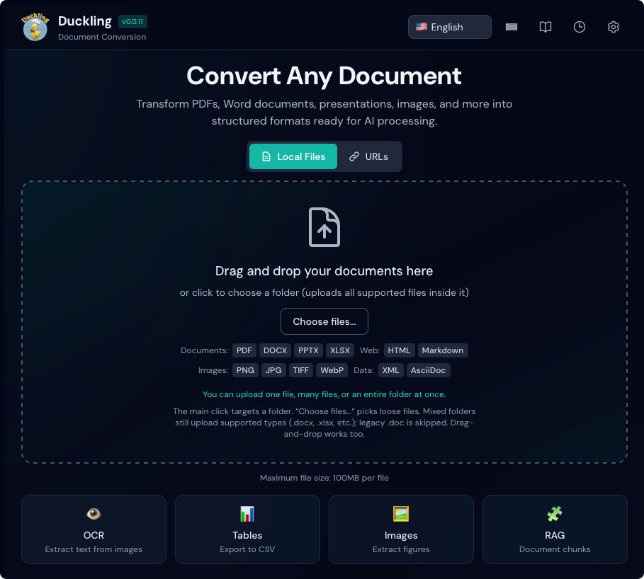
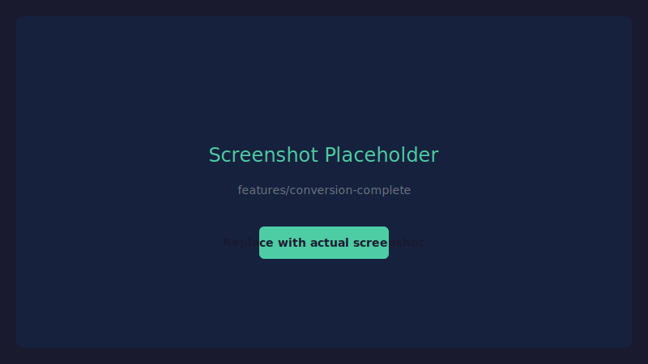

# Inicio rápido

Comienza con Duckling en 5 minutos.

## Iniciar la aplicación

Elige tu método preferido:

=== "Docker (recomendado)"

    ¡La forma más rápida de empezar - sin dependencias que instalar!

    **Opción 1: Imágenes preconstruidas (más rápido)**
    ```bash
    # Download the compose file
    curl -O https://raw.githubusercontent.com/davidgs/duckling/main/docker-compose.prebuilt.yml

    # Start Duckling
    docker-compose -f docker-compose.prebuilt.yml up -d
    ```

    **Opción 2: Construir localmente**
    ```bash
    # Clone and start
    git clone https://github.com/davidgs/duckling.git
    cd duckling
    docker-compose up --build
    ```

    La interfaz estará disponible en `http://localhost:3000`

    !!! tip "Primera ejecución"
        El primer inicio puede tardar unos minutos mientras Docker descarga/construye las imágenes.

=== "Configuración manual"

    ### Terminal 1: Backend

    ```bash
    cd backend
    source venv/bin/activate  # Windows: venv\Scripts\activate
    python duckling.py
    ```

    La API estará disponible en `http://localhost:5001`

    ### Terminal 2: Frontend

    ```bash
    cd frontend
    npm run dev
    ```

    La interfaz estará disponible en `http://localhost:3000`

## Tu primera conversión

### 1. Abrir la aplicación

Navega a `http://localhost:3000` en tu navegador.

<figure markdown="span">
  { loading=lazy }
  <figcaption>La interfaz principal de Duckling</figcaption>
</figure>

### 2. Subir un documento

Arrastra y suelta un PDF, documento Word o imagen en la zona de soltar, o haz clic para explorar.

<figure markdown="span">
  { loading=lazy }
  <figcaption>Indicador de progreso de carga</figcaption>
</figure>

### 3. Ver el progreso

El progreso de conversión se mostrará en tiempo real.

<figure markdown="span">
  { loading=lazy }
  <figcaption>Progreso de conversión en tiempo real</figcaption>
</figure>

### 4. Descargar resultados

Una vez completado, elige tu formato de exportación:

<figure markdown="span">
  { loading=lazy }
  <figcaption>Conversión completa con opciones de exportación</figcaption>
</figure>

- **Markdown** - Ideal para documentación
- **HTML** - Salida lista para web
- **JSON** - Estructura completa del documento
- **Texto plano** - Extracción de texto simple

## Configuración básica

Haz clic en :material-cog: **Configuración** botón para configurar:

### Configuración OCR

| Configuración | Predeterminado | Descripción |
|---------|---------|-------------|
| Habilitado | `true` | Habilitar OCR para documentos escaneados |
| Backend | `easyocr` | Motor OCR a utilizar |
| Idioma | `en` | Idioma principal |

### Configuración de tablas

| Configuración | Predeterminado | Descripción |
|---------|---------|-------------|
| Habilitado | `true` | Extraer tablas de documentos |
| Modo | `preciso` | Nivel de precisión de detección |

### Configuración de imágenes

| Configuración | Predeterminado | Descripción |
|---------|---------|-------------|
| Extraer | `true` | Extraer imágenes incrustadas |
| Escala | `1.0` | Escala de salida de imagen |

## Varios archivos a la vez

Para convertir varios archivos a la vez:

1. Arrastra varios archivos a la zona, elige una carpeta o usa **Elegir archivos…**
2. Los archivos se procesarán según la cola de trabajos (ver Características para el paralelismo)

<figure markdown="span">
  { loading=lazy }
  <figcaption>Varios archivos seleccionados para subir</figcaption>
</figure>

!!! tip "Rendimiento"
    El procesamiento por lotes usa una cola de trabajos con un máximo de 2 conversiones simultáneas para evitar el agotamiento de memoria.

## Usar la API

Para acceso programático, usa la API REST:

```bash
# Upload and convert a document
curl -X POST http://localhost:5001/api/convert \
  -F "file=@document.pdf"

# Response
{
  "job_id": "550e8400-e29b-41d4-a716-446655440000",
  "status": "processing"
}
```

Consulta la [Referencia de la API](../api/index.md) para documentación completa.

## Próximos pasos

- [Características](../user-guide/features.md) - Explorar todas las capacidades
- [Configuración](../user-guide/configuration.md) - Configuración avanzada
- [Referencia de la API](../api/index.md) - Integrar con tus aplicaciones

