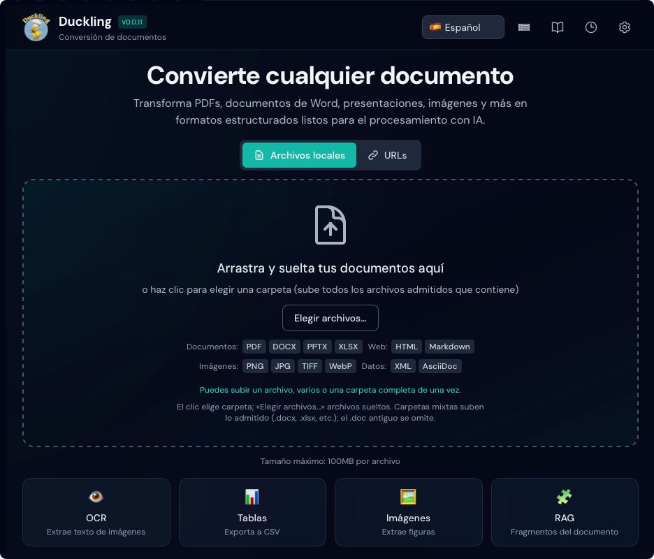
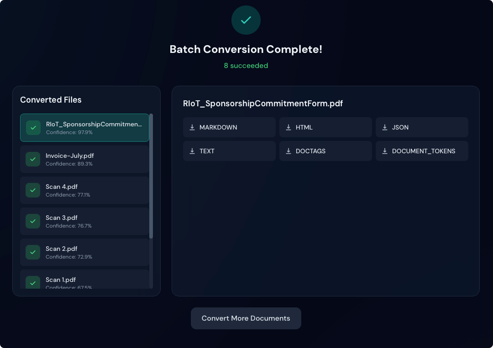

# Inicio rápido

Póngase en marcha con Duckling en 5 minutos.

## Iniciar la aplicación

Elija su método preferido:

=== "Docker (recomendado)"

    La forma más rápida de empezar: ¡no hay dependencias que instalar!

    **Opción 1: Imágenes precompiladas (la más rápida)**
    ```bash
    # Descargar el archivo compose
    curl -O https://raw.githubusercontent.com/duckling-ui/duckling/main/docker-compose.prebuilt.yml

    # Iniciar Duckling
    docker-compose -f docker-compose.prebuilt.yml up -d
    ```

    **Opción 2: Compilar localmente**
    ```bash
    # Clonar el repositorio e iniciar
    git clone https://github.com/duckling-ui/duckling.git
    cd duckling
    docker-compose up --build
    ```

    La interfaz estará disponible en `http://localhost:3000`

    !!! tip "Primera ejecución"
        El primer arranque puede tardar unos minutos mientras Docker descarga o construye las imágenes.

=== "Configuración manual"

    ### Terminal 1: Backend

    ```bash
    cd backend
    source venv/bin/activate  # Windows: venv\Scripts\activate
    python duckling.py
    ```

    La API estará disponible en `http://localhost:5001`

    ### Terminal 2: Frontend

    ```bash
    cd frontend
    npm run dev
    ```

    La interfaz estará disponible en `http://localhost:3000`

## Su primera conversión

### 1. Abrir la aplicación

Abra `http://localhost:3000` en el navegador.

<figure markdown="span">
  { loading=lazy }
  <figcaption>La interfaz principal de Duckling</figcaption>
</figure>

### 2. Subir un documento

Arrastre y suelte un PDF, un documento Word o una imagen en la zona de depósito, o haga clic para examinar.

### 3. Ver el progreso

El progreso de la conversión se muestra en tiempo real.

### 4. Descargar resultados

Cuando termine, elija el formato de exportación:

<figure markdown="span">
  { loading=lazy }
  <figcaption>Conversión completada con opciones de exportación</figcaption>
</figure>

- **Markdown** – Ideal para documentación
- **HTML** – Salida lista para la web
- **JSON** – Estructura completa del documento
- **Texto plano** – Extracción de texto sencilla

## Configuración básica

Pulse el botón :material-cog: **Ajustes** para configurar:

### Ajustes de OCR

| Ajuste | Predeterminado | Descripción |
|--------|----------------|-------------|
| Activado | `true` | Activar OCR para documentos escaneados |
| Motor | `easyocr` | Motor OCR a usar |
| Idioma | `en` | Idioma principal |

### Ajustes de tablas

| Ajuste | Predeterminado | Descripción |
|--------|----------------|-------------|
| Activado | `true` | Extraer tablas de los documentos |
| Modo | `accurate` | Nivel de precisión de detección |

### Ajustes de imágenes

| Ajuste | Predeterminado | Descripción |
|--------|----------------|-------------|
| Extraer | `true` | Extraer imágenes incrustadas |
| Escala | `1.0` | Escala de salida de imágenes |

## Procesamiento por lotes

Para convertir varios archivos a la vez:

1. **Arrastre y suelte** varios archivos **o una carpeta entera** en la zona de depósito. El navegador expande una carpeta en sus archivos; Duckling encola cada documento admitido (los tipos no admitidos se omiten).
2. **Haga clic** en la zona de depósito para abrir un selector de **carpeta** y subir de una vez todos los archivos admitidos dentro de esa carpeta.
3. Use **Elegir archivos…** cuando quiera seleccionar **solo archivos** (no el modo carpeta).

Todos los archivos en cola se procesan según la cola de trabajos (consulte [Funciones](../user-guide/features.md) para los límites de concurrencia).

!!! tip "Rendimiento"
    El procesamiento por lotes usa una cola de trabajos con un máximo de 2 conversiones simultáneas para evitar agotar la memoria.

## Usar la API

Para acceso programático, use la API REST:

```bash
# Subir y convertir un documento
curl -X POST http://localhost:5001/api/convert \
  -F "file=@document.pdf"

# Respuesta
{
  "job_id": "550e8400-e29b-41d4-a716-446655440000",
  "status": "processing"
}
```

Consulte la [referencia de la API](../api/index.md) para la documentación completa.

## Próximos pasos

- [Funciones](../user-guide/features.md) – Explorar todas las capacidades
- [Configuración](../user-guide/configuration.md) – Ajustes avanzados
- [Referencia de la API](../api/index.md) – Integrar con sus aplicaciones

