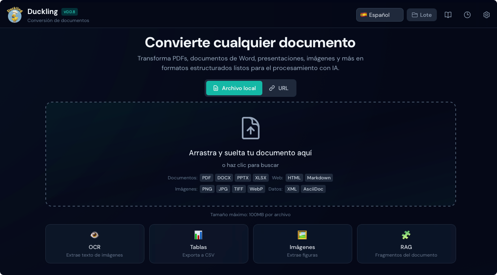
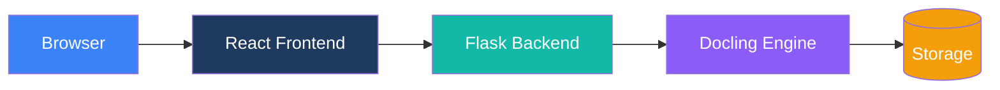

# Duckling

Una interfaz gráfica moderna y fácil de usar para [Docling](https://github.com/docling-project/docling) - la potente biblioteca de conversión de documentos de IBM.



## Resumen

Duckling proporciona una interfaz web intuitiva para convertir documentos usando la biblioteca Docling de IBM. Ya sea que necesites extraer texto de PDFs, convertir documentos Word a Markdown o realizar OCR en imágenes escaneadas, Duckling lo hace sencillo.

## Características principales

<div class="grid cards" markdown>

-   :material-cursor-move:{ .lg .middle } __Carga por arrastrar y soltar__

    ---

    Simplemente arrastra tus documentos a la interfaz para procesamiento instantáneo

-   :material-file-multiple:{ .lg .middle } __Procesamiento por lotes__

    ---

    Convierte múltiples archivos a la vez con procesamiento paralelo

-   :material-format-list-bulleted:{ .lg .middle } __Soporte multi-formato__

    ---

    PDFs, documentos Word, PowerPoints, archivos Excel, HTML, Markdown, imágenes y más

-   :material-export:{ .lg .middle } __Múltiples formatos de exportación__

    ---

    Exporta a Markdown, HTML, JSON, DocTags, Document Tokens, RAG Chunks o texto plano

-   :material-image-multiple:{ .lg .middle } __Extracción de imágenes y tablas__

    ---

    Extrae imágenes y tablas incrustadas con exportación CSV

-   :material-puzzle:{ .lg .middle } __Fragmentación lista para RAG__

    ---

    Genera fragmentos de documentos optimizados para aplicaciones RAG

-   :material-eye:{ .lg .middle } __OCR avanzado__

    ---

    Múltiples backends OCR con soporte de aceleración GPU

-   :material-history:{ .lg .middle } __Historial de conversiones__

    ---

    Accede a documentos previamente convertidos en cualquier momento

-   :material-chart-line:{ .lg .middle } __Estadísticas de conversión__

    ---

    Panel de análisis con rendimiento, uso de almacenamiento y métricas de rendimiento

</div>

## Inicio rápido

Comienza en minutos:

=== "Docker (Recomendado)"

    **Inicio con un comando usando imágenes preconstruidas:**
    ```bash
    curl -O https://raw.githubusercontent.com/davidgs/duckling/main/docker-compose.prebuilt.yml && docker-compose -f docker-compose.prebuilt.yml up -d
    ```

    **O construir localmente:**
    ```bash
    git clone https://github.com/davidgs/duckling.git
    cd duckling
    docker-compose up --build
    ```

=== "Desarrollo local"

    ```bash
    # Clonar el repositorio
    git clone https://github.com/davidgs/duckling.git
    cd duckling

    # Configuración del backend
    cd backend
    python -m venv venv
    source venv/bin/activate
    pip install -r requirements.txt
    python duckling.py

    # Configuración del frontend (nueva terminal)
    cd frontend
    npm install
    npm run dev
    ```

Accede a la aplicación en `http://localhost:3000`

## Formatos soportados

### Formatos de entrada

| Formato | Extensiones | Descripción |
|--------|-------------|-------------|
| PDF | `.pdf` | Formato de documento portátil |
| Word | `.docx` | Documentos de Microsoft Word |
| PowerPoint | `.pptx` | Presentaciones de Microsoft PowerPoint |
| Excel | `.xlsx` | Hojas de cálculo de Microsoft Excel |
| HTML | `.html`, `.htm` | Páginas web |
| Markdown | `.md`, `.markdown` | Archivos Markdown |
| Imágenes | `.png`, `.jpg`, `.jpeg`, `.tiff`, `.gif`, `.webp`, `.bmp` | OCR directo de imágenes |
| AsciiDoc | `.asciidoc`, `.adoc` | Documentación técnica |
| PubMed XML | `.xml` | Artículos científicos |
| USPTO XML | `.xml` | Documentos de patentes |

### Formatos de exportación

| Formato | Extensión | Descripción |
|--------|-----------|-------------|
| Markdown | `.md` | Texto formateado con encabezados, listas, enlaces |
| HTML | `.html` | Formato listo para web con estilos |
| JSON | `.json` | Estructura completa del documento |
| Texto plano | `.txt` | Texto simple sin formato |
| DocTags | `.doctags` | Formato de documento etiquetado |
| Document Tokens | `.tokens.json` | Representación a nivel de tokens |
| RAG Chunks | `.chunks.json` | Fragmentos para aplicaciones RAG |

## Arquitectura



## Documentación

- **[Primeros pasos](getting-started/index.md)** - Guía de instalación e inicio rápido
- **[Guía del usuario](user-guide/index.md)** - Características y opciones de configuración
- **[Documentación Docling](docling/index.md)** - Documentación curada de Docling
- **[Referencia API](api/index.md)** - Documentación completa de la API
- **[Arquitectura](architecture/index.md)** - Diseño del sistema y componentes
- **[Despliegue](deployment/index.md)** - Guía de despliegue en producción
- **[Contribuir](contributing/index.md)** - Cómo contribuir

## Agradecimientos

- [Docling](https://github.com/docling-project/docling) de IBM por el potente motor de conversión de documentos
- [React](https://react.dev/) por el framework frontend
- [Flask](https://flask.palletsprojects.com/) por el framework backend
- [Tailwind CSS](https://tailwindcss.com/) por el estilo
- [Framer Motion](https://www.framer.com/motion/) por las animaciones
