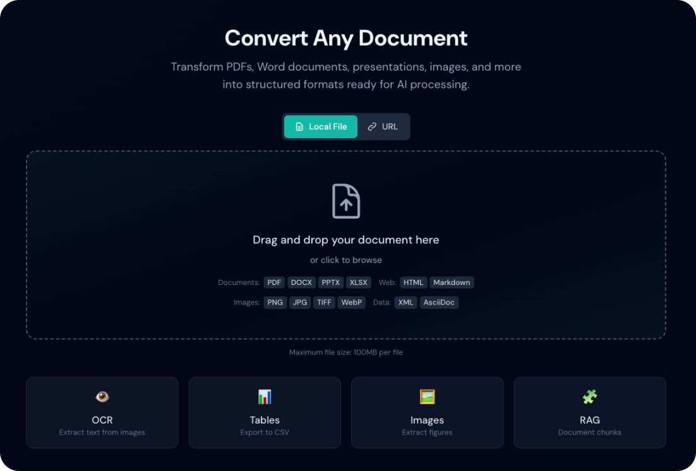
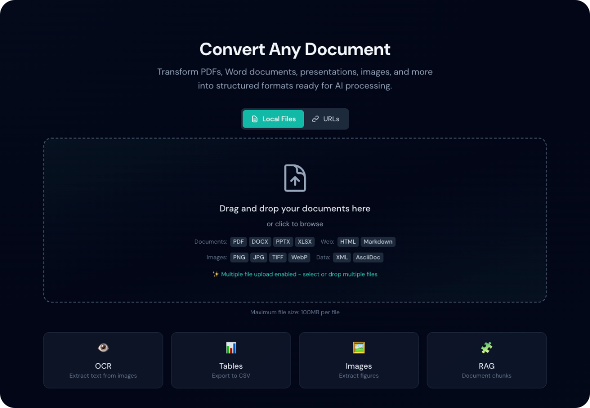
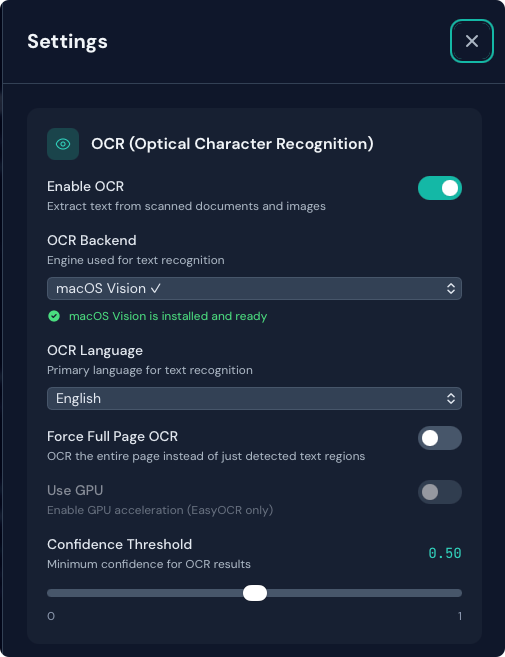
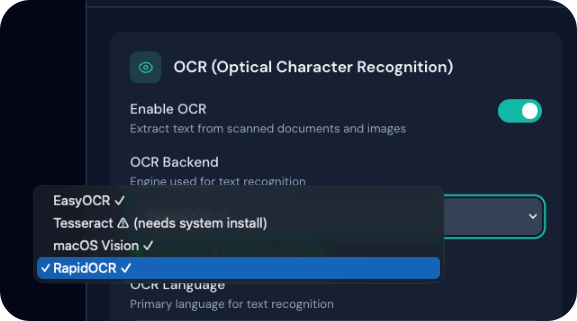
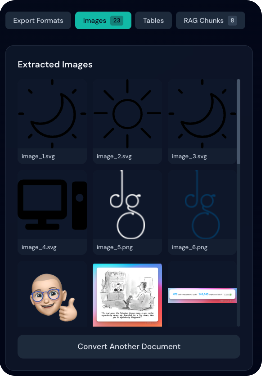
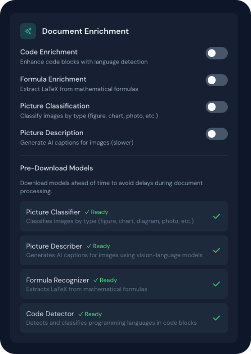
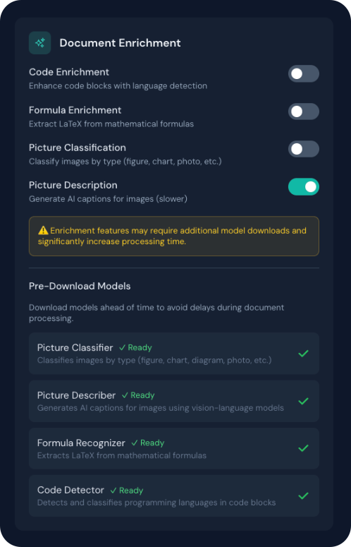
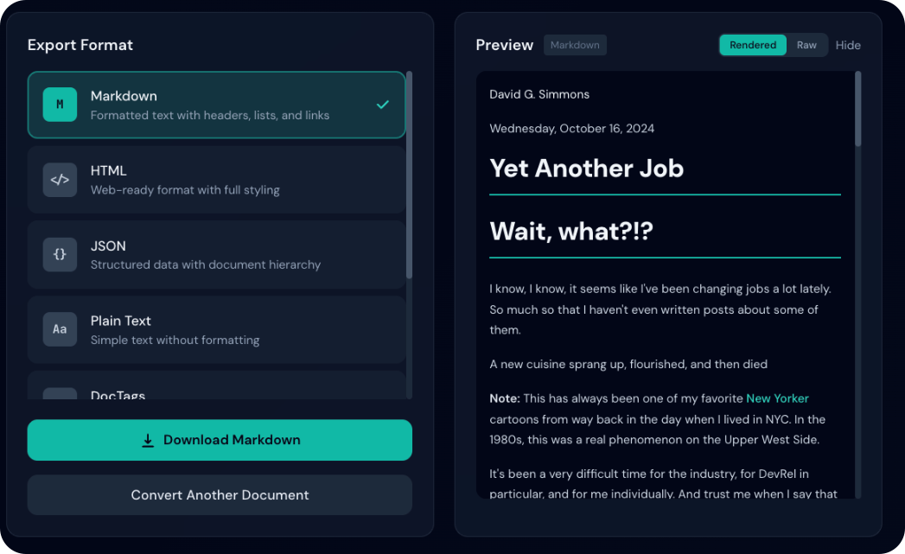
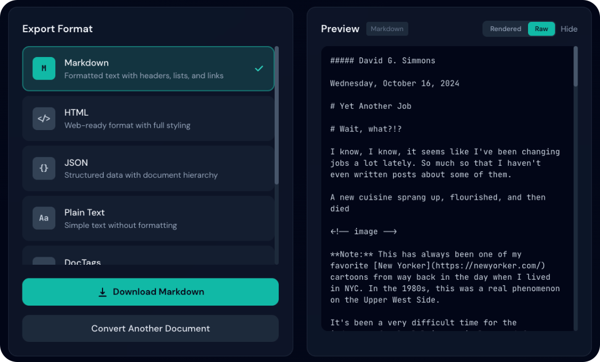
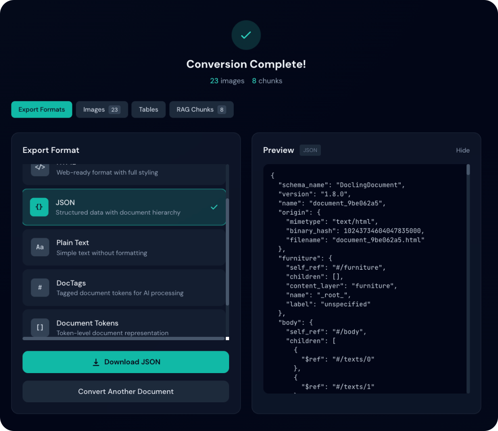

# Características

Duckling provides a comprehensive set of features for document conversion.

## Document Upload

### Drag-y-Drop

Simply drag files onto the drop zone for instant upload. The interface validates file types y shows upload progress.

<figure markdown="span">
  { loading=lazy }
  <figcaption>The dropzone ready to receive files</figcaption>
</figure>

### URL Input

Convert documents directly from URLs without downloading them first:

1. Haz clic en la pestaña **URLs** encima de la zona de soltar
2. Pega una URL por línea (una sola línea convierte un documento; varias líneas inician un lote)
3. Haz clic en **Convert All**
4. Los documentos se descargan y convierten automáticamente

Supported URL features:

- Automatic file type detection from URL path
- Content-Type header detection for files without extensions
- Content-Disposition header support for filename extraction
- Same file type restrictions as local uploads
- **Automatic image extraction for HTML pages**: When converting HTML from URLs, Duckling automatically downloads all images referenced in the page y makes them available in the Image Preview Gallery

!!! tip "HTML Pages with Images"
    When you convert an HTML page (like a blog post or article), Duckling will:

    1. Descargar the HTML content
    2. Find all `` tags y CSS background images
    3. Descargar each image from its source URL
    4. Embed the images as base64 data URIs in the HTML
    5. Save the images separately for preview y download

    This ensures that converted HTML documents include all their images, even when viewed offline.

!!! tip "Direct Links"
    Use direct download links, not web page URLs. For example:

    - ✅ `https://example.com/document.pdf`
    - ✅ `https://example.com/blog/article` (HTML pages work too!)
    - ❌ `https://example.com/view/document` (JavaScript-rendered content may not work)

### Varios archivos y carpetas

Sube y convierte más de un archivo (o una carpeta entera) desde la misma zona de entrega, sin activar un modo aparte:

1. Arrastra archivos, haz clic para elegir carpeta o usa **Elegir archivos…** para archivos sueltos
2. Cambia a la pestaña **URLs** y pega una URL por línea si conviertes desde la web
3. Supervisa el progreso (un solo trabajo usa la vista habitual; varios trabajos muestran el resumen de lote)
4. Descarga los resultados por separado o juntos al terminar un lote

<figure markdown="span">
  { loading=lazy }
  <figcaption>Varios archivos seleccionados para subir</figcaption>
</figure>

#### Varias URLs

El campo de URL es siempre un área de texto multilínea:

1. Cambia a la pestaña **URLs**
2. Pega una URL por línea
3. Haz clic en **Convert All**

!!! info "Concurrent Procesyo"
    The job queue processes up to 2 documents simultaneously to prevent memory exhaustion.

## OCR (Optical Character Recognition)

Extraer text from scanned documents y images.

### Supported Backends

| Backend | Descripción | Soporte GPU | Mejor para |
|---------|-------------|-------------|----------|
| **EasyOCR** | Multi-language, preciso | Yes (CUDA) | Complex documents |
| **Tesseract** | Classic, reliable | No | Simple documents |
| **macOS Vision** | Native Apple OCR | Apple Neural Motor | Mac users |
| **RapidOCR** | Fast, lightweight | No | Speed-critical |

### Automatic Backend Installation

Duckling can automatically install OCR backends when you select them:

1. Open **Configuración** panel
2. Select an OCR backend from the dropdown
3. If the backend is not installed, you'll see an **Install** button
4. Click to automatically install via pip

<figure markdown="span">
  { loading=lazy }
  <figcaption>OCR settings with backend selection</figcaption>
</figure>

!!! note "Installation Requirements"
    - **EasyOCR, OcrMac, RapidOCR**: Can be installed automatically via pip
    - **Tesseract**: Requires system-level installation first:
      - macOS: `brew install tesseract`
      - Ubuntu/Debian: `apt-get install tesseract-ocr`
      - Windows: Descargar from [GitHub releases](https://github.com/UB-Mannheim/tesseract/wiki)

<figure markdown="span">
  { loading=lazy }
  <figcaption>Tesseract requires manual system installation</figcaption>
</figure>

The Configuración panel shows the status of each backend:

- ✓ **Installed y ready** - Backend is available for use
- ⚠ **Not installed** - Click to install (pip-installable backends)
- ℹ **Requires system installation** - Follow manual installation instructions

### Idioma Support

28+ languages including:

- **European**: English, German, French, Spanish, Italian, Portuguese, Dutch, Polish, Russian
- **Asian**: Japanese, Chinese (Simplified/Traditional), Korean, Thai, Vietnamese
- **Middle Eastern**: Arabic, Hebrew, Turkish
- **South Asian**: Hindi

### OCR Options

| Option | Descripción |
|--------|-------------|
| Force Full Page OCR | Process entire page vs detected regions |
| GPU Acceleration | Use CUDA for faster processing (EasyOCR) |
| Confidence Threshold | Minimum confidence for results (0-1) |
| Bitmap Area Threshold | Minimum area ratio for bitmap OCR |

## Table Extraerion

Automatically detect y extract tables from documents.

### Detection Modos

=== "Accurate Modo"

    - Altoer precision detection
    - Better cell boundary recognition
    - Slower processing
    - Recommended for complex tables

=== "Fast Modo"

    - Faster processing
    - Good for simple tables
    - May miss complex structures

### Export Options

- **CSV**: Descargar individual tables as CSV files
- **Image**: Descargar table as PNG image
- **JSON**: Full table structure in API response

## Image Extraerion

Extraer imágenes incrustadas from documents.

### Options

| Option | Descripción |
|--------|-------------|
| Extraer Images | Enable image extraction |
| Classify Images | Tag images (figure, picture, etc.) |
| Generate Page Images | Create images of each page |
| Generate Picture Images | Extraer pictures as files |
| Generate Table Images | Extraer tables as images |
| Image Escala | Output scale factor (0.1x - 4.0x) |

### Image Preview Gallery

After conversion, extracted images are displayed in a visual gallery:

- **Thumbnail Grid**: View all images as thumbnails in a responsive grid
- **Hover Actions**: Quick access to view y download buttons on hover
- **Lightbox Viewer**: Click any image to view full-size in a modal
- **Navigation**: Use arrow buttons to browse through multiple images
- **Descargar**: Descargar individual images directly from the gallery or lightbox

<figure markdown="span">
  { loading=lazy }
  <figcaption>Extraered images displayed as thumbnails</figcaption>
</figure>

<figure markdown="span">
  { loading=lazy }
  <figcaption>Full-size image view with navigation</figcaption>
</figure>

!!! tip "Image Formatos"
    All extracted images are saved as PNG format for maximum compatibility.

## Document Enrichment

Enhance your converted documents with advanced AI-powered features.

### Available Enrichments

| Feature | Descripción | Impact |
|---------|-------------|--------|
| **Code Enrichment** | Detect programming languages y enhance code blocks | Bajo |
| **Formula Enrichment** | Extraer LaTeX from mathematical equations | Medio |
| **Picture Classification** | Classify images (figure, chart, diagram, photo) | Bajo |
| **Picture Descripción** | Generate AI captions for images | Alto |

### Configuración

Enable enrichments in the **Configuración** panel under **Document Enrichment**:

1. Open Configuración (gear icon)
2. Scroll to "Document Enrichment" section
3. Activar desired features on/off
4. Configuración are saved automatically

<figure markdown="span">
  { loading=lazy }
  <figcaption>Document Enrichment settings panel</figcaption>
</figure>

!!! warning "Procesyo Time"
    Enrichment features, especially **Picture Descripción** y **Formula Enrichment**, can significantly increase processing time as they require additional AI model inference. A warning is displayed when these features are enabled.

<figure markdown="span">
  { loading=lazy }
  <figcaption>Warning displayed when slow features are enabled</figcaption>
</figure>

### Code Enrichment

When enabled, code blocks in your documents are enhanced with:

- Automatic programming language detection
- Syntax highlighting metadata
- Improved code structure recognition

### Formula Enrichment

Extraers mathematical formulas y converts them to LaTeX:

- Inline equations: `$E = mc^2$`
- Display equations with proper formatting
- Better rendering in HTML y Markdown exports

### Picture Classification

Automatically tags images with semantic types:

- **Figure**: Diagramas, illustrations, schematics
- **Chart**: Bar charts, line graphs, pie charts
- **Photo**: Photographs, screenshots
- **Logo**: Bry logos, icons
- **Table**: Table images (separate from table extraction)

### Picture Descripción

Uses vision-language AI models to generate descriptive captions:

- Natural language descriptions of image content
- Useful for accessibility (alt text)
- Enhances searchability of documents
- Requires model download on first use

!!! note "Modol Requirements"
    Picture Descripción requires downloading a vision-language model (~1-2GB). This happens automatically on first use but may take several minutes.

### Pre-Descargaring Modols

To avoid delays during document processing, you can pre-download enrichment models:

1. Open **Configuración** panel
2. Scroll to **Document Enrichment** section
3. Find the **Pre-Descargar Modols** area at the bottom
4. Click **Descargar** next to any model you want to pre-download

| Modol | Size | Propósito |
|-------|------|---------|
| Picture Classifier | ~350MB | Image type classification |
| Picture Describer | ~2GB | AI image captions |
| Formula Recognizer | ~500MB | LaTeX extraction |
| Code Detector | ~200MB | Programming language detection |

!!! tip "Descargar Progress"
    A progress bar shows the download status. Modols are cached locally after download, so you only need to download them once.

## RAG Chunking

Generate document chunks optimized for Retrieval-Augmented Generation.

### How It Works

1. Document is split into semantic chunks
2. Each chunk respects document structure
3. Chunks include metadata (headings, page numbers)
4. Undersized chunks can be merged

### Configuración

| Configuración | Descripción | Predeterminado |
|---------|-------------|---------|
| Max Tokens | Maximum tokens per chunk | 512 |
| Merge Peers | Merge undersized chunks | true |

### Output Format

```json
{
  "chunks": [
    {
      "id": 1,
      "text": "Introduction to machine learning...",
      "meta": {
        "headings": ["Chapter 1", "Introduction"],
        "page": 1
      }
    }
  ]
}
```

## Export Formatos

### Available Formatos

| Format | Extension | Descripción |
|--------|-----------|-------------|
| **Markdown** | `.md` | Formatted text with headers, lists, links |
| **HTML** | `.html` | Web-ready format with styling |
| **JSON** | `.json` | Estructura completa del documento (lossless) |
| **Texto plano** | `.txt` | Simple text without formatting |
| **DocTags** | `.doctags` | Tagged document format |
| **Document Tokens** | `.tokens.json` | Token-level representation |
| **RAG Chunks** | `.chunks.json` | Chunks for RAG applications |

<figure markdown="span">
  { loading=lazy }
  <figcaption>Available export formats with selection</figcaption>
</figure>

### Preview

The export panel shows a live preview of your converted content that updates as you switch between export formats.

#### Format-Specific Preview

- **Dynamic Content**: Preview automatically loads content for the selected export format
- **Format Badge**: Shows which format you're currently previewing
- **Content Caching**: Previously loaded formats are cached for instant switching

#### Rendered vs Raw Modo

For HTML y Markdown formats, toggle between rendered y raw views:

<figure markdown="span">
  { loading=lazy }
  <figcaption>Activar between Rendered y Raw preview modes</figcaption>
</figure>

=== "Rendered Modo"

    - **HTML**: Displays formatted HTML with styling, tables, y links
    - **Markdown**: Renders headers, bold/italic text, code blocks, y links
    - Best for reviewing the final visual appearance

    { loading=lazy }

=== "Raw Modo"

    - Shows the actual source code/markup
    - HTML: View raw HTML tags y attributes
    - Markdown: View markdown syntax (# headers, **bold**, etc.)
    - Useful for copying content or debugging formatting issues

    { loading=lazy }

#### Other Formatos

- **JSON**: Automatically pretty-printed with proper indentation
- **Texto plano**: Displayed as-is
- **DocTags/Tokens**: Raw format display

<figure markdown="span">
  { loading=lazy }
  <figcaption>Pretty-printed JSON output</figcaption>
</figure>

## Conversión History

Access previously converted documents:

- View conversion status y metadata
- Re-download converted files
- Search history by filename
- View conversion statistics

### History Características

- **Search**: Find documents by filename
- **Filter**: Filter by status (completed, failed)
- **Export**: Descargar history as JSON
- **Reload Documents**: Click on completed history entries to reload the converted document without re-conversion
  - Documents are automatically stored on disk after conversion
  - Estructura completa del documento is preserved y can be reloaded instantly
- **Content deduplication**: Same file with identical settings reuses stored output
- **Generate Chunks Now**: When no RAG chunks exist, generate them on demy using current chunking settings (no re-conversion needed)
  - Conversións with matching file content y document-affecting settings (OCR, tables, images) complete instantly from cache
  - Outputs are stored once in a content-addressed store y shared via symlinks
### Statistics Panel

A dedicated slide-in panel for full conversion analytics. Open via the **Statistics** button en el encabezado or the **View full statistics** link in the History panel.

**Resumen:**

- Total conversions, success/failed counts, success rate
- Average processing time y queue depth

**Storage usage:**

- Uploads, outputs, y total storage

**Breakdowns:**

- Input formats, OCR backends, output formats
- Rendimiento devices (CPU/CUDA/MPS), source types
- Error categories
- Chunking-enabled count

**Extended metrics:**

- **System**: Hardware type (CPU/CUDA/MPS), CPU count, current CPU usage (Duckling backend process), GPU info
- **Throughput**: Average pages/sec y pages/sec per CPU
- **Conversión time distribution**: Median, 95th, y 99th percentile
- **Pages/sec over time**: Chart showing throughput over conversion history
- **Rendimiento by config**: Pages/sec y conversion time by hardware, OCR backend, y image classifier

### Statistics Panel

A dedicated slide-in panel for full conversion analytics. Open via the **Statistics** button en el encabezado or the **View full statistics** link in the History panel.

**Resumen:**

- Total conversions, success/failed counts, success rate
- Average processing time y queue depth

**Storage usage:**

- Uploads, outputs, y total storage

**Breakdowns:**

- Input formats, OCR backends, output formats
- Rendimiento devices (CPU/CUDA/MPS), source types
- Error categories
- Chunking-enabled count

**Extended metrics:**

- **System**: Hardware type (CPU/CUDA/MPS), CPU count, current CPU usage (Duckling backend process), GPU info
- **Throughput**: Average pages/sec y pages/sec per CPU
- **Conversión time distribution**: Median, 95th, y 99th percentile
- **Pages/sec over time**: Chart showing throughput over conversion history
- **Rendimiento by config**: Pages/sec y conversion time by hardware, OCR backend, y image classifier

