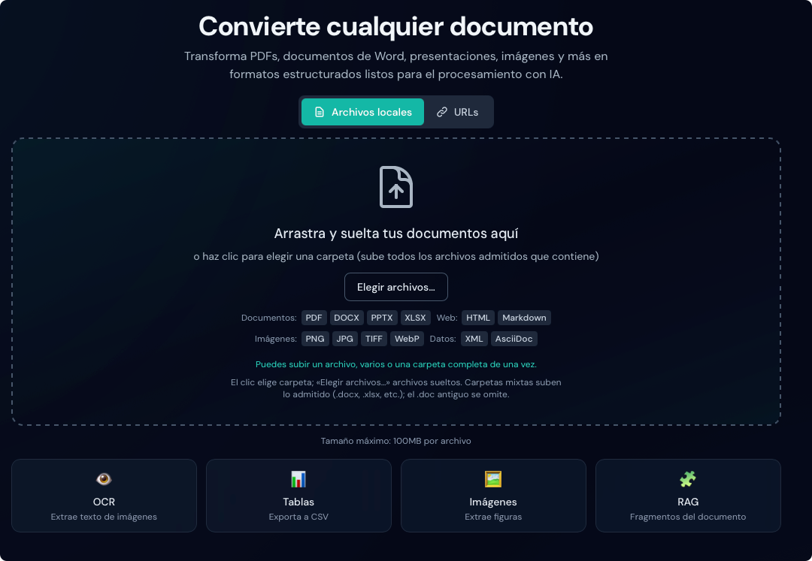

# Características

Duckling ofrece un conjunto completo de funciones para la conversión de documentos.

## Carga de documentos

### Arrastrar y soltar

Arrastra archivos a la zona de entrega para subirlos al instante. La interfaz valida los tipos de archivo y muestra el progreso de la subida.

<figure markdown="span">
  { loading=lazy }
  <figcaption>Zona de entrega lista para recibir archivos</figcaption>
</figure>

### Entrada por URL

Convierte documentos directamente desde URL sin descargarlos antes a mano:

1. Haz clic en la pestaña **URLs** encima de la zona de entrega
2. Pega una URL por línea (una línea = un documento; varias líneas = procesamiento por lotes)
3. Haz clic en **Convertir todo**
4. Los documentos se descargan y convierten automáticamente

Funciones de URL:

- Detección automática del tipo de archivo desde la ruta de la URL
- Detección mediante la cabecera `Content-Type` si no hay extensión
- Soporte de `Content-Disposition` para el nombre de archivo
- Las mismas restricciones de tipo que en subidas locales
- **Extracción automática de imágenes en HTML**: al convertir HTML desde URL, Duckling descarga todas las imágenes referenciadas y las deja disponibles en la galería de vista previa

!!! tip "Páginas HTML con imágenes"
    Al convertir una página HTML (por ejemplo un artículo de blog), Duckling:

    1. Descarga el HTML
    2. Localiza todas las etiquetas `` e imágenes de fondo CSS
    3. Descarga cada imagen desde su URL
    4. Incrusta las imágenes como URI de datos en base64 en el HTML
    5. Guarda las imágenes por separado para vista previa y descarga

    Así los HTML convertidos conservan todas sus imágenes, incluso sin conexión.

!!! tip "Enlaces directos"
    Usa enlaces de descarga directos, no URL genéricas de página. Por ejemplo:

    - ✅ `https://example.com/document.pdf`
    - ✅ `https://example.com/blog/article` (las páginas HTML también funcionan)
    - ❌ `https://example.com/view/document` (el contenido con JavaScript puede fallar)

### Varios archivos y carpetas

Sube y convierte varios archivos (o una carpeta entera) desde la misma zona, sin modo aparte:

1. Arrastra archivos, elige carpeta o usa **Elegir archivos…**
2. Cambia a la pestaña **URLs** y pega una URL por línea
3. Sigue el progreso (un trabajo: vista habitual; varios: resumen multiarchivo)
4. Descarga los resultados por separado o juntos al terminar el lote

#### Varias URLs

El campo URL es siempre un área de texto multilínea:

1. Cambia a la pestaña **URLs**
2. Pega una URL por línea
3. Haz clic en **Convertir todo**

!!! info "Procesamiento concurrente"
    La cola procesa hasta 2 documentos a la vez para limitar el uso de memoria.

## OCR (reconocimiento óptico de caracteres)

Extrae texto de documentos escaneados e imágenes.

### Motores admitidos

| Motor | Descripción | GPU | Ideal para |
|-------|-------------|-----|------------|
| **EasyOCR** | Multilingüe, preciso | Sí (CUDA) | Documentos complejos |
| **Tesseract** | Clásico, fiable | No | Documentos simples |
| **macOS Vision** | OCR nativo de Apple | Apple Neural Engine | Usuarios de Mac |
| **RapidOCR** | Rápido, ligero | No | Alto rendimiento |

### Instalación automática de motores

Duckling puede instalar motores OCR al seleccionarlos:

1. Abre el panel **Configuración**
2. Elige un motor OCR en la lista
3. Si no está instalado, aparece **Instalar**
4. Haz clic para instalar con pip

<figure markdown="span">
  { loading=lazy }
  <figcaption>Configuración OCR y elección del motor</figcaption>
</figure>

!!! note "Requisitos de instalación"
    - **EasyOCR, OcrMac, RapidOCR**: se pueden instalar con pip
    - **Tesseract**: requiere instalación a nivel de sistema:
      - macOS: `brew install tesseract`
      - Ubuntu/Debian: `apt-get install tesseract-ocr`
      - Windows: descarga desde [GitHub releases](https://github.com/UB-Mannheim/tesseract/wiki)

<figure markdown="span">
  { loading=lazy }
  <figcaption>Tesseract requiere instalación manual en el sistema</figcaption>
</figure>

El panel **Configuración** muestra el estado de cada motor:

- ✓ **Instalado y listo** — disponible para convertir
- ⚠ **No instalado** — haz clic para instalar (motores instalables con pip)
- ℹ **Requiere instalación del sistema** — sigue las instrucciones manuales

### Idiomas admitidos

Más de 28 idiomas, entre ellos:

- **Europa**: inglés, alemán, francés, español, italiano, portugués, neerlandés, polaco, ruso
- **Asia**: japonés, chino (simplificado/tradicional), coreano, tailandés, vietnamita
- **Oriente Medio**: árabe, hebreo, turco
- **Sur de Asia**: hindi

### Opciones de OCR

| Opción | Descripción |
|--------|---------------|
| Forzar OCR en toda la página | Procesar la página completa frente a regiones detectadas |
| Aceleración por GPU | Usar CUDA para ir más rápido (EasyOCR) |
| Umbral de confianza | Confianza mínima de los resultados (0–1) |
| Umbral de área de mapa de bits | Ratio mínimo de área para OCR en mapas de bits |

## Extracción de tablas

Detecta y extrae tablas de los documentos automáticamente.

### Modos de detección

=== "Modo preciso"

    - Detección más precisa
    - Mejor reconocimiento de límites de celdas
    - Procesamiento más lento
    - Recomendado para tablas complejas

=== "Modo rápido"

    - Procesamiento más rápido
    - Adecuado para tablas simples
    - Puede omitir estructuras complejas

### Opciones de exportación

- **CSV**: descarga cada tabla como CSV
- **Imagen**: descarga la tabla como PNG
- **JSON**: estructura completa en la respuesta de la API

## Extracción de imágenes

Extrae imágenes incrustadas de los documentos.

### Opciones

| Opción | Descripción |
|--------|---------------|
| Extraer imágenes | Activar extracción |
| Clasificar imágenes | Etiquetar imágenes (figura, ilustración, etc.) |
| Generar imágenes de página | Una imagen por página |
| Generar imágenes de ilustraciones | Extraer ilustraciones como archivos |
| Generar imágenes de tablas | Extraer tablas como imágenes |
| Escala de imagen | Factor de escala de salida (0,1x a 4,0x) |

### Galería de vista previa de imágenes

Tras la conversión, las imágenes extraídas se muestran en una galería:

- **Cuadrícula de miniaturas**: todas como vista previa
- **Acciones al pasar el cursor**: acceso rápido a ver y descargar
- **Visor lightbox**: clic para ver a tamaño completo
- **Navegación**: flechas para recorrer imágenes
- **Descargar**: desde la galería o la lightbox

<figure markdown="span">
  { loading=lazy }
  <figcaption>Imágenes extraídas en miniatura</figcaption>
</figure>

<figure markdown="span">
  { loading=lazy }
  <figcaption>Vista a pantalla completa con navegación</figcaption>
</figure>

!!! tip "Formatos de imagen"
    Las imágenes extraídas se guardan en PNG para máxima compatibilidad.

## Enriquecimiento de documentos

Enriquece los documentos convertidos con funciones avanzadas asistidas por IA.

### Enriquecimientos disponibles

| Función | Descripción | Impacto |
|---------|-------------|---------|
| **Enriquecimiento de código** | Detección de lenguajes y bloques de código mejorados | Bajo |
| **Enriquecimiento de fórmulas** | Extracción LaTeX de ecuaciones | Medio |
| **Clasificación de imágenes** | Tipos semánticos (figura, gráfico, esquema, foto) | Bajo |
| **Descripción de imágenes** | Leyendas generadas por IA | Alto |

### Configuración

Activa los enriquecimientos en **Configuración**, sección **Enriquecimiento de documentos**:

1. Abre **Configuración** (icono de engranaje)
2. Desplázate hasta **Enriquecimiento de documentos**
3. Activa o desactiva las opciones
4. Los ajustes se guardan automáticamente

<figure markdown="span">
  { loading=lazy }
  <figcaption>Panel de enriquecimiento de documentos</figcaption>
</figure>

!!! warning "Tiempo de procesamiento"
    Los enriquecimientos, sobre todo **Descripción de imágenes** y **Enriquecimiento de fórmulas**, aumentan mucho el tiempo (inferencia de modelos). Se muestra una advertencia si están activos.

<figure markdown="span">
  { loading=lazy }
  <figcaption>Advertencia con opciones lentas activadas</figcaption>
</figure>

### Enriquecimiento de código

Cuando está activo, mejora los bloques de código con:

- Detección automática del lenguaje
- Metadatos para resaltado de sintaxis
- Mejor reconocimiento de la estructura

### Enriquecimiento de fórmulas

Extrae fórmulas matemáticas y las convierte a LaTeX:

- Ecuaciones en línea: `$E = mc^2$`
- Ecuaciones en bloque con formato
- Mejor representación en exportaciones HTML y Markdown

### Clasificación de imágenes

Etiqueta imágenes por tipo:

- **Figura**: esquemas, ilustraciones
- **Gráfico**: barras, líneas, sectores
- **Foto**: fotografías, capturas
- **Logo**: logotipos, iconos
- **Tabla**: imágenes de tabla (distinto de la extracción de tablas)

### Descripción de imágenes

Usa modelos visión-lenguaje para generar leyendas:

- Descripciones en lenguaje natural
- Útil para accesibilidad (texto alternativo)
- Mejora la búsqueda en el documento
- Descarga del modelo en el primer uso

!!! note "Requisitos de modelos"
    La descripción de imágenes requiere un modelo visión-lenguaje (~1–2 GB), descarga automática en el primer uso (puede tardar varios minutos).

### Descarga previa de modelos

Para evitar esperas durante la conversión, puedes descargar modelos antes:

1. Abre **Configuración**
2. Ve a **Enriquecimiento de documentos**
3. Abajo, zona **Descargar modelos por adelantado**
4. Haz clic en **Descargar** junto al modelo deseado

| Modelo | Tamaño | Función |
|--------|--------|---------|
| Clasificador de imágenes | ~350 MB | Tipo de imagen |
| Descriptor de imágenes | ~2 GB | Leyendas con IA |
| Reconocedor de fórmulas | ~500 MB | Extracción LaTeX |
| Detector de código | ~200 MB | Lenguaje de programación |

!!! tip "Progreso de descarga"
    Una barra muestra el estado. Los modelos se guardan en caché local; basta descargarlos una vez.

## Fragmentación para RAG

Genera fragmentos de documento optimizados para generación aumentada por recuperación (RAG).

### Funcionamiento

1. El documento se divide en fragmentos semánticos
2. Cada fragmento respeta la estructura
3. Los fragmentos incluyen metadatos (encabezados, números de página)
4. Los fragmentos demasiado pequeños pueden fusionarse

### Configuración

| Parámetro | Descripción | Predeterminado |
|-----------|-------------|----------------|
| Máx. tokens | Máximo de tokens por fragmento | 512 |
| Fusionar pares | Fusionar fragmentos pequeños | true |

### Formato de salida

```json
{
  "chunks": [
    {
      "id": 1,
      "text": "Introduction to machine learning...",
      "meta": {
        "headings": ["Chapter 1", "Introduction"],
        "page": 1
      }
    }
  ]
}
```

## Formatos de exportación

### Formatos disponibles

| Formato | Extensión | Descripción |
|---------|-----------|-------------|
| **Markdown** | `.md` | Texto estructurado (encabezados, listas, enlaces) |
| **HTML** | `.html` | Listo para web con estilos |
| **JSON** | `.json` | Estructura completa del documento (sin pérdida) |
| **Texto plano** | `.txt` | Texto simple |
| **DocTags** | `.doctags` | Formato etiquetado |
| **Tokens de documento** | `.tokens.json` | Representación a nivel de tokens |
| **Fragmentos RAG** | `.chunks.json` | Fragmentos para aplicaciones RAG |

<figure markdown="span">
  { loading=lazy }
  <figcaption>Formatos de exportación disponibles</figcaption>
</figure>

### Vista previa

El panel de exportación muestra una vista previa en vivo que se actualiza al cambiar de formato.

#### Vista previa por formato

- **Contenido dinámico**: carga según el formato seleccionado
- **Insignia de formato**: formato mostrado actualmente
- **Caché**: cambio instantáneo entre formatos ya cargados

#### Modo renderizado o sin formato

En HTML y Markdown, alterna entre vista renderizada y código fuente:

<figure markdown="span">
  { loading=lazy }
  <figcaption>Alternar entre vista previa renderizada y sin formato</figcaption>
</figure>

=== "Modo renderizado"

    - **HTML**: formato, tablas, enlaces
    - **Markdown**: encabezados, negrita/cursiva, bloques de código, enlaces
    - Ideal para revisar el aspecto final

    { loading=lazy }

=== "Modo sin formato"

    - Muestra el código fuente
    - HTML: etiquetas y atributos en bruto
    - Markdown: sintaxis (`#`, `**negrita**`, etc.)
    - Útil para copiar o depurar formato

    { loading=lazy }

#### Otros formatos

- **JSON**: formateado con sangría
- **Texto plano**: tal cual
- **DocTags / tokens**: vista en bruto

<figure markdown="span">
  { loading=lazy }
  <figcaption>Salida JSON formateada</figcaption>
</figure>

## Historial de conversiones

Accede a documentos convertidos anteriormente:

- Estado de la conversión y metadatos
- Volver a descargar archivos convertidos
- Buscar por nombre de archivo
- Estadísticas de conversión

### Funciones del historial

- **Búsqueda**: por nombre de archivo
- **Filtro**: por estado (completado, fallido)
- **Exportar**: historial en JSON
- **Recargar documento**: clic en una entrada completada para abrir el resultado sin volver a convertir
  - Los documentos se guardan en disco tras la conversión
  - Se conserva la estructura completa; recarga instantánea
- **Deduplicación**: mismo archivo y mismos ajustes reutilizan la salida almacenada
- **Generar fragmentos ahora**: si no hay fragmentos RAG, generación bajo demanda con los ajustes de fragmentación actuales (sin reconversión)
  - Las conversiones con mismo contenido y ajustes que afectan al documento (OCR, tablas, imágenes) pueden servirse desde caché
  - Las salidas se almacenan una vez y se comparten (enlaces simbólicos)

### Panel de estadísticas

Panel lateral para análisis de conversiones. Ábrelo con el botón **Estadísticas** en la cabecera o el enlace **Ver estadísticas completas** en el historial.

**Resumen**

- Total de conversiones, aciertos/fallos, tasa de éxito
- Tiempo medio de procesamiento y profundidad de cola

**Almacenamiento**

- Subidas, salidas y almacenamiento total

**Desgloses**

- Formatos de entrada, motores OCR, formatos de salida
- Hardware (CPU/CUDA/MPS), tipos de origen
- Categorías de error
- Recuento con fragmentación RAG activa

**Métricas ampliadas**

- **Sistema**: tipo de hardware (CPU/CUDA/MPS), núcleos CPU, uso actual de CPU (proceso backend de Duckling), información de GPU
- **Rendimiento**: páginas/s medias y páginas/s por núcleo CPU
- **Distribución de tiempos**: mediana, percentil 95 y 99
- **Páginas/s en el tiempo**: gráfico en el historial
- **Rendimiento por configuración**: páginas/s y tiempo por hardware, motor OCR y clasificador de imágenes
