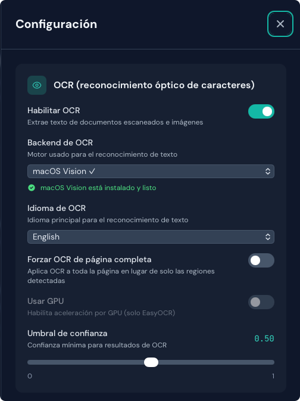
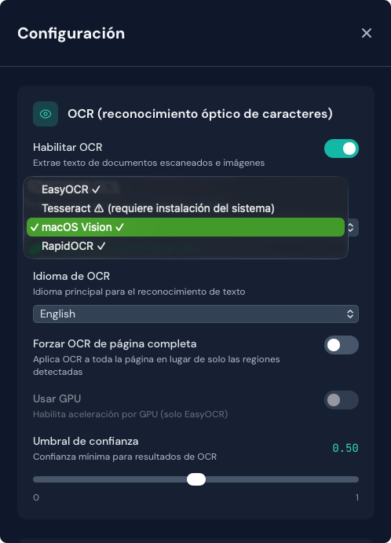
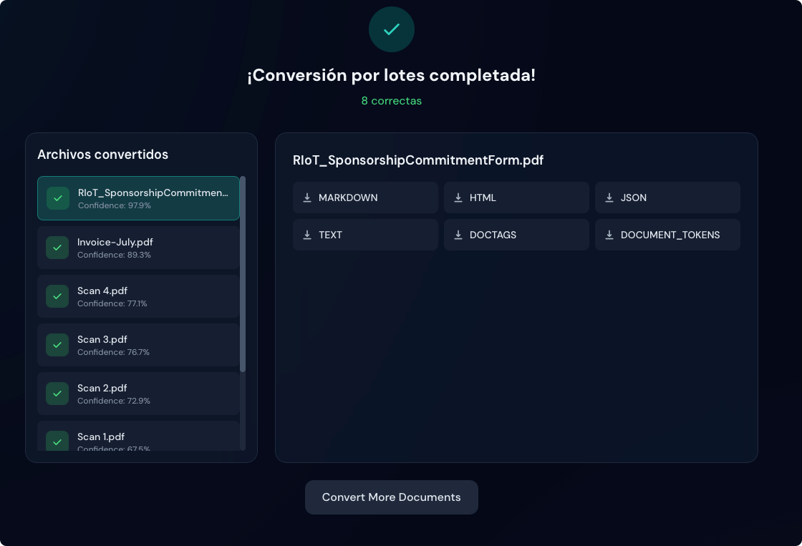

# Galería de capturas

Esta página ofrece un recorrido visual por la interfaz de Duckling. Todas las capturas están en modo oscuro.

!!! note "Estado de las capturas"
    Algunas imágenes pueden mostrar marcadores de posición. Consulte la [guía de capturas](../../assets/screenshots/SCREENSHOT_GUIDE.md) para instrucciones de captura.

## Interfaz principal

### Zona de carga

Área principal donde arrastra y suelta documentos para convertirlos.

=== "Estado vacío"

    <figure markdown="span">
      { loading=lazy }
      <figcaption>Lista para recibir archivos</figcaption>
    </figure>

=== "Arrastrar (hover)"

    <figure markdown="span">
      { loading=lazy }
      <figcaption>Retroalimentación visual al arrastrar archivos</figcaption>
    </figure>

=== "Subiendo"

    <figure markdown="span">
      { loading=lazy }
      <figcaption>Indicador de progreso de la subida</figcaption>
    </figure>

=== "Varios archivos"

    <figure markdown="span">
      { loading=lazy }
      <figcaption>Varios archivos seleccionados para subir</figcaption>
    </figure>

### Barra superior

<figure markdown="span">
  { loading=lazy }
  <figcaption>Barra de la aplicación con ajustes e idioma</figcaption>
</figure>

### Panel del historial

=== "Lista del historial"

    <figure markdown="span">
      { loading=lazy }
      <figcaption>Lista de conversiones anteriores</figcaption>
    </figure>

=== "Búsqueda"

    <figure markdown="span">
      { loading=lazy }
      <figcaption>Búsqueda en el historial de conversiones</figcaption>
    </figure>

---

## Panel de ajustes

### Ajustes de OCR

=== "Resumen"

    <figure markdown="span">
      { loading=lazy }
      <figcaption>Opciones de configuración OCR</figcaption>
    </figure>

=== "Instalar backend"

    <figure markdown="span">
      { loading=lazy }
      <figcaption>Instalación del backend con un clic</figcaption>
    </figure>

=== "Aviso de Tesseract"

    <figure markdown="span">
      { loading=lazy }
      <figcaption>Instrucciones de instalación manual de Tesseract</figcaption>
    </figure>

### Ajustes de tablas

<figure markdown="span">
  { loading=lazy }
  <figcaption>Configuración de extracción de tablas</figcaption>
</figure>

### Ajustes de imágenes

<figure markdown="span">
  { loading=lazy }
  <figcaption>Opciones de extracción de imágenes</figcaption>
</figure>

### Ajustes de enriquecimiento

=== "Todas las opciones"

    <figure markdown="span">
      { loading=lazy }
      <figcaption>Enriquecimiento del documento: código, fórmulas, clasificación de imágenes y descripción</figcaption>
    </figure>

=== "Mensaje de advertencia"

    <figure markdown="span">
      { loading=lazy }
      <figcaption>Advertencia cuando están activas funciones de enriquecimiento lentas</figcaption>
    </figure>

### Ajustes de rendimiento

<figure markdown="span">
  { loading=lazy }
  <figcaption>Configuración del rendimiento de procesamiento</figcaption>
</figure>

### Ajustes de fragmentación (chunking)

<figure markdown="span">
  { loading=lazy }
  <figcaption>Configuración de fragmentos para RAG</figcaption>
</figure>

### Ajustes de salida

<figure markdown="span">
  { loading=lazy }
  <figcaption>Selección del formato de salida predeterminado</figcaption>
</figure>

---

## Opciones de exportación

### Selección de formato

=== "Todos los formatos"

    <figure markdown="span">
      { loading=lazy }
      <figcaption>Formatos de exportación disponibles</figcaption>
    </figure>

=== "Formato seleccionado"

    <figure markdown="span">
      { loading=lazy }
      <figcaption>Formato seleccionado con marca de verificación</figcaption>
    </figure>

### Modos de vista previa

=== "Alternar renderizado / sin formato"

    <figure markdown="span">
      { loading=lazy }
      <figcaption>Alternar entre vista renderizada y código fuente</figcaption>
    </figure>

=== "Markdown renderizado"

    <figure markdown="span">
      { loading=lazy }
      <figcaption>Markdown renderizado con formato</figcaption>
    </figure>

=== "Markdown sin formato"

    <figure markdown="span">
      { loading=lazy }
      <figcaption>Fuente Markdown sin renderizar</figcaption>
    </figure>

=== "HTML renderizado"

    <figure markdown="span">
      { loading=lazy }
      <figcaption>HTML renderizado con estilos</figcaption>
    </figure>

=== "HTML sin formato"

    <figure markdown="span">
      { loading=lazy }
      <figcaption>Código fuente HTML sin renderizar</figcaption>
    </figure>

=== "JSON"

    <figure markdown="span">
      { loading=lazy }
      <figcaption>Salida JSON con formato legible</figcaption>
    </figure>

---

## Funciones en acción

### Estado de la conversión

=== "En curso"

    <figure markdown="span">
      { loading=lazy }
      <figcaption>Documento en procesamiento</figcaption>
    </figure>

=== "Completada"

    <figure markdown="span">
      { loading=lazy }
      <figcaption>Conversión correcta con estadísticas</figcaption>
    </figure>

=== "Puntuación de confianza"

    <figure markdown="span">
      { loading=lazy }
      <figcaption>Porcentaje de confianza del OCR</figcaption>
    </figure>

### Galería de imágenes

=== "Cuadrícula de miniaturas"

    <figure markdown="span">
      { loading=lazy }
      <figcaption>Imágenes extraídas como miniaturas</figcaption>
    </figure>

=== "Acciones al pasar el cursor"

    <figure markdown="span">
      { loading=lazy }
      <figcaption>Botones ver y descargar al pasar el cursor</figcaption>
    </figure>

=== "Visor a pantalla completa"

    <figure markdown="span">
      { loading=lazy }
      <figcaption>Visor a tamaño completo con navegación</figcaption>
    </figure>

### Tablas

=== "Lista de tablas"

    <figure markdown="span">
      { loading=lazy }
      <figcaption>Tablas extraídas con vistas previas</figcaption>
    </figure>

=== "Opciones de descarga"

    <figure markdown="span">
      { loading=lazy }
      <figcaption>Exportación a CSV e imagen</figcaption>
    </figure>

### Fragmentos RAG

<figure markdown="span">
  { loading=lazy }
  <figcaption>Fragmentos del documento con metadatos</figcaption>
</figure>
