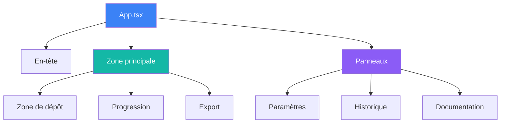
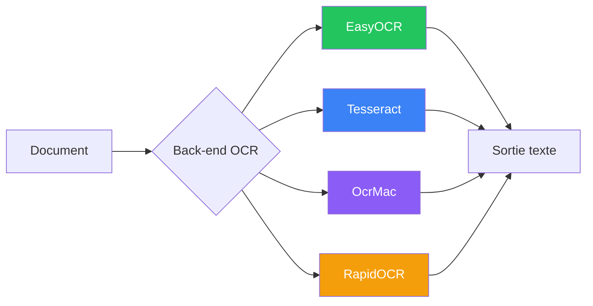
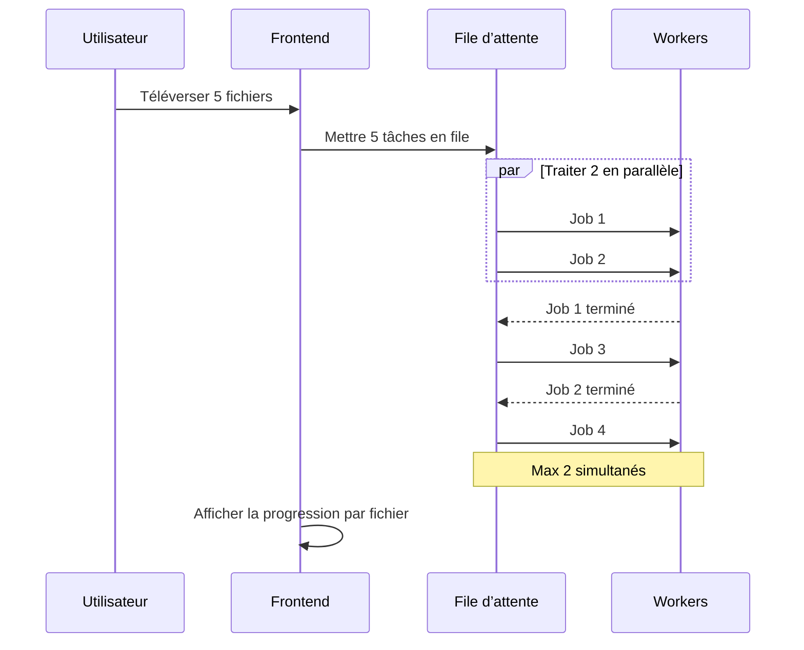

# Composants

Documentation détaillée des composants de Duckling.

## Architecture frontend

### Pile technologique

- **React 18** – Framework UI avec composants fonctionnels et hooks
- **TypeScript** – JavaScript typé
- **Tailwind CSS** – Framework CSS utilitaire
- **Framer Motion** – Bibliothèque d’animations
- **React Query** – Gestion de l’état serveur
- **Axios** – Client HTTP
- **Vite** – Outil de build et serveur de développement

### Structure des composants



### Fichiers de composants

| Chemin | Description |
|------|-------------|
| `src/App.tsx` | Composant principal de l’application |
| `src/main.tsx` | Point d’entrée de l’application |
| `src/index.css` | Styles globaux |
| `src/components/DropZone.tsx` | Téléversement de fichiers par glisser-déposer |
| `src/components/ConversionProgress.tsx` | Affichage de la progression |
| `src/components/ExportOptions.tsx` | Téléchargement et aperçu des résultats |
| `src/components/SettingsPanel.tsx` | Panneau de configuration |
| `src/components/HistoryPanel.tsx` | Historique des conversions |
| `src/components/DocsPanel.tsx` | Visionneuse de documentation |
| `src/hooks/useConversion.ts` | État et actions de conversion |
| `src/hooks/useSettings.ts` | Gestion de l’état des paramètres |
| `src/services/api.ts` | Fonctions du client API |
| `src/types/index.ts` | Interfaces TypeScript |

### Gestion de l’état

L’application combine :

1. **État local** – État au niveau du composant avec `useState`
2. **React Query** – Mise en cache et synchronisation de l’état serveur
3. **Hooks personnalisés** – Logique métier encapsulée

### Hooks principaux

#### `useConversion`

Gère le flux de conversion de documents :

- Téléversement de fichiers (unitaire et par lots)
- Interrogation du statut
- Récupération des résultats
- Gestion des téléchargements

#### `useSettings`

Gère les paramètres de l’application :

- Paramètres OCR, tableaux, images, performances et découpage
- Persistance des paramètres via l’API
- Validation des paramètres

---

## Architecture backend

### Pile technologique

- **Flask** – Framework web
- **SQLAlchemy** – ORM pour les opérations base de données
- **SQLite** – Base embarquée pour l’historique
- **Docling** – Moteur de conversion de documents
- **Threading** – Traitement asynchrone des tâches

### Structure des modules

| Chemin | Description |
|------|-------------|
| `backend/duckling.py` | Fabrique d’application Flask |
| `backend/config.py` | Configuration et valeurs par défaut |
| `backend/models/database.py` | Modèles SQLAlchemy |
| `backend/routes/convert.py` | Points de terminaison de conversion |
| `backend/routes/settings.py` | Points de terminaison des paramètres |
| `backend/routes/history.py` | Points de terminaison de l’historique |
| `backend/services/converter.py` | Intégration Docling |
| `backend/services/file_manager.py` | Opérations sur les fichiers |
| `backend/services/history.py` | CRUD historique |
| `backend/tests/` | Suite de tests |

### Services

#### ConverterService

Gère la conversion de documents avec Docling :

```python
class ConverterService:
    def convert(self, file_path: str, settings: dict) -> ConversionResult:
        """Convertir un document avec les paramètres donnés."""
        pass

    def get_status(self, job_id: str) -> JobStatus:
        """Obtenir le statut d’une tâche de conversion."""
        pass
```

#### FileManager

Gère les téléversements et les sorties :

```python
class FileManager:
    def save_upload(self, file) -> str:
        """Enregistrer le fichier téléversé et renvoyer le chemin."""
        pass

    def get_output_path(self, job_id: str) -> str:
        """Obtenir le répertoire de sortie pour une tâche."""
        pass
```

#### HistoryService

Opérations CRUD sur l’historique des conversions :

```python
class HistoryService:
    def create(self, job_id: str, filename: str) -> Conversion:
        """Créer une nouvelle entrée d’historique."""
        pass

    def update(self, job_id: str, **kwargs) -> Conversion:
        """Mettre à jour une entrée existante."""
        pass

    def get_stats(self) -> dict:
        """Obtenir les statistiques de conversion."""
        pass
```

---

## Intégration OCR

Docling prend en charge plusieurs moteurs OCR :



| Moteur | Description | Support GPU |
|---------|-------------|-------------|
| **EasyOCR** | Usage général, multilingue | Oui |
| **Tesseract** | Moteur OCR classique | Non |
| **OcrMac** | Framework Vision macOS | Non |
| **RapidOCR** | Rapide, basé sur ONNX | Non |

Le backend bascule automatiquement vers un traitement sans OCR si l’initialisation OCR échoue.

---

## Traitement par lots



| Étape | Description |
|------|-------------|
| 1 | Le frontend envoie POST /convert/batch avec plusieurs fichiers |
| 2 | Le backend enregistre chaque fichier, crée les tâches et les met toutes en file |
| 3 | Le backend renvoie 202 avec un tableau d’identifiants de tâches |
| 4 | Le frontend interroge le statut de chaque tâche en parallèle |
| 5 | Le backend traite au plus 2 tâches à la fois, les autres attendent |
| 6 | Le frontend affiche la progression par fichier |
