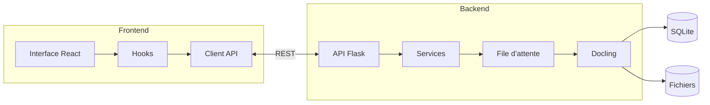
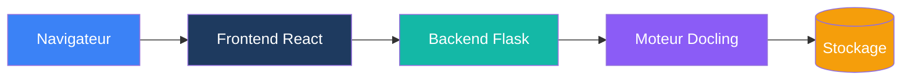
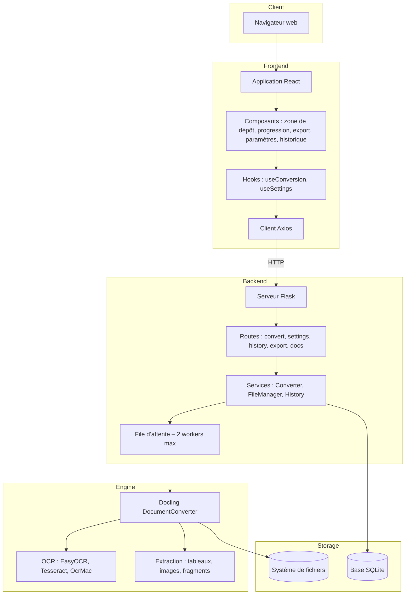
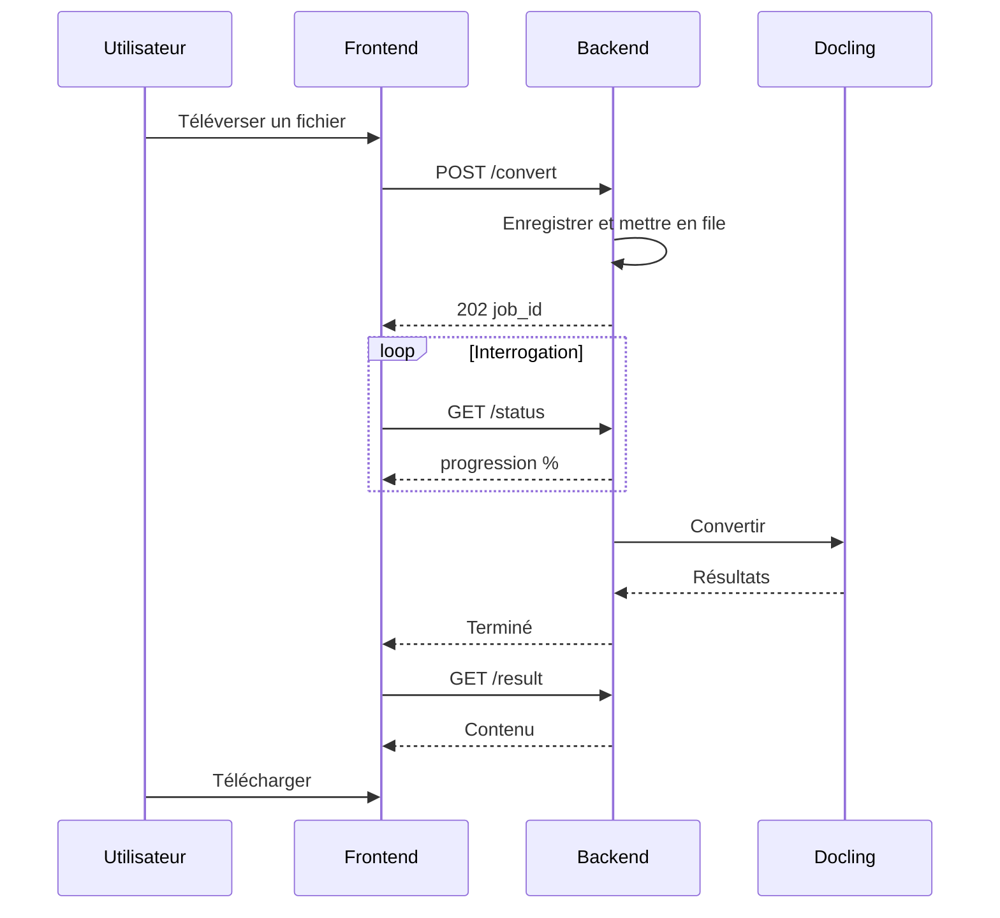
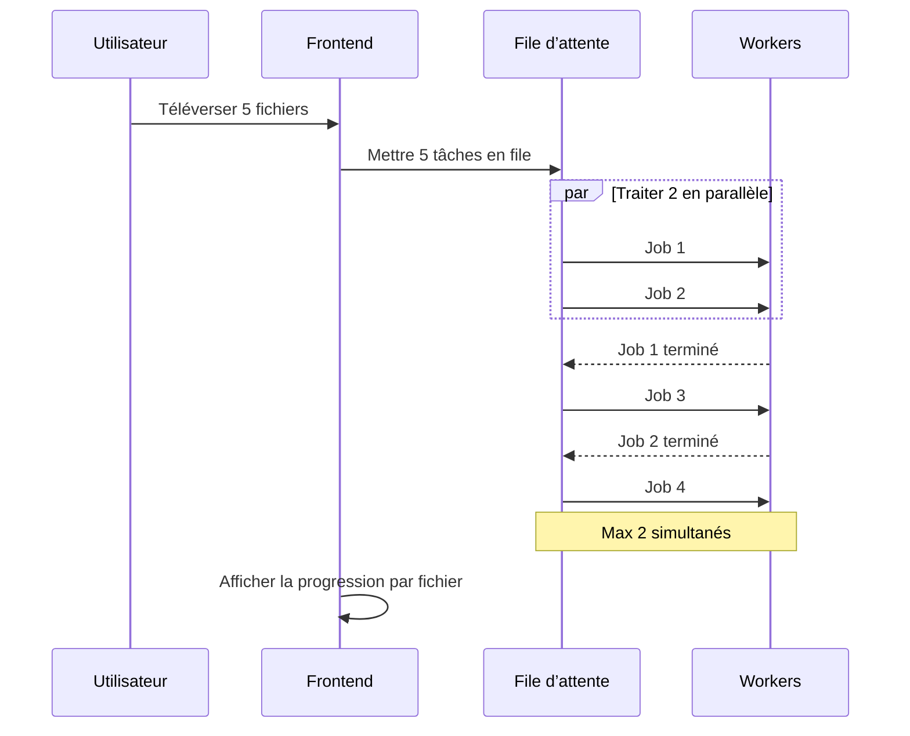
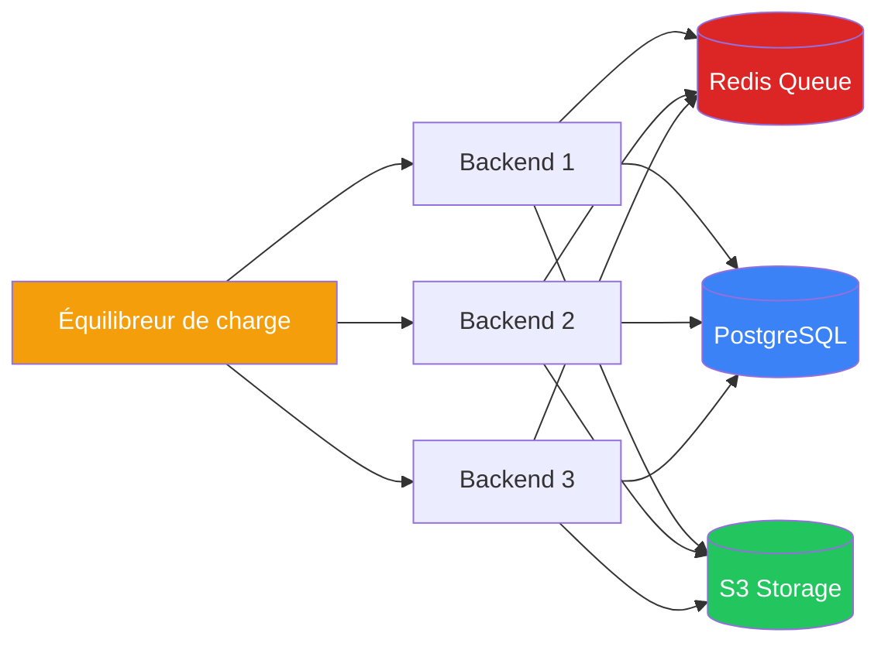
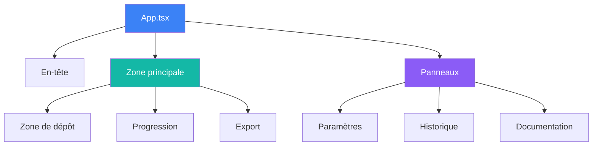
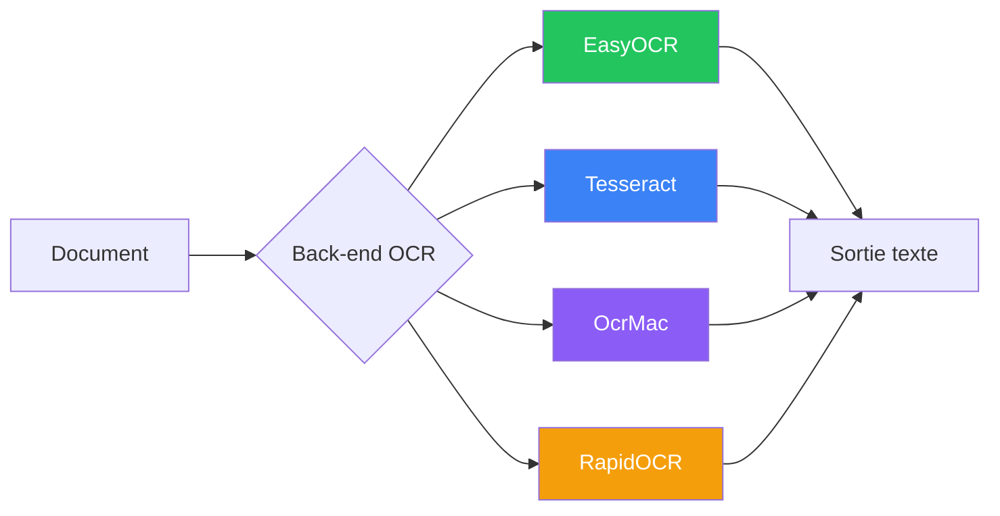

# Schémas d’architecture

Diagrammes visuels de l’architecture Duckling.

## Vue d’ensemble de l’architecture système

---

## Architecture simple

---

## Vue détaillée par couches

---

## Flux de conversion

---

## Traitement par lots

---

## Architecture de montée en charge

Pour les déploiements en production à fort trafic :

---

## Arbre de composants

---

## Options OCR

---

## Images statiques des schémas

Pour les environnements sans rendu Mermaid, des images statiques sont disponibles :

- [Architecture système](../arch.png)
- [Vue détaillée par couches](../Detailed-Layer-View.png)
- [Pipeline de conversion](../ConversionPipeline.png)
- [Traitement par lots](../BatchProcessing.png)
- [Architecture de montée en charge](../ScalingArchitecture.png)
- [Arbre de composants](../ComponentTree.png)
- [Options OCR](../OCR.png)
