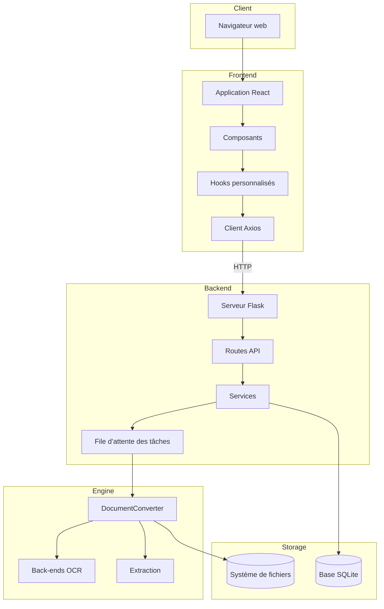
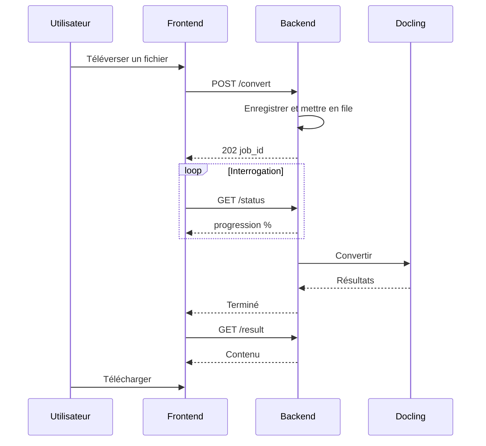

# Vue d’ensemble du système

Architecture et flux de données de Duckling à un niveau élevé.

## Schéma d’architecture


## Vue détaillée par couches



## Flux de données

### Flux de conversion de document



### Pipeline de conversion

| Étape | Description |
|------|-------------|
| 1 | **Requête de téléversement** – Fichier reçu via POST |
| 2 | **Validation et stockage** – Vérifier l’extension, enregistrer dans uploads/ |
| 3 | **Création de tâche** – UUID attribué, entrée créée |
| 4 | **Mise en file pour traitement** – Ajout à la file d’attente |
| 5 | **Prise en charge par le thread worker** – Lorsque la capacité est disponible |
| 6 | **Initialisation de DocumentConverter** – Avec réglages OCR, tableaux, images |
| 7 | **Conversion du document** – Extraire images, tableaux, fragments |
| 8 | **Export vers les formats** – MD, HTML, JSON, TXT, DocTags, Tokens |
| 9 | **Mise à jour du statut et de l’historique** – Marquer comme terminé, stocker les métadonnées |
| 10 | **Résultats disponibles** – Prêts au téléchargement |

**Téléversement de dossier (UI) :** Le navigateur développe un répertoire choisi ou glissé-déposé en liste de fichiers ; le frontend filtre par extension et taille autorisées, puis envoie les fichiers pris en charge via `POST /api/convert/batch` avec des parties `files` répétées (comme pour le lot multi-fichiers). Le backend rejette individuellement les parties non prises en charge ; si aucune partie n’est convertible, l’API répond **400**.

## File d’attente des tâches

Pour éviter l’épuisement de la mémoire lors du traitement de plusieurs documents :

```python
class ConverterService:
    _job_queue: Queue       # Pending jobs
    _worker_thread: Thread  # Background processor
    _max_concurrent_jobs = 2  # Limit parallel processing
```

Le thread worker :

1. Surveille la file d’attente des tâches
2. Lance des threads de conversion jusqu’à la limite de parallélisme
3. Suit les threads actifs et nettoie ceux qui sont terminés
4. Évite l’épuisement des ressources lors du traitement par lots

## Schéma de base de données

### Table de conversion

| Colonne | Type | Description |
|--------|------|-------------|
| `id` | VARCHAR(36) | Clé primaire (UUID) |
| `filename` | VARCHAR(255) | Nom de fichier assaini |
| `original_filename` | VARCHAR(255) | Nom d’origine du téléversement |
| `input_format` | VARCHAR(50) | Format détecté |
| `status` | VARCHAR(50) | pending/processing/completed/failed |
| `confidence` | FLOAT | Score de confiance OCR |
| `error_message` | TEXT | Détails d’erreur en cas d’échec |
| `output_path` | VARCHAR(500) | Chemin vers les fichiers de sortie |
| `settings` | TEXT | Paramètres JSON utilisés |
| `file_size` | FLOAT | Taille du fichier en octets |
| `created_at` | DATETIME | Horodatage du téléversement |
| `completed_at` | DATETIME | Horodatage de fin |

## Considérations de sécurité

| Risque | Atténuation |
|---------|------------|
| **Téléversement** | Seules les extensions autorisées |
| **Taille des fichiers** | Maximum configurable (défaut 100 Mo) |
| **Noms de fichiers** | Assainis avant stockage |
| **Accès aux fichiers** | Servis uniquement via l’API, pas de chemins directs |
| **CORS** | Limité à l’origine du frontend |

## Optimisations des performances

| Optimisation | Description |
|--------------|-------------|
| **Mise en cache du convertisseur** | Instances DocumentConverter mises en cache par hachage des paramètres |
| **File d’attente** | Traitement séquentiel pour éviter l’épuisement mémoire |
| **Chargement différé** | Composants lourds chargés à la demande |
| **Cache React Query** | Réponses API mises en cache et dédupliquées |
| **Traitement en arrière-plan** | Les conversions ne bloquent pas l’API |
