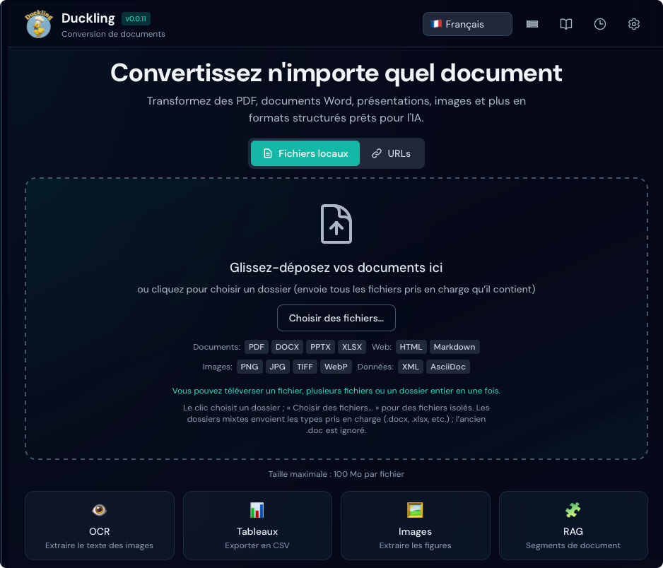

# Démarrage rapide

Démarrez avec Duckling en 5 minutes.

## Lancer l’application

Choisissez votre méthode préférée :

=== "Docker (recommandé)"

    Le moyen le plus rapide pour commencer — aucune dépendance à installer !

    **Option 1 : Images préconstruites (la plus rapide)**
    ```bash
    # Télécharger le fichier compose
    curl -O https://raw.githubusercontent.com/duckling-ui/duckling/main/docker-compose.prebuilt.yml

    # Démarrer Duckling
    docker-compose -f docker-compose.prebuilt.yml up -d
    ```

    **Option 2 : Construire localement**
    ```bash
    # Cloner le dépôt et démarrer
    git clone https://github.com/duckling-ui/duckling.git
    cd duckling
    docker-compose up --build
    ```

    L’interface est disponible sur `http://localhost:3000`

    !!! tip "Premier lancement"
        Le premier démarrage peut prendre quelques minutes pendant que Docker télécharge ou construit les images.

=== "Configuration manuelle"

    ### Terminal 1 : Backend

    ```bash
    cd backend
    source venv/bin/activate  # Windows : venv\Scripts\activate
    python duckling.py
    ```

    L’API est disponible sur `http://localhost:5001`

    ### Terminal 2 : Frontend

    ```bash
    cd frontend
    npm run dev
    ```

    L’interface est disponible sur `http://localhost:3000`

## Votre première conversion

### 1. Ouvrir l’application

Ouvrez `http://localhost:3000` dans votre navigateur.

<figure markdown="span">
  { loading=lazy }
  <figcaption>L’interface principale de Duckling</figcaption>
</figure>

### 2. Téléverser un document

Glissez-déposez un PDF, un document Word ou une image dans la zone de dépôt, ou cliquez pour parcourir.


### 3. Suivre la progression

La progression de la conversion s’affiche en temps réel.

### 4. Télécharger les résultats

Une fois terminé, choisissez votre format d’export :

<figure markdown="span">
  { loading=lazy }
  <figcaption>Conversion terminée avec options d’export</figcaption>
</figure>

- **Markdown** – Idéal pour la documentation
- **HTML** – Sortie prête pour le web
- **JSON** – Structure complète du document
- **Texte brut** – Extraction de texte simple

## Configuration de base

Cliquez sur le bouton :material-cog: **Paramètres** pour configurer :

### Paramètres OCR

| Paramètre | Par défaut | Description |
|-----------|------------|-------------|
| Activé | `true` | Activer l’OCR pour les documents numérisés |
| Moteur | `easyocr` | Moteur OCR à utiliser |
| Langue | `en` | Langue principale |

### Paramètres des tableaux

| Paramètre | Par défaut | Description |
|-----------|------------|-------------|
| Activé | `true` | Extraire les tableaux des documents |
| Mode | `accurate` | Niveau de précision de détection |

### Paramètres des images

| Paramètre | Par défaut | Description |
|-----------|------------|-------------|
| Extraire | `true` | Extraire les images intégrées |
| Échelle | `1.0` | Échelle de sortie des images |

## Traitement par lots

Pour convertir plusieurs fichiers à la fois :

1. **Glissez-déposez** plusieurs fichiers **ou un dossier entier** dans la zone de dépôt. Le navigateur développe un dossier en liste de fichiers ; Duckling met en file chaque document pris en charge (les types non pris en charge sont ignorés).
2. **Cliquez** sur la zone de dépôt pour ouvrir un sélecteur de **dossier** et téléverser d’un coup tous les fichiers pris en charge qu’il contient.
3. Utilisez **Choisir des fichiers…** lorsque vous voulez sélectionner **uniquement des fichiers** (pas le mode dossier).

Tous les fichiers en file sont traités selon la file d’attente des tâches (voir [Fonctionnalités](../user-guide/features.md) pour les limites de concurrence).

!!! tip "Performances"
    Le traitement par lots utilise une file d’attente avec au plus 2 conversions simultanées pour éviter l’épuisement de la mémoire.

## Utiliser l’API

Pour un accès programmatique, utilisez l’API REST :

```bash
# Téléverser et convertir un document
curl -X POST http://localhost:5001/api/convert \
  -F "file=@document.pdf"

# Réponse
{
  "job_id": "550e8400-e29b-41d4-a716-446655440000",
  "status": "processing"
}
```

Consultez la [référence API](../api/index.md) pour la documentation complète.

## Étapes suivantes

- [Fonctionnalités](../user-guide/features.md) – Explorer toutes les capacités
- [Configuration](../user-guide/configuration.md) – Paramètres avancés
- [Référence API](../api/index.md) – Intégrer à vos applications

