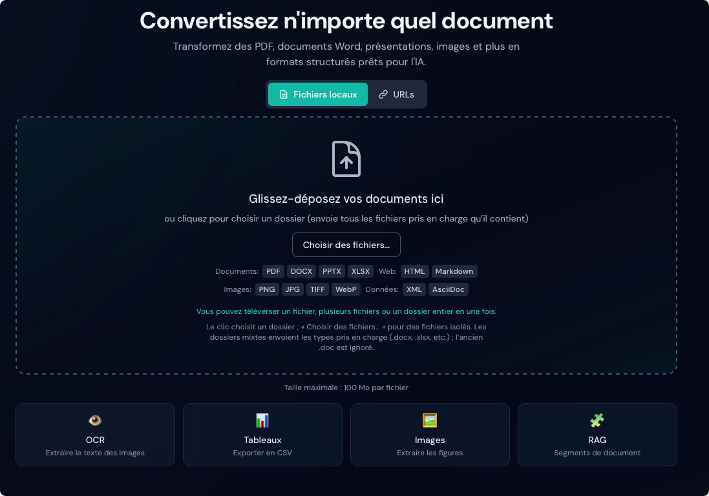

# Fonctionnalités

Duckling propose un ensemble complet de fonctionnalités pour la conversion de documents.

## Téléversement de documents

### Glisser-déposer

Glissez-déposez des fichiers sur la zone de dépôt pour un téléversement immédiat. L’interface valide les types de fichiers et affiche la progression du téléversement.

<figure markdown="span">
  { loading=lazy }
  <figcaption>Zone de dépôt prête à recevoir des fichiers</figcaption>
</figure>

### Saisie par URL

Convertissez des documents directement à partir d’URL, sans les télécharger au préalable :

1. Cliquez sur l’onglet **URLs** au-dessus de la zone de dépôt
2. Collez une URL par ligne (une ligne = un document ; plusieurs lignes = traitement par lot)
3. Cliquez sur **Tout convertir**
4. Les documents sont téléchargés et convertis automatiquement

Fonctionnalités des URL :

- Détection automatique du type de fichier à partir du chemin de l’URL
- Détection via l’en-tête `Content-Type` pour les fichiers sans extension
- Prise en charge de l’en-tête `Content-Disposition` pour le nom de fichier
- Mêmes restrictions de type que pour les téléversements locaux
- **Extraction automatique des images pour les pages HTML** : lors de la conversion de HTML depuis une URL, Duckling télécharge toutes les images référencées dans la page et les rend disponibles dans la galerie d’aperçu des images

!!! tip "Pages HTML avec images"
    Lorsque vous convertissez une page HTML (article de blog, etc.), Duckling :

    1. Télécharge le contenu HTML
    2. Repère toutes les balises `` et les images d’arrière-plan CSS
    3. Télécharge chaque image depuis son URL
    4. Intègre les images en URI de données base64 dans le HTML
    5. Enregistre les images séparément pour l’aperçu et le téléchargement

    Les documents HTML convertis conservent ainsi toutes leurs images, même hors ligne.

!!! tip "Liens directs"
    Utilisez des liens de téléchargement directs, pas des URL de pages web génériques. Par exemple :

    - ✅ `https://example.com/document.pdf`
    - ✅ `https://example.com/blog/article` (les pages HTML fonctionnent aussi)
    - ❌ `https://example.com/view/document` (le contenu rendu en JavaScript peut ne pas fonctionner)

### Plusieurs fichiers et dossiers

Téléversez et convertissez plusieurs fichiers (ou tout un dossier) depuis la même zone, sans activer un mode séparé :

1. Glissez-déposez des fichiers, choisissez un dossier ou utilisez **Choisir des fichiers…**
2. Passez à l’onglet **URLs** et collez une URL par ligne pour le web
3. Suivez la progression (un seul traitement : vue habituelle ; plusieurs : résumé multi-fichiers)
4. Téléchargez les résultats séparément ou ensemble à la fin du lot

#### Plusieurs URLs

Le champ URL est toujours une zone de texte multiligne :

1. Passez à l’onglet **URLs**
2. Collez une URL par ligne
3. Cliquez sur **Tout convertir**

!!! info "Traitement concurrent"
    La file d’attente traite jusqu’à 2 documents en parallèle pour limiter l’usage mémoire.

## OCR (reconnaissance optique de caractères)

Extrayez le texte des documents numérisés et des images.

### Moteurs pris en charge

| Moteur | Description | GPU | Idéal pour |
|---------|-------------|-----|------------|
| **EasyOCR** | Multilingue, précis | Oui (CUDA) | Documents complexes |
| **Tesseract** | Classique, fiable | Non | Documents simples |
| **macOS Vision** | OCR Apple natif | Apple Neural Engine | Utilisateurs Mac |
| **RapidOCR** | Rapide, léger | Non | Débit prioritaire |

### Installation automatique des moteurs

Duckling peut installer automatiquement les moteurs OCR lorsque vous les sélectionnez :

1. Ouvrez le panneau **Paramètres**
2. Choisissez un moteur OCR dans la liste
3. S’il n’est pas installé, un bouton **Installer** apparaît
4. Cliquez pour lancer l’installation via pip

<figure markdown="span">
  { loading=lazy }
  <figcaption>Paramètres OCR et choix du moteur</figcaption>
</figure>

!!! note "Prérequis d’installation"
    - **EasyOCR, OcrMac, RapidOCR** : installation possible via pip
    - **Tesseract** : installation système requise au préalable :
      - macOS : `brew install tesseract`
      - Ubuntu/Debian : `apt-get install tesseract-ocr`
      - Windows : téléchargement depuis [GitHub releases](https://github.com/UB-Mannheim/tesseract/wiki)

<figure markdown="span">
  { loading=lazy }
  <figcaption>Tesseract nécessite une installation manuelle sur le système</figcaption>
</figure>

Le panneau **Paramètres** indique l’état de chaque moteur :

- ✓ **Installé et prêt** — disponible pour la conversion
- ⚠ **Non installé** — cliquez pour installer (moteurs installables via pip)
- ℹ **Installation système requise** — suivez les instructions manuelles

### Langues prises en charge

Plus de 28 langues, notamment :

- **Europe** : anglais, allemand, français, espagnol, italien, portugais, néerlandais, polonais, russe
- **Asie** : japonais, chinois (simplifié/traditionnel), coréen, thaï, vietnamien
- **Moyen-Orient** : arabe, hébreu, turc
- **Asie du Sud** : hindi

### Options OCR

| Option | Description |
|--------|-------------|
| Forcer l’OCR sur toute la page | Traiter toute la page plutôt que les zones détectées |
| Accélération GPU | Utiliser CUDA pour accélérer (EasyOCR) |
| Seuil de confiance | Confiance minimale des résultats (0 à 1) |
| Seuil de surface bitmap | Ratio de surface minimal pour l’OCR sur bitmap |

## Extraction des tableaux

Détectez et extrayez automatiquement les tableaux des documents.

### Modes de détection

=== "Mode précis"

    - Détection plus précise
    - Meilleure reconnaissance des limites des cellules
    - Traitement plus lent
    - Recommandé pour les tableaux complexes

=== "Mode rapide"

    - Traitement plus rapide
    - Adapté aux tableaux simples
    - Structures complexes parfois manquées

### Options d’export

- **CSV** : télécharger chaque tableau au format CSV
- **Image** : télécharger le tableau en PNG
- **JSON** : structure complète du tableau dans la réponse API

## Extraction des images

Extrayez les images intégrées des documents.

### Options

| Option | Description |
|--------|-------------|
| Extraire les images | Activer l’extraction d’images |
| Classifier les images | Étiqueter les images (figure, illustration, etc.) |
| Générer des images de page | Créer une image par page |
| Générer des images d’illustrations | Extraire les illustrations en fichiers |
| Générer des images de tableaux | Extraire les tableaux sous forme d’images |
| Échelle des images | Facteur d’échelle de sortie (0,1x à 4,0x) |

### Galerie d’aperçu des images

Après conversion, les images extraites s’affichent dans une galerie :

- **Grille de miniatures** : toutes les images en vignettes
- **Actions au survol** : aperçu et téléchargement rapides
- **Visionneuse (lightbox)** : clic pour voir en taille réelle
- **Navigation** : flèches pour parcourir les images
- **Télécharger** : téléchargement depuis la galerie ou la lightbox

<figure markdown="span">
  { loading=lazy }
  <figcaption>Images extraites affichées en miniatures</figcaption>
</figure>

<figure markdown="span">
  { loading=lazy }
  <figcaption>Vue plein écran avec navigation</figcaption>
</figure>

!!! tip "Formats d’image"
    Les images extraites sont enregistrées en PNG pour une compatibilité maximale.

## Enrichissement des documents

Enrichissez vos documents convertis avec des fonctions avancées assistées par l’IA.

### Enrichissements disponibles

| Fonctionnalité | Description | Impact |
|----------------|-------------|--------|
| **Enrichissement du code** | Détection des langages et blocs de code améliorés | Faible |
| **Enrichissement des formules** | Extraction LaTeX des équations | Moyen |
| **Classification d’images** | Types sémantiques (figure, graphique, schéma, photo) | Faible |
| **Description d’images** | Légendes générées par IA | Élevé |

### Configuration

Activez les enrichissements dans **Paramètres**, section **Enrichissement des documents** :

1. Ouvrez **Paramètres** (icône d’engrenage)
2. Faites défiler jusqu’à **Enrichissement des documents**
3. Activez ou désactivez les options souhaitées
4. Les paramètres sont enregistrés automatiquement

<figure markdown="span">
  { loading=lazy }
  <figcaption>Panneau d’enrichissement des documents</figcaption>
</figure>

!!! warning "Durée de traitement"
    Les enrichissements, surtout **Description d’images** et **Enrichissement des formules**, allongent notablement le traitement (inférence de modèles). Un avertissement s’affiche lorsqu’ils sont activés.

<figure markdown="span">
  { loading=lazy }
  <figcaption>Avertissement lorsque des options lentes sont activées</figcaption>
</figure>

### Enrichissement du code

Lorsqu’il est activé, les blocs de code sont enrichis avec :

- Détection automatique du langage
- Métadonnées pour la coloration syntaxique
- Meilleure reconnaissance de la structure

### Enrichissement des formules

Extrait les formules mathématiques et les convertit en LaTeX :

- Équations en ligne : `$E = mc^2$`
- Équations affichées avec mise en forme
- Meilleur rendu en export HTML et Markdown

### Classification d’images

Étiquette les images par type :

- **Figure** : schémas, illustrations
- **Graphique** : histogrammes, courbes, secteurs
- **Photo** : photographies, captures d’écran
- **Logo** : logos, icônes
- **Tableau** : images de tableaux (distinct de l’extraction de tableaux)

### Description d’images

Utilise des modèles vision-langage pour générer des légendes :

- Descriptions en langage naturel
- Utile pour l’accessibilité (texte alternatif)
- Améliore la recherche dans le document
- Téléchargement du modèle au premier usage

!!! note "Modèles requis"
    La description d’images nécessite un modèle vision-langage (~1 à 2 Go), téléchargé automatiquement au premier usage (plusieurs minutes possibles).

### Prétéléchargement des modèles

Pour éviter les attentes pendant la conversion, vous pouvez prétélécharger les modèles :

1. Ouvrez **Paramètres**
2. Allez à **Enrichissement des documents**
3. En bas, zone **Prétélécharger les modèles**
4. Cliquez sur **Télécharger** à côté du modèle souhaité

| Modèle | Taille | Rôle |
|--------|--------|------|
| Classificateur d’images | ~350 Mo | Type d’image |
| Descripteur d’images | ~2 Go | Légendes IA |
| Reconnaisseur de formules | ~500 Mo | Extraction LaTeX |
| Détecteur de code | ~200 Mo | Langage de programmation |

!!! tip "Progression du téléchargement"
    Une barre de progression indique l’état. Les modèles sont mis en cache localement ; un seul téléchargement suffit.

## Découpage pour RAG

Générez des segments de document adaptés à la génération augmentée par récupération (RAG).

### Fonctionnement

1. Le document est découpé en segments sémantiques
2. Chaque segment respecte la structure du document
3. Les segments incluent des métadonnées (titres, numéros de page)
4. Les segments trop petits peuvent être fusionnés

### Configuration

| Paramètre | Description | Par défaut |
|-----------|-------------|------------|
| Jetons max. | Nombre maximal de jetons par segment | 512 |
| Fusion des pairs | Fusionner les petits segments | true |

### Format de sortie

```json
{
  "chunks": [
    {
      "id": 1,
      "text": "Introduction to machine learning...",
      "meta": {
        "headings": ["Chapter 1", "Introduction"],
        "page": 1
      }
    }
  ]
}
```

## Formats d’export

### Formats disponibles

| Format | Extension | Description |
|--------|-----------|-------------|
| **Markdown** | `.md` | Texte structuré (titres, listes, liens) |
| **HTML** | `.html` | Prêt pour le Web avec styles |
| **JSON** | `.json` | Structure complète du document (sans perte) |
| **Texte brut** | `.txt` | Texte simple |
| **DocTags** | `.doctags` | Format balisé |
| **Jetons de document** | `.tokens.json` | Représentation au niveau des jetons |
| **Segments RAG** | `.chunks.json` | Segments pour applications RAG |

<figure markdown="span">
  { loading=lazy }
  <figcaption>Formats d’export disponibles</figcaption>
</figure>

### Aperçu

Le panneau d’export affiche un aperçu en direct qui se met à jour selon le format choisi.

#### Aperçu par format

- **Contenu dynamique** : chargement selon le format sélectionné
- **Badge de format** : format actuellement affiché
- **Mise en cache** : bascule instantanée entre formats déjà chargés

#### Mode rendu ou brut

Pour HTML et Markdown, basculez entre vue rendue et code source :

<figure markdown="span">
  { loading=lazy }
  <figcaption>Basculer entre aperçu rendu et brut</figcaption>
</figure>

=== "Mode rendu"

    - **HTML** : mise en forme, tableaux, liens
    - **Markdown** : titres, gras/italique, blocs de code, liens
    - Idéal pour vérifier le rendu visuel

    { loading=lazy }

=== "Mode brut"

    - Affiche le code source
    - HTML : balises et attributs bruts
    - Markdown : syntaxe (`#`, `**gras**`, etc.)
    - Utile pour copier le contenu ou déboguer la mise en forme

    { loading=lazy }

#### Autres formats

- **JSON** : pretty-print avec indentation
- **Texte brut** : affichage tel quel
- **DocTags / jetons** : affichage brut

<figure markdown="span">
  { loading=lazy }
  <figcaption>Sortie JSON mise en forme</figcaption>
</figure>

## Historique des conversions

Accédez aux documents déjà convertis :

- État de la conversion et métadonnées
- Retéléchargement des fichiers convertis
- Recherche par nom de fichier
- Statistiques de conversion

### Fonctionnalités de l’historique

- **Recherche** : par nom de fichier
- **Filtrage** : par état (terminé, échoué)
- **Export** : historique au format JSON
- **Recharger un document** : cliquez une entrée terminée pour rouvrir le résultat sans reconvertir
  - Les documents sont stockés sur disque après conversion
  - La structure complète est conservée ; rechargement instantané
- **Déduplication** : même fichier et mêmes paramètres réutilisent la sortie stockée
- **Générer les segments maintenant** : si aucun segment RAG n’existe, génération à la demande avec les paramètres de découpage actuels (sans reconversion)
  - Les conversions avec contenu et paramètres identiques (OCR, tableaux, images) peuvent être servies depuis le cache
  - Les sorties sont stockées une fois et partagées (liens symboliques)

### Panneau des statistiques

Panneau latéral dédié aux analyses de conversion. Ouvrez-le via le bouton **Statistiques** dans l’en-tête ou le lien **Voir les statistiques complètes** dans l’historique.

**Vue d’ensemble**

- Nombre total de conversions, réussites/échecs, taux de réussite
- Temps de traitement moyen et profondeur de file

**Stockage**

- Téléversements, sorties et stockage total

**Répartitions**

- Formats d’entrée, moteurs OCR, formats de sortie
- Matériel (CPU/CUDA/MPS), types de source
- Catégories d’erreurs
- Nombre de conversions avec découpage RAG

**Métriques étendues**

- **Système** : type de matériel (CPU/CUDA/MPS), nombre de cœurs, utilisation CPU du backend Duckling, informations GPU
- **Débit** : pages/s moyen et pages/s par cœur CPU
- **Distribution des durées** : médiane, 95e et 99e percentiles
- **Pages/s dans le temps** : graphique du débit sur l’historique
- **Performances par configuration** : pages/s et durée selon matériel, moteur OCR et classificateur d’images
