# Galerie de captures d’écran

Cette page propose une visite visuelle de l’interface Duckling. Toutes les captures sont en mode sombre.

!!! note "État des captures"
    Certaines images peuvent afficher des espaces réservés. Consultez le [guide des captures d’écran](../../assets/screenshots/SCREENSHOT_GUIDE.md) pour les instructions de prise de vue.

## Interface principale

### Zone de dépôt

Zone principale où vous glissez-déposez les documents à convertir.

=== "État vide"

    <figure markdown="span">
      { loading=lazy }
      <figcaption>Prête à recevoir des fichiers</figcaption>
    </figure>

=== "Survol pendant le glisser-déposer"

    <figure markdown="span">
      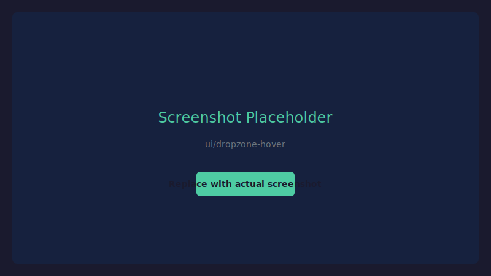{ loading=lazy }
      <figcaption>Retour visuel pendant le glissement des fichiers</figcaption>
    </figure>

=== "Téléversement"

    <figure markdown="span">
      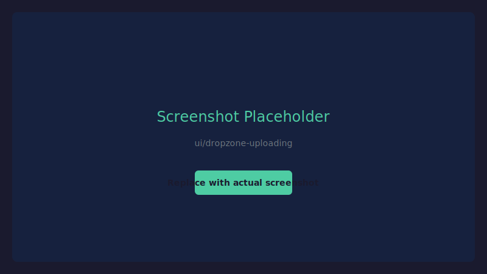{ loading=lazy }
      <figcaption>Indicateur de progression du téléversement</figcaption>
    </figure>

=== "Plusieurs fichiers"

    <figure markdown="span">
      { loading=lazy }
      <figcaption>Plusieurs fichiers sélectionnés pour le téléversement</figcaption>
    </figure>

### En-tête

<figure markdown="span">
  { loading=lazy }
  <figcaption>En-tête avec paramètres et choix de la langue</figcaption>
</figure>

### Panneau d’historique

=== "Liste d’historique"

    <figure markdown="span">
      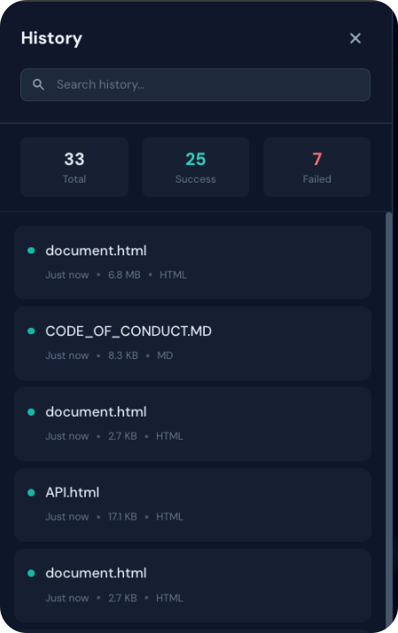{ loading=lazy }
      <figcaption>Liste des conversions précédentes</figcaption>
    </figure>

=== "Recherche"

    <figure markdown="span">
      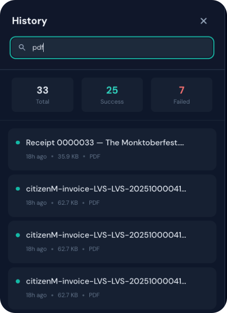{ loading=lazy }
      <figcaption>Recherche dans l’historique des conversions</figcaption>
    </figure>

---

## Panneau des paramètres

### Paramètres OCR

=== "Vue d’ensemble"

    <figure markdown="span">
      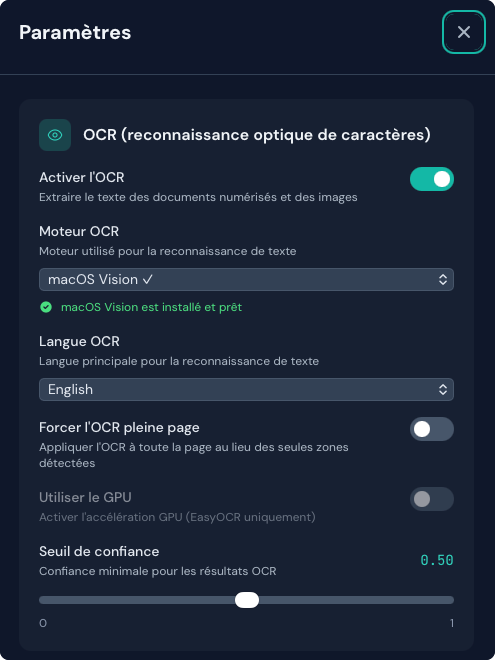{ loading=lazy }
      <figcaption>Options de configuration OCR</figcaption>
    </figure>

=== "Installer le backend"

    <figure markdown="span">
      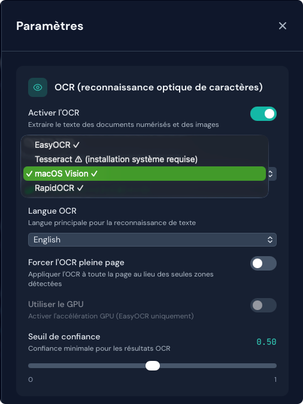{ loading=lazy }
      <figcaption>Installation du backend en un clic</figcaption>
    </figure>

=== "Avis Tesseract"

    <figure markdown="span">
      { loading=lazy }
      <figcaption>Instructions d’installation manuelle de Tesseract</figcaption>
    </figure>

### Paramètres des tableaux

<figure markdown="span">
  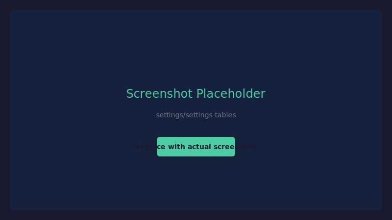{ loading=lazy }
  <figcaption>Configuration de l’extraction des tableaux</figcaption>
</figure>

### Paramètres des images

<figure markdown="span">
  { loading=lazy }
  <figcaption>Options d’extraction des images</figcaption>
</figure>

### Paramètres d’enrichissement

=== "Toutes les options"

    <figure markdown="span">
      { loading=lazy }
      <figcaption>Enrichissement du document : code, formules, classification d’images et description</figcaption>
    </figure>

=== "Message d’avertissement"

    <figure markdown="span">
      { loading=lazy }
      <figcaption>Avertissement lorsque des fonctions d’enrichissement lentes sont activées</figcaption>
    </figure>

### Paramètres de performance

<figure markdown="span">
  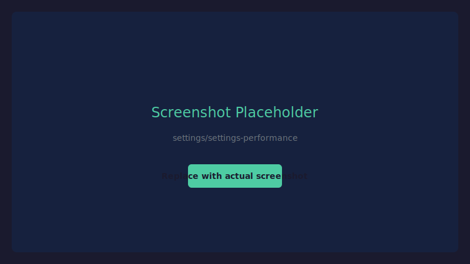{ loading=lazy }
  <figcaption>Configuration des performances de traitement</figcaption>
</figure>

### Paramètres de découpage (chunking)

<figure markdown="span">
  { loading=lazy }
  <figcaption>Configuration du découpage pour le RAG</figcaption>
</figure>

### Paramètres de sortie

<figure markdown="span">
  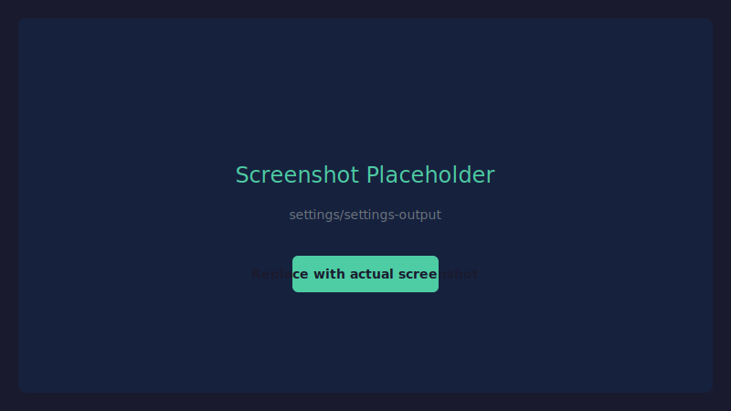{ loading=lazy }
  <figcaption>Choix du format de sortie par défaut</figcaption>
</figure>

---

## Options d’export

### Choix du format

=== "Tous les formats"

    <figure markdown="span">
      { loading=lazy }
      <figcaption>Formats d’export disponibles</figcaption>
    </figure>

=== "Format sélectionné"

    <figure markdown="span">
      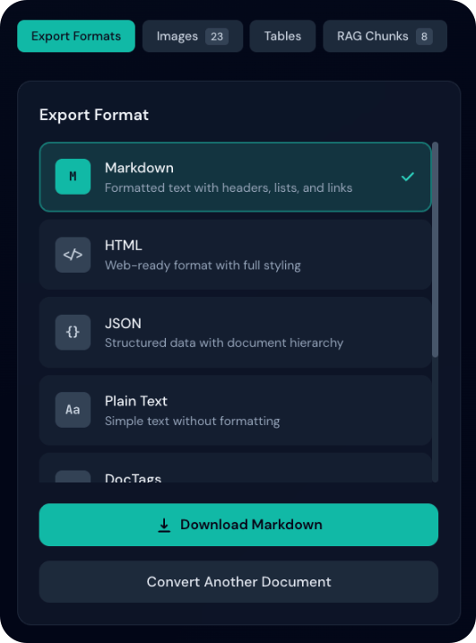{ loading=lazy }
      <figcaption>Format sélectionné avec une coche</figcaption>
    </figure>

### Modes d’aperçu

=== "Basculer rendu / brut"

    <figure markdown="span">
      { loading=lazy }
      <figcaption>Basculer entre vue rendue et vue brute</figcaption>
    </figure>

=== "Markdown rendu"

    <figure markdown="span">
      { loading=lazy }
      <figcaption>Markdown rendu avec mise en forme</figcaption>
    </figure>

=== "Markdown brut"

    <figure markdown="span">
      { loading=lazy }
      <figcaption>Source Markdown brute</figcaption>
    </figure>

=== "HTML rendu"

    <figure markdown="span">
      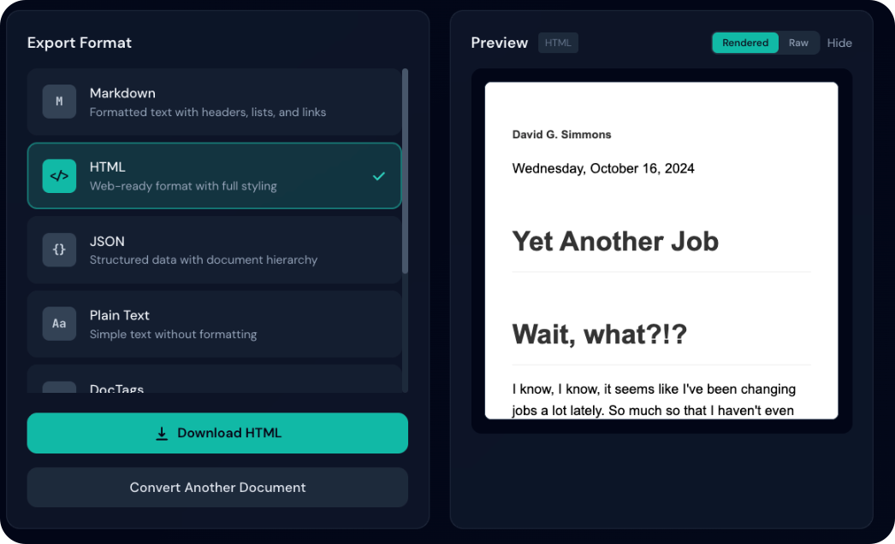{ loading=lazy }
      <figcaption>HTML rendu avec styles</figcaption>
    </figure>

=== "HTML brut"

    <figure markdown="span">
      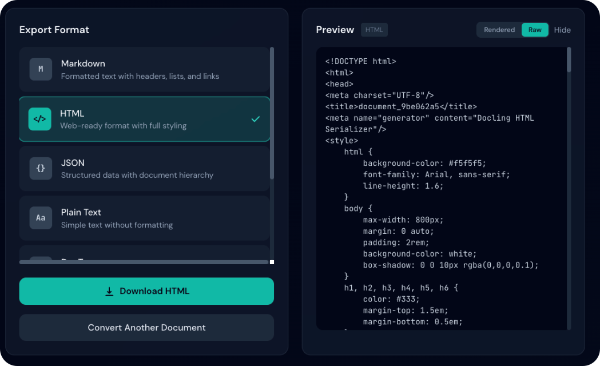{ loading=lazy }
      <figcaption>Code source HTML brut</figcaption>
    </figure>

=== "JSON"

    <figure markdown="span">
      { loading=lazy }
      <figcaption>Sortie JSON mise en forme</figcaption>
    </figure>

---

## Fonctionnalités en action

### État de la conversion

=== "En cours"

    <figure markdown="span">
      { loading=lazy }
      <figcaption>Document en cours de traitement</figcaption>
    </figure>

=== "Terminé"

    <figure markdown="span">
      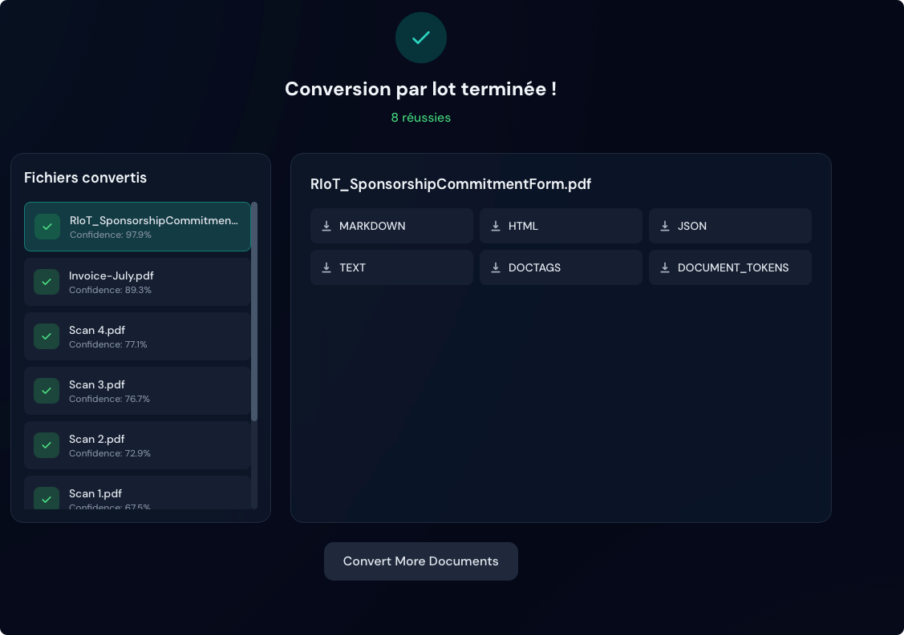{ loading=lazy }
      <figcaption>Conversion réussie avec statistiques</figcaption>
    </figure>

=== "Score de confiance"

    <figure markdown="span">
      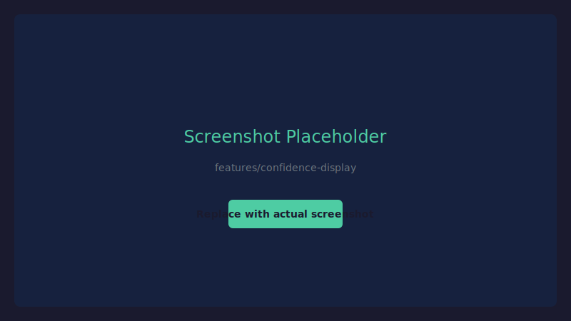{ loading=lazy }
      <figcaption>Pourcentage de confiance OCR</figcaption>
    </figure>

### Galerie d’images

=== "Grille de miniatures"

    <figure markdown="span">
      { loading=lazy }
      <figcaption>Images extraites sous forme de miniatures</figcaption>
    </figure>

=== "Actions au survol"

    <figure markdown="span">
      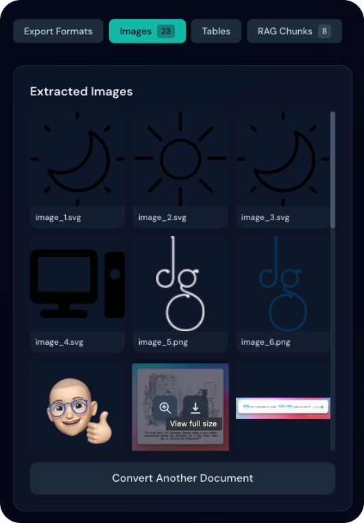{ loading=lazy }
      <figcaption>Boutons afficher et télécharger au survol</figcaption>
    </figure>

=== "Visionneuse plein écran"

    <figure markdown="span">
      { loading=lazy }
      <figcaption>Visionneuse en taille réelle avec navigation</figcaption>
    </figure>

### Tableaux

=== "Liste des tableaux"

    <figure markdown="span">
      { loading=lazy }
      <figcaption>Tableaux extraits avec aperçus</figcaption>
    </figure>

=== "Options de téléchargement"

    <figure markdown="span">
      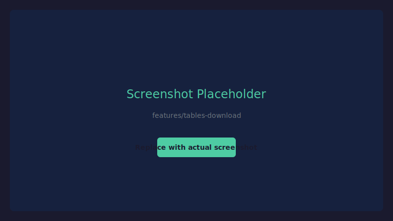{ loading=lazy }
      <figcaption>Export CSV et image</figcaption>
    </figure>

### Fragments RAG

<figure markdown="span">
  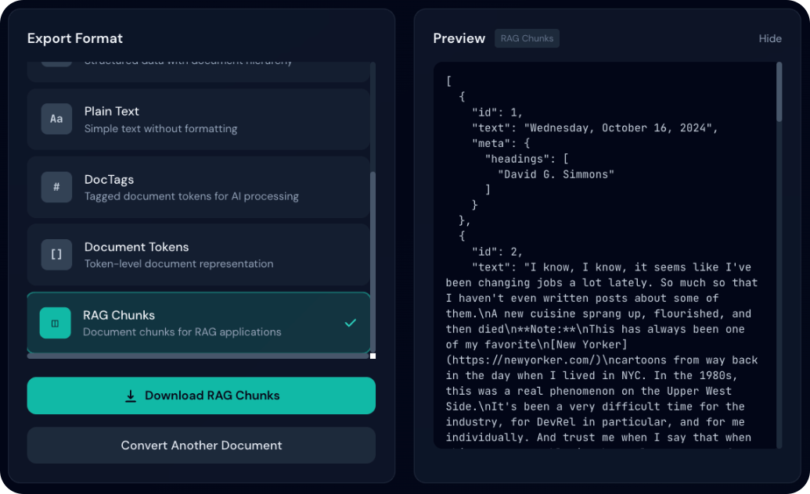{ loading=lazy }
  <figcaption>Fragments de document avec métadonnées</figcaption>
</figure>
